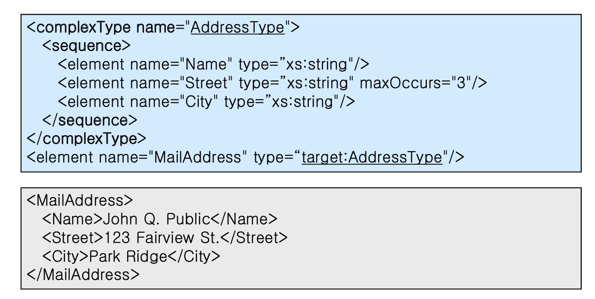
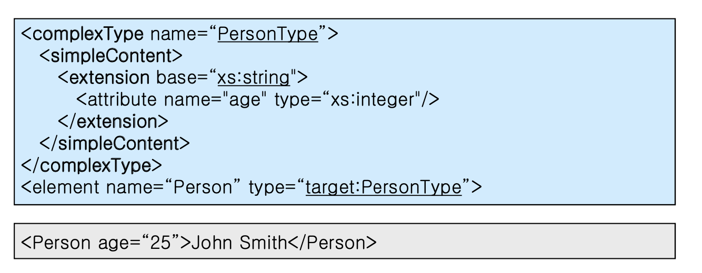
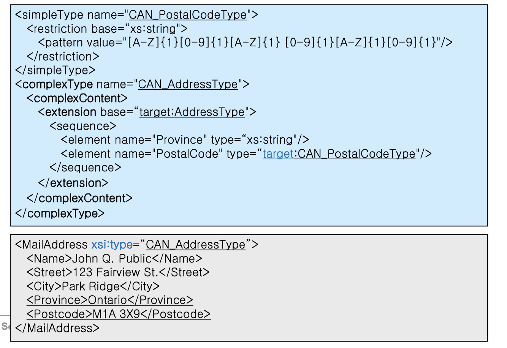
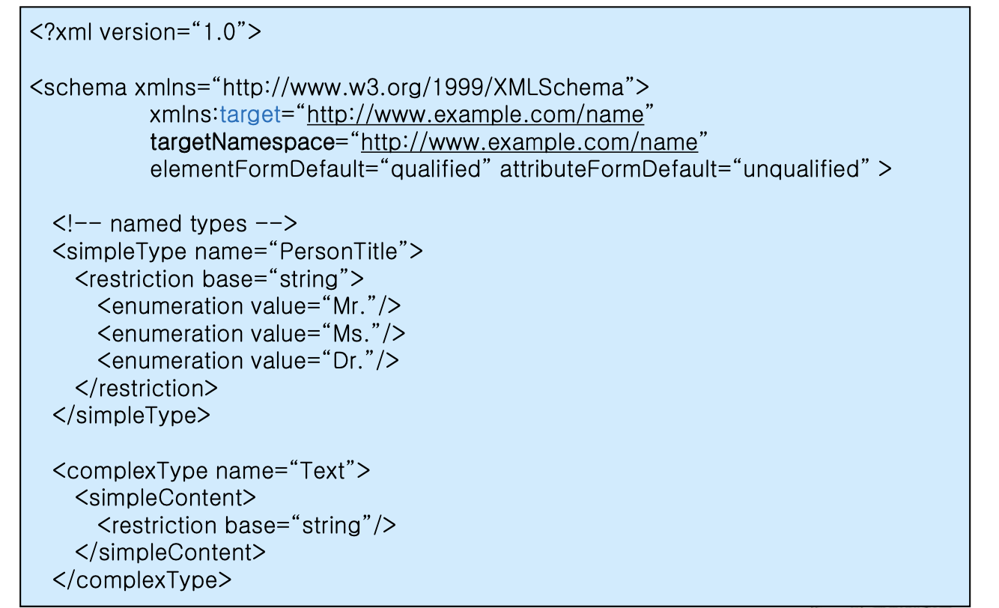
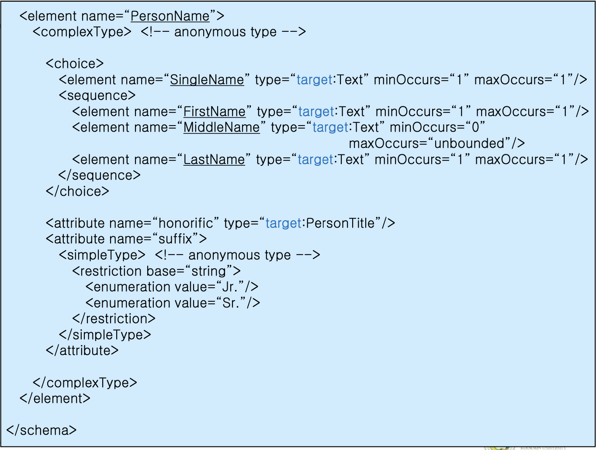
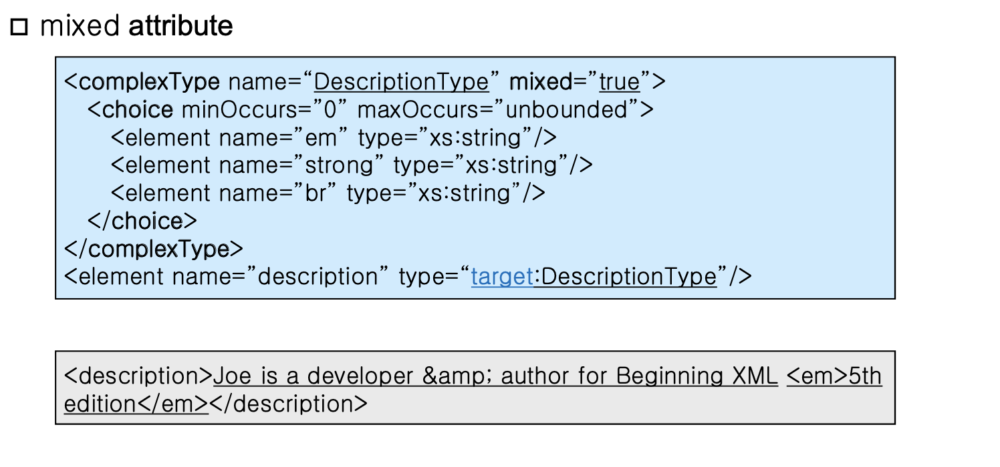
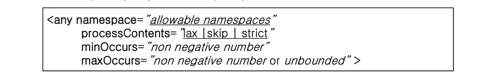
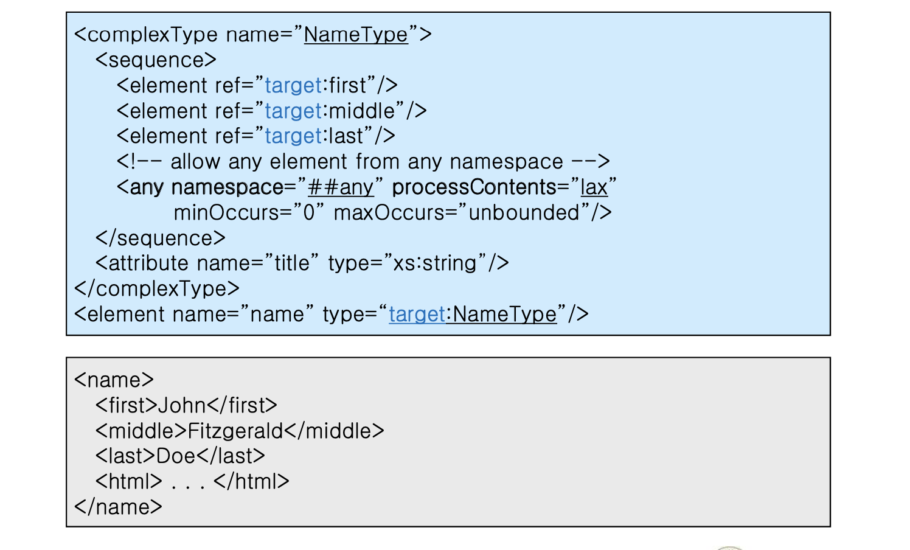

## XML

1015

##### Elements for Type Definition

```xml
<x>Text</x>	//SimpleType
<x a="">Text</x>	// ComplexType-SimpleContent
// 단순 Text가 등장한다.
<x a=""><y>...</y></x>	//ComplexType-ComplexContent Element가 등장하기 때문.
```

- Extension

  조건 등이 추가된 형태인 경우 Extension 이다. 조건을 추가하면서, 조건에 만족하는 것들로 점점 줄여가는 형태일 때.

- Restrict

##### Complex Type Definition

- Compositor

  \<Sequence>,\<choice>,\<all> 중의 하나를 넣어 이용한다.

  

  시퀀스는 해당 순서대로 모두,초이스는 그 중 하나,올은 순서 상관 없이 모두 나와야 한다.

- Simple Content

  심플 컨텐트의 경우 어트리뷰트가 나와야 하는데 어트리뷰트는 조건이므로, Extension이다. 
  

  PersonType은 String의 child라고 본다. 

- Complex Content



- 분석해보기 

  

컴포지터가 타입 바로 아래에 나온 경우, Data type에 대한 inheritance를 받지 않겠다는 의미이다. 컴포지터, 어트리뷰트에 대한 내용이 나온다.

타입에 대한 네임이 본래 나와야 하는데, 네임이 나오지 않는것을 Anonymous 타입이라고 한다. 이것은 한번만 이용할 것이다.

네임을 지정할때 나오는 타입에 대한것은 반드시 prefix가 나와야 함

## XML

1017

##### Text-Only Content

네임에 나오는 것은 항상 :이 나오면 안된다. 즉 Prefix가 없어야 한다는 뜻이다. 반대로 type에는 반드시 :가 나와야 한다. (Prefix가 있어야 한다.) 없는 경우에는 Default인 것이다. 

Inherite 받은 Type라면, Simple 또는 Complex Content가 나온다. 아니라면 Inherite받은 것이 아니다.

##### Mixed Content



mixed="true"를 넣어준다. minOccurs 와 maxOccurs는 0~무한까지 나와도 된다는 뜻이다. 이것이 없을 때에는 그저 min,max가 1이라는 의미이다. default가 1인 것이다. mixed는 디폴트가 false이다. mixed가 true면, 엘리먼트 앞이나 뒤에 텍스트가 나올 수 있다는 의미이다.

##### Empty Content

내용이 없는 Content.

##### Any Content

무엇이든지 올 수 있다는 뜻이다. 그런데 조건이 있다. 그 문서에서 정의가 된 엘리먼트만이 올 수 있다. 



네임스페이스가 없다면 현재 문서에서, 네임스페이스가 적혀 있다면 그곳의 엘리먼트에 대하여 이용가능하다. 다른 스키마에서 정의된 것을 이용 가능한 것이다. 

processContents 에 lax / skip / strict가 올 수 있다.

- lax : url에 대해 가서 존재한다면 가져와서 이용하고, 없다면 확인하지 않는다는 것이다. 없다면 외부 namespace에 대해 parser가 체크하지 않는다.
- skip : parser가 외부로부터 가져온 namespace에 대해 확인할 필요가 없다는 의미이다.
- strict : parser가 외부로부터 가져온 문서와 현재 문서에 대해 모두 파악해야 한다는 것이다. url을 파악해서 만일 없다면 오류가 나는 것이다.



3번째 라인부터 보면 name대신 ref가 나온다. 이것은 기존에 존재하는 것에 대해 이용하겠다는 의미이다. ref에 대해 이용하려면 글로벌로 정의 되어 있어야 이용이 가능하다. 

\##any가 나온다면 다른 엘리먼트 아무거나 나와도 된다는 의미이다. 단, 이 문서 내에서 정의된 엘리먼트여야 한다. 

XML Schema는 타입을 정의하는 것의 나열이다. 

Built in이면 정의할 필요 없고, 아니라면 정의하면 된다. 타입에 대해 내부에 정의할 때에는 익명으로 정의해도 괜찮지만 외부에 정의할 경우 반드시 이름을 적어야 이용할 수 있다. 

스키마 태그 바로 아래 레벨에 나오는 것에 대한것은 글로벌이다. 한단위 더 들어가는 부분에 대한 것들은 로컬이다. 