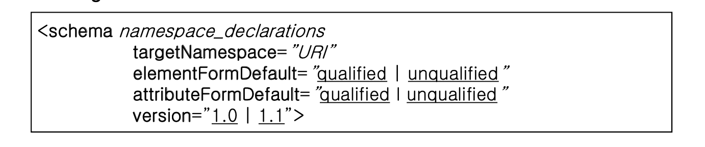
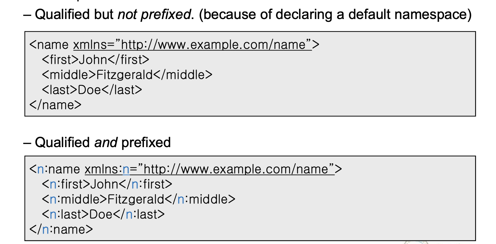
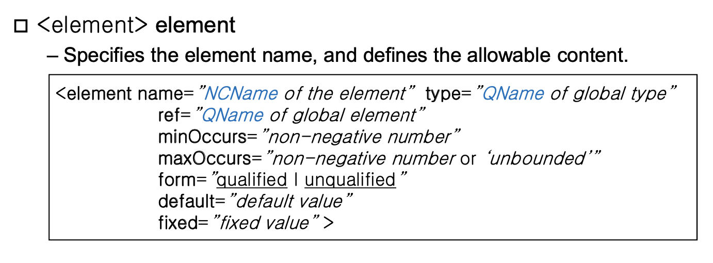
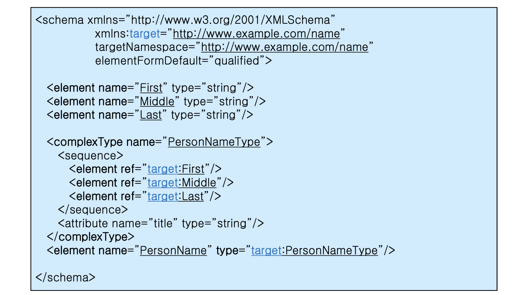
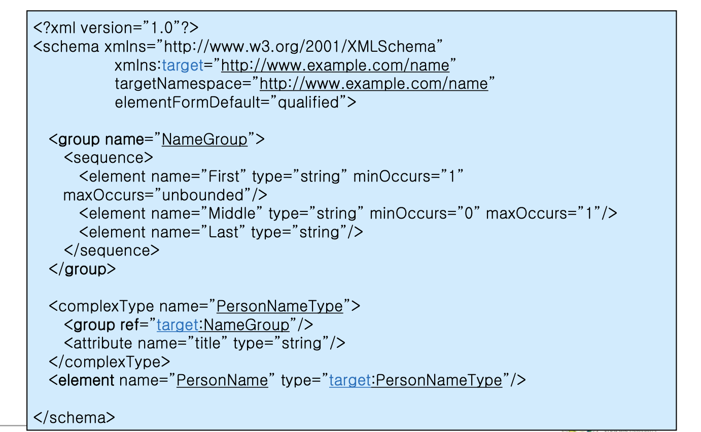
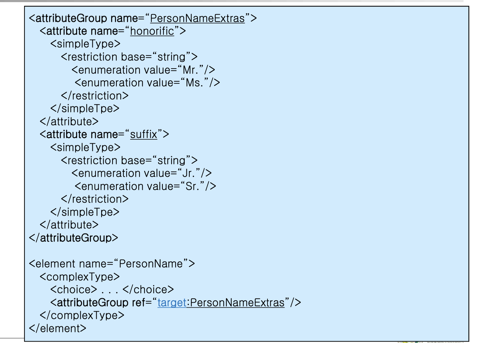
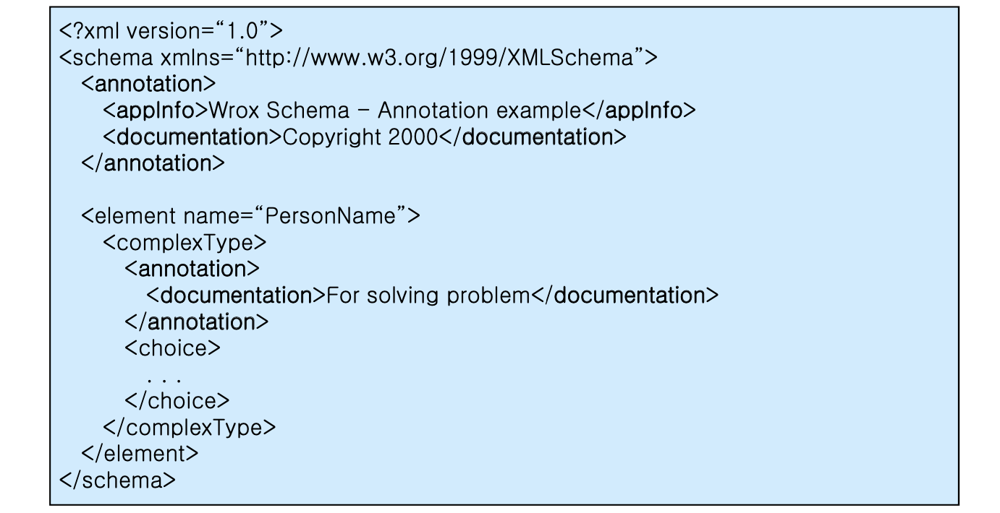

## XML

1029

##### namespace

elementFormDefault 값의 Default는 unqualified이다. 습관적으로 이것을 qualified로 선언해주는 것이 좋다.

##### Element

스키마 태그 바로 아래에 나오는 것은 글로벌이다. 그리고 안쪽에 나오는 element에 대하여는 로컬 엘리먼트 이다. 

타입에 대해 이름을 선언하지 않고 작성할 수 있는데, 이를 어나니머스 타입이라고 하며, 1회만 이용하는 용도로 작성한다.

엘리먼트의 네임에 대하여는 NCName이며, 타입의 네임에 대하여는 QName이다.

##### Refer to an Existing Global Element

이미 선언한 엘리먼트에 대해 ref로 가져와서 이용할 수 있다.

ref는 기존에 있는 글로벌 엘리먼트를 가져와서 사용하겠다는 의미이다. 

> 엘리먼트는 항상 대응되는 타입이 존재한다. 엘리먼트를 작성하기 전 타입에 대한 정의가 반드시 필요하다. 

엘리먼트는 declarations 라고 지칭하고 타입에 대하여는 definition이라고 하는데에는 위같은 이유가 존재하는 것이다. 

- minOccurs and maxOccurs

  둘다 기본값은 1이다. 몇번 등장하게 하는지를 지정할 수 있다.

- Default and Fixed value of Element

  엘리먼트의 값에대해 디폴트를 지정할수도 있고 픽스를 지정해 반드시 그 값만 오게 할 수도 있다. 

##### Group

내부 엘리먼트에 대해 묶어서 쓰는 이름을 부여한다. 엘리먼트 말고도 어트리뷰트에 대한 그룹또한 지정가능한데 다음과 같다.

##### Anootations

XML에 설명을 붙일 수 있다. 

- appInfo : 해당 xml에 대해 이 xml을 가지고 다른 것을 이용하는 개발자에 대하여 정보를 전달한다. 
- documentation : 문서를 사용하는 사람에 대한 정보를 부여하는 것이라고 생각할 수 있다.

annotation은 어디에나 나타날 수 있다.

\<!-- --> 와의 차이점은 parser가 건드리냐 건드리지 않느냐의 차이이다. (Annotation은 parser가 건들인다.)