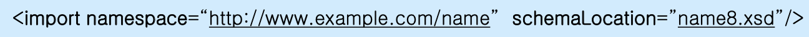

## XML

1031

##### import & include

스키마 파일을 나눠서 작성할때 방법이 두개가 존재한다.

- 스키마 파일의 네임스페이스 네임을 같게 하는것

  동일한 사람이 만들었다는 것을 의미한다.  너무 내용이 많아 분리해서 저장한 것이다. **이경우는 include 해서 이용한다.**

- 스키마 파일의 네임스페이스가 다르게 하는것

  다른사람이 각각 정의했음을 알려준다. 이경우는 한 스키마에서 다른 스키마에 대한것을 불러와서 이용한다. 이경우 네임스페이스가 다르다. **해당 경우에는 import를 이용한다.**

include에는 namespace 어트리뷰트가 존재하지 않는데, 이 이유는 타겟네임스페이스와 해당 값이 같기 때문에 해당 어트리뷰트는 존재하지 않는다. 

##### 과제

XMLSpy 과제할때 이용.