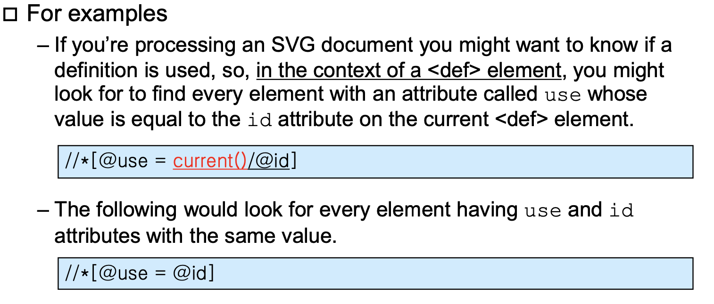

#### ㄱXML

1112

#### XPath Types

##### boolean

true거나 false거나 인데 함수처럼 반드시 ()를 넣어줘야 한다.

Ex) true()

##### Node-Sets

순서가 없지만(것처럼 보이지만) 실제로는 순서가 있다.

- Document order(preorder)

  \자료구조에서 나오는 preorder순서라고 생각하면 된다.

- reverse document order

  Document order순서의 반대 순서이다. 

##### Number

##### String

##### XPath Basics

Current() 현재 가르키고 있는 것에대한 표기.

##### Path Node Type and Node Tests

XPath의 리턴은 

path

/

상대 path 

[...]