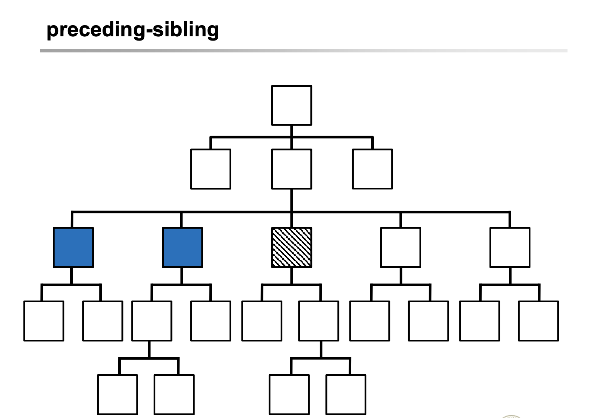

## XML

##### XPath Axes

```xml
/book/chapter	약어로 표현
/child::book/child::chapter full syntex
/axes::element 해당 형태가 기본
```

어떤 임의의 노드에 대해 위로 가는것은 parent를 찾아가는 것이고 아래로 가는것은 child를 찾아 가는 것이다.

13가지 타입의 축이 존재한다.

- Self axis : 자기 자신으로 찾아가는것
- Child,descendent,descendent-or-self axes : 자식,자식의 자식, 나를 포함한 자식을 찾는것
- Parent,ancestor,ancestor-or-self axes : 부모,부모의 부모, 나를 포함한 부모를 찾는것
- Following,preceding,following-sibling,preceding-sibiling axes : 따라가는것, 뒤로 따라가는것, 내 뒤로 모두 따르는 것, 내 앞으로 모두 따르는것.
- attribute axis : 그 노드의 어트리뷰트에 대해 축을 따르는것
- Namespace axis : 그 노드의 네임스페이스에 대해 축을 따르는것

Element node 와 text node가 주축이며, attribute나 namespace에 대해서는 추가로 이용하게 되는것이다. 

엘리먼트와 텍스트 노드에 대하여는 하단으로 그리는게 맞고, 어트리뷰트는 자식이라고 볼 수 없으므로 옆으로 그리는 것이 옳다.(XDM tree에서) 때문에 우측으로 가는것은 child axes를 타는 것이 아니다. attribute나 namespcace를 타야하는 것이다. 


약어로 사용하는 경우가 많다. // 는 하단에 존재하는 모든. @는 어트리뷰트 ..은 parent로 가게 되는 것이다.

>  트리 그림으로 구체적 설명이 XPath.pdf 68p ~ 79p에 자세히 나와있다. 참고하자. 몇가지 어려운 것만 가져왔다.

ancestor는 모든 조상에 대함이고(직계만 - 루트로 올라가는 길들의 노드만) or-self가 들어간다면 본인까지 포함이다. child는 바로 아래 child만 이다 (parent 동일) descendant는 ancestor의 반대.(자식 포함한 손자들) attribute는 부모나 자식같은 요소가 아니다. 즉 상속의 개념이 아니기 때문에 엘리먼트 우측에 적는다.





트리에 대해 Document order로 root에서부터 읽었을 때, 현재 current에 대하여 이전의 노드들을 preceding 이후를 following이라고 한다. 

단, preceding, following할때, ancestor와 descendant는 제외해야한다.

Document order는 문서에서 그냥 위에서 밑으로 내려가는 순서라고 생각하면 된다. 

```xml
– //*[@id=“7”] : /descendant::*[attribute::id=“7”]

– /entry/title=“XML” : /child::entry/child::title/child::text()=“XML” 

– /book/chapter[2] : /child::book/child::chapter[position()=2]

– a//b : a/descendant-or-self::node()/child::b

– ../description : parent::node()/child::description

//*[@id="7"] 에서 대괄호 안은 조건이다. 이것은 어트리뷰트를 찾는 것이 아니라 id값이 7인 엘리먼트를 찾는 구문이다.

a//b는 a 하단 모든 손자들중 b를 찾는것이다. (몇개든)
```

엘리먼트의 밸류는 자신의 child의 value들의 합이다. 텍스트는 자신의 밸류로 텍스트를 가진다. 어트리뷰트는 밸류상속이 없다.

슬래시 안에는 반드시 다음과 같은 형태가 온다

***/axes::node_tests/***

그저 생략되거나 축약해서 이용 할뿐이다


##### XPath Expressions


axis와 node test는 반드시 필요. predicate는 옵션이다. 이를 합쳐 location step이라고 부른다. 


하단의 expresstion에서는 text가 "XPath"임을 파악하여 boolean형을 리턴한다. 다른것을 이용할 경우도 있다. 

location path, location step 모두 XPath라고 지칭할 수 있다. 

이 아래로 별로 쳐다볼 필요 없다.