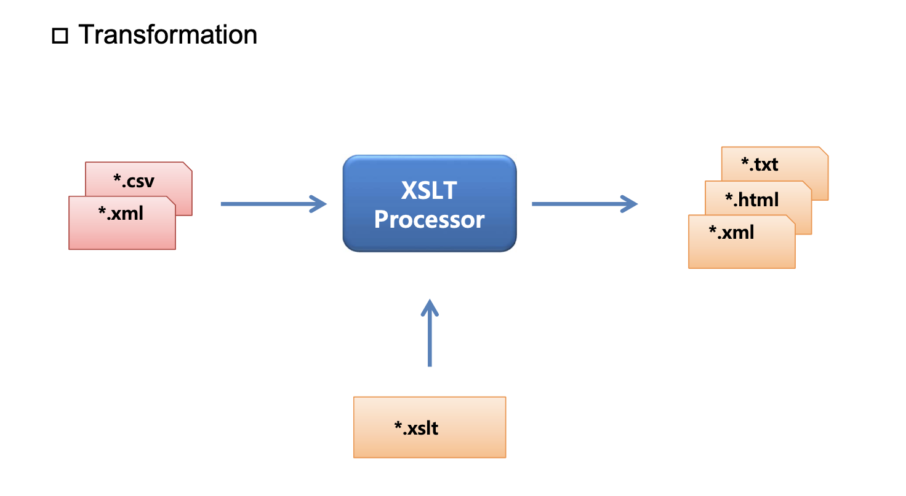
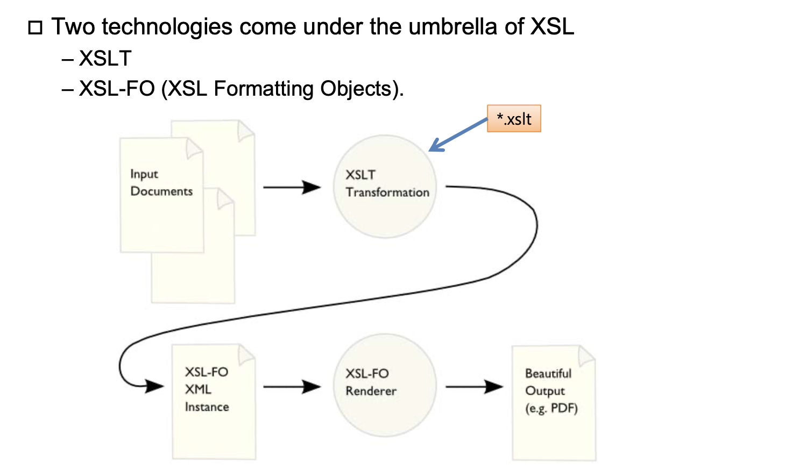

## XML

#### XSLT

XSLT는 XML 문서를 XHTML 문서나 또 다른 XML 타입의 문서로 변환하기 위해 사용하는 언어입니다.

XSLT는 W3C 표준 권고안으로, XSL에서 가장 중요한 언어입니다.

위와 같은 변환과정에서 XSLT는 XPath를 이용하여 XML 문서에서 필요한 정보를 찾는 역할을 합니다

두가지 주요한 변화가 있다. 

- XML -> XML (Transformation)
- XML -> HTML,pdf 등 (formatter)



eXtensible Stylesheet Language Transformations.

xml파일 등을 입력받아 html등 다른 형태로 변환해주는 프로그램이다. 

xml은 serialized한 한줄의 string으로 구성된다. 하지만 우리가 시각적으로 보기 어렵기 때문에 태그에 맞춰 들여쓰기를 하는 등의 방식으로 문서를 구성한다. 

먼저 xml파일을 가지고 source Tree를 만든다. Source Tree -> Target tree로 변환을 한다. 변환한 트리를 Document order순으로 순회하며 확인해 넘겨주면 serialized한 긴 String으로 변환이 되는 원리라고 생각하면 된다. 이 변환된 것을 이용하게 된다.  



- Presentation-neutral : XML
- Presentation-specific format : HTML or PDF...

- XSL-FO : XSL Formatting Objects, XML schema로 만든 XML파일. PDF등 형태로 변환할수 있는 파일.

##### 

예시

```xml
<xsl:stylesheet xmlns:xsl=http://www.w3.org/1999/XSL/Transform version=”1.0”> 
	<xsl:template match=”/”>
		<html> 
			<head>
      	<title>Information about <xsl:value-of select=”count(/People/Person)”/> people.
	      </title> </head>
  	    <body>
    	  <h3>Information about <xsl:value-of select=”count(/People/Person)”/>
      people. </h3>
     	 <br/>
				<xsl:apply-templatesselect=”/People/Person”/> 				
				</body>
		</html>
	</xsl:template>
	<xsl:template match=”Person”>
	  <h3><xsl:value-of select=”Name”/></h3> 
  	<p><xsl:value-of select=”Description”/></p> 
		<br/>
	</xsl:template> 
</xsl:stylesheet>
```

- Xsl:apply-template 

  서브루틴에 대한 호출. 해당 xml에서는 People하단의 Person을 만날때마다 template를 호출하는 것으로 해석할 수 있다. for문과 유사한 것이라고 생각하면 된다. 

- Xsl:template

  템플릿 지정. 매치 어트리뷰트와 값이 일치한다면 해당 템플릿을 적용한다는 것으로보면 된다. 해당 xml에서 Person과 일치하면 해당 템플릿을 적용하도록 되어있다. Xsl:value-of select="Name"를 사용하면 해당 네임을 가진 엘리먼트에 대한 밸류를 가져올 수 있다.

템플릿 내부에 있는 것들을(내부를) literal result elements라고 지칭하며 xsl로 시작하는 문구들을 instruction이라고 지칭한다. 