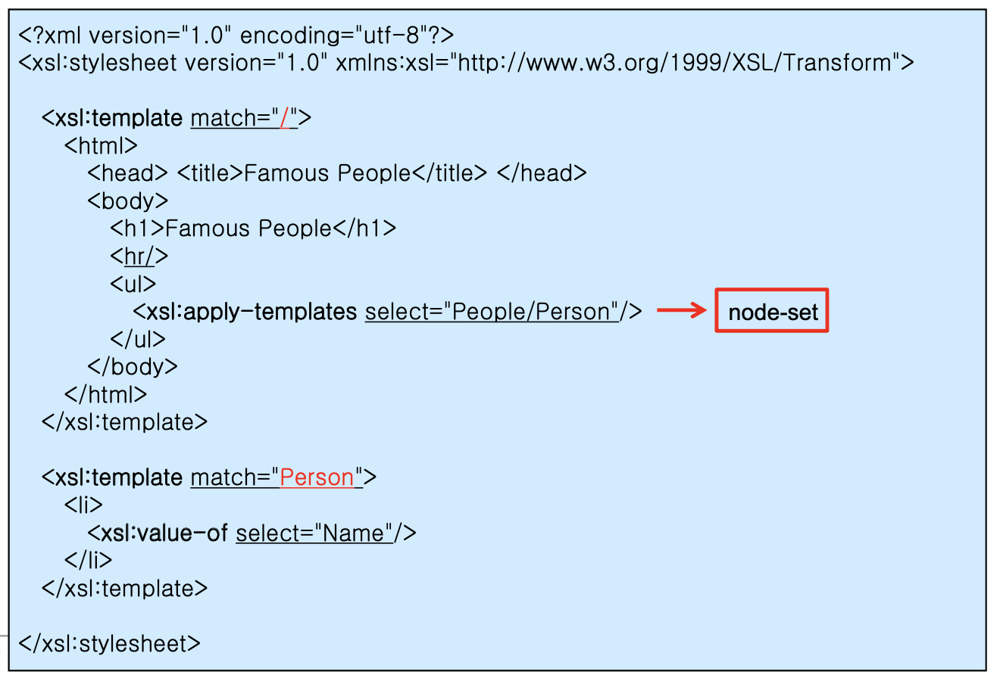
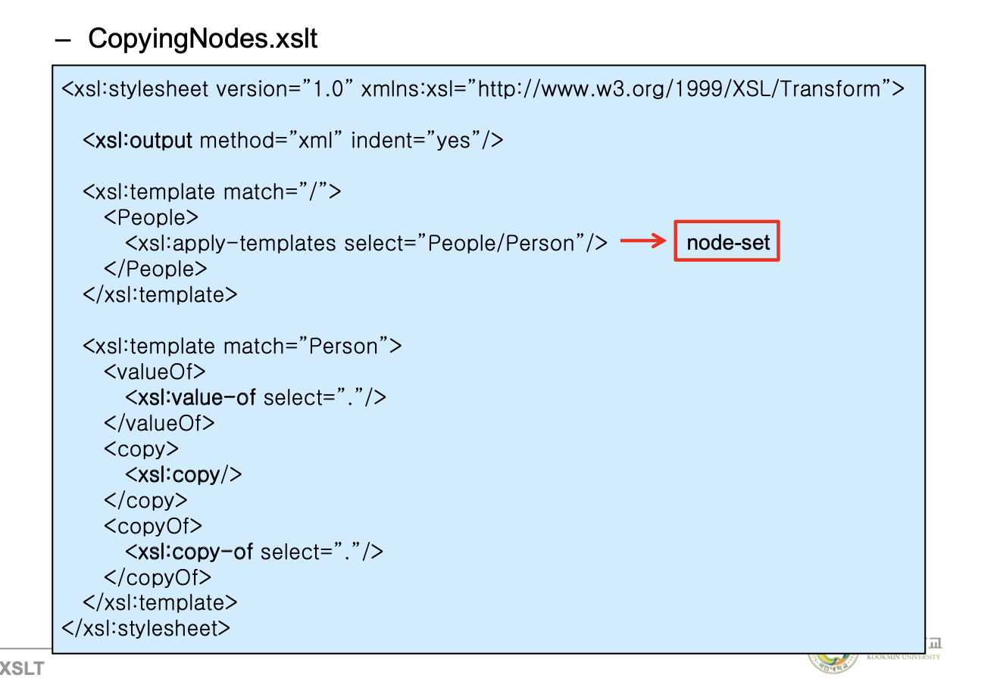
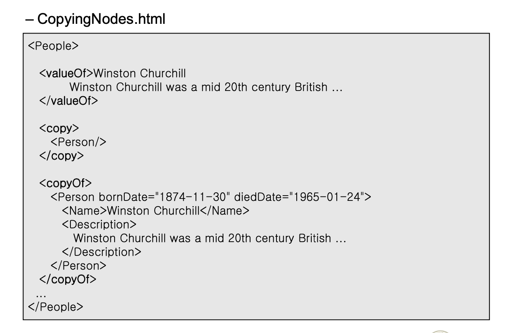
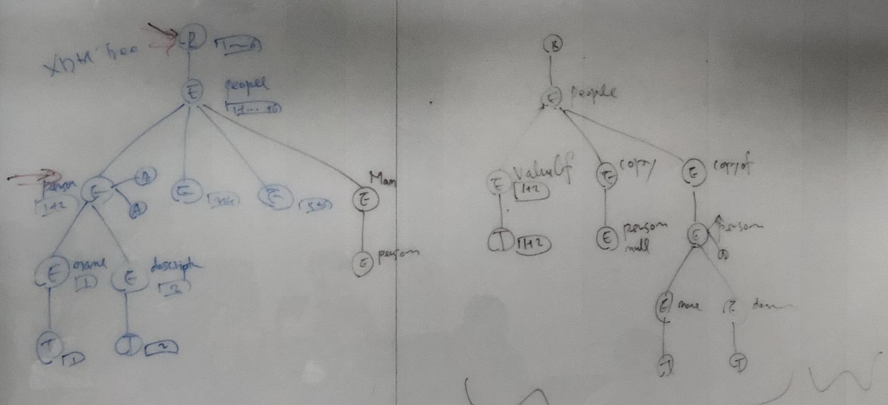

## XML

1121

\<xsl:template match=""> 는 매치 안의 내용을 만나게 되면 템플릿 내부 값을 리턴한다. 

- Literal result element

  템플릿 내부 내용 전체를 지칭한다.

- Instructions

  템플릿 내부 내용 중 \<xsl:...> 에 대한 값을 instruction이라고 한다. 

\<xsl:value-of select="count(/People/Person)"/> 는 카운트 내부 값이 몇 번 등장하는지 숫자로 나타낸다. 여기서는 People 아래 Person이 몇 번 나오는지를 파악해 숫자로 나타낸다.

\<xsl:apply-templates select="/People/Person"/>는 템플릿을 적용하라는 의미이다. 

match 안에 XPATH 값을 넣어 이용한다. 

##### Specify a Transformation

- \<xsl:template>

  Match 어트리뷰트를 이용해 XPath를 지정하여 적용한다.

- \<xsl:apply-template>

  Select 어트리뷰트로 노드를 선택해 이용한다. 노드셋이 나올 것이다. 

  push라고 지칭한다.Source 트리로부터 result 트리방향으로 결과값을 밀어내기 때문이다.

- \<xsl:for-each> 

  기본적으로 apply-템플릿과 같은 일을 하지만, 방식이 조금 다르다. select 내부 값을 만날 때 마다 Pull 해온다.

  Source트리로부터 result 트리로 당겨오기 때문에 pull Processing이다. 

  작성법도 조금 다른데, 템플릿을 따로 지정하는 것이 아니라, 태그 내부에 직접 정의한다.

  

  하지만 이 방법은 메인 내부에 많은 양의 코드 작성을 강요하게 되기 때문에 효율적이지 못하다. 분산시켜 이용함이 더 적절하기 때문에 잘 이용하지 않는다.

  테스트 할 때, 개발할 때 임시로 적용하는 경우가 많다. 

##### Select

Apply-templates,for-each,value-of이후에 select 어트리뷰트가 많이 나오는데 이 어트리뷰트 안에 XPath를 넣어서 노드의 셋을 가져온다.

match에서도 XPath가 동일하게 이용된다.

select에서는 XPath가 위로 자라나지 못한다. 내려오는 방향으로만 가도록 되어있다. 이러한 패턴을 **XSL Pattern**이라고 칭한다.

> match에 들어가는 것은 XPath이고 select에 들어가는 것은 XSL pattern인가 ? 둘의 차이가 뭘까 

##### Getting information from the Source Tree

- \<xsl:value-of>

  값을 가져온다.

- \<xsl:copy>

  지정한 노드에 대해 복사해서 가져온다. (shallow copy)

- \<xsl:copy-of>

  지정한 노드 본인 포함 서브트리 전부 가져온다. (deep copy)



\<xsl:template match="Person">내부 \<valueOf>는 inst가 아니다. Literal이다. 해당 노드를 생성한다는 의미이다.(값 바뀌는거 아니라 이름 그대로 태그임에 주의)

\<xsl:value-of select=".">에서 '.'은 최근 노드에 대한 정보를 지칭하는 것이다. 

```xml
<copy>
	<xsl:copy/>
</copy>
```

노드 하나를 복사해서 온다.

```xml
<copyOf>
	<xsl:copy-of select="."/>
</copyOf>
```

노드를 포함한 서브트리까지 전부 가져온다. 



***shallow copy에서 어트리뷰트가 복사 되는지 안되는지 시험에 나온다.***




