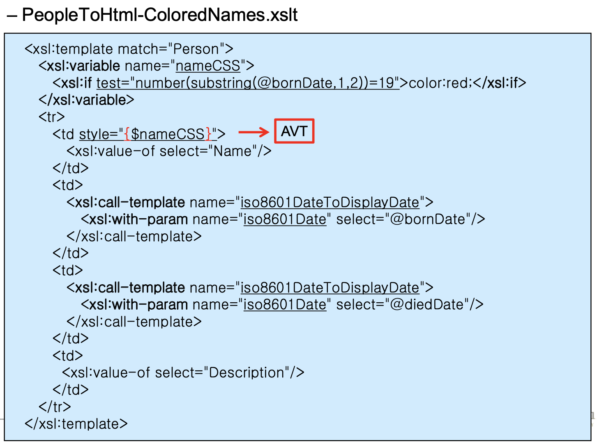

## XML

##### External Document vs Local Document

- External document

  별도의 파일을 만드는 방법.

- Local document

  프로그램 안에 끼워넣는 방법.

아무튼 두 방법 모두 function이 필요한데 그것이 document()이다. external에 대한 데이터를 읽어오는데 document가 필요하다. 아래 코드를 보자.

```xml
<xsl:variable name="books" select="document('URL')"/>
```

book 변수에 외부 파일에 대한 값을 읽어와서 넣었다. 이외 로컬에 대한 것은 빈 스트링을 이용해 읽는다. 로컬의 경우 도큐먼트 내부 URL값을 입력하지 않는다. 현재 파일이라는 의미이다. 

##### Conditional Logic

- if

  \<xsl:if> : 조건 확인이 가능하다. 단, else를 지원하지 않음에 주의. Test 어트리뷰트에 조건을 넣어 파악한다. True 일 경우 태그 내의 값이 출력된다.

  Ex)

  

  태어난 날이 19가 된다면 스타일을 red로 바꾸는 구문이다. 그런데 자세히 보면 xslt의 프로그램이 아닌 부분, 즉 html의 부분에서 변수를 사용하는 부분이 존재한다. 빤간 중괄호 부분이 그것인데, 이러한 경우에는 중괄호 안에 값을 넣어주는 형태를 취하게 된다면 XPath를 이용 가능하다. 

  Literal Result Elements 부분에서 프로그램 변수 사용을 위해서는 중괄호 형태를 이용해야 한다. 

- choose

  \<xsl:choose> 태그가 존재하고, 내부에 \<xsl:when> 구문을 통해 컨디션을 파악하는 구문을 취한다. 여러 if문을 사용하는 대신 이것을 이용한다. 

  컬러에 대한 색을 표현할때 hex로 표현된다. #이후 6자리가 등장하는데 2자리씩 RGB값이다. 

  Ex) #006666

  