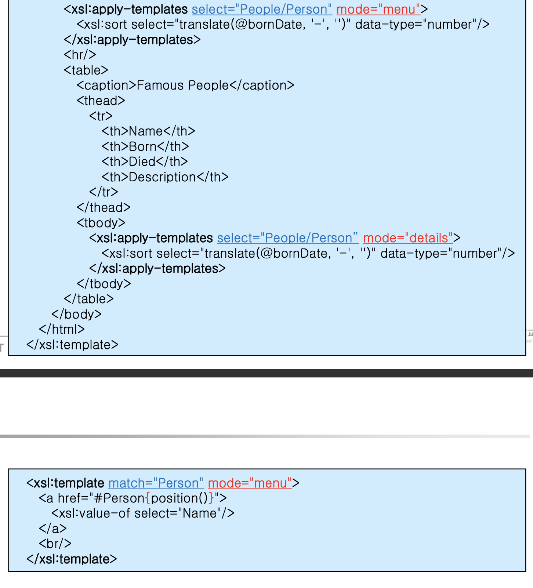

## XML

##### Sort

\<xsl:sort\>

translate(data,originString,changeString) 데이터 내부에서 원하는 문자열 값을 변경한다.

order를 명시하지 않은 경우에는(default) 오름차 순으로 정렬된다.(내림차는 descending을 Order로 지정해주어야 한다.) 

##### Reusing Code in XSLT

XSLT변환에서 다른XSL파일을 연결하여 이용 가능하다. \<xsl:include> 문을 이용하여 외부 xsl파일에 대하여 이용이 가능하다. 단, 이경우 href를 이용하여 URL을 지정해 주어야 한다. 스타일 시트에 대한 선언문을 제외한 내부 부분에 대해 모두 가져온다. 

\<xsl:include>와 \<xsl:import>의 차이는 같은 네임에 대한 처리이다. 만일 템플릿을 작성하는데 동일한 네임이 등장하면 include는 외부에서 불러온 것에대해 수행하고, import의 경우 내부의 함수를 수행한다. 

불러온 것에 대해 include는 불러온것이 높은 우선 순위. import는 낮은 우선순위 이다.

##### XSLT Modes

소스 트리에서 동일 노드에 대해 두번 이상 처리되는 경우에 만일 다른 작업이라면 이에 대해 처리를 정의한다. 어플라이 템플릿 또는 템플릿에서 어트리뷰트로 이용한다. 

같은 노드에 대해 한가지 처리가 아닌 몇가지의 처리를 원할 경우 mode를 지정하여 이용해야 한다.

어트리뷰트 밸류 패스 : html에서 중괄호 가 나온다면 이 내부의 것은 AVP이다. 때문에 이 내부값은 XPATH라고 할 수 있다. 

##### XSLT function

XPath의 함수가 사실 더 중요하다. 프로그램을 만들기 보다는 이 함수들을 어떻게 이용해서 결과를 얻어낼 것이냐 하는 문제가 있다.∑