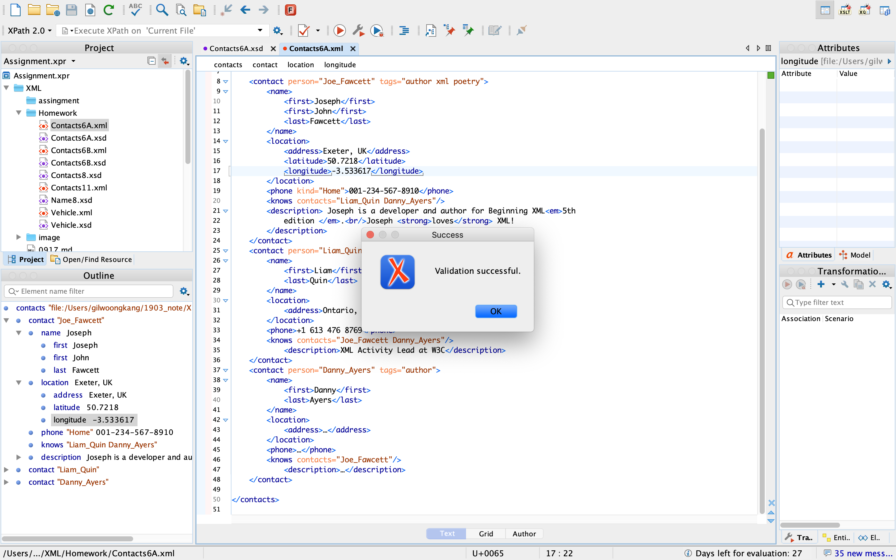
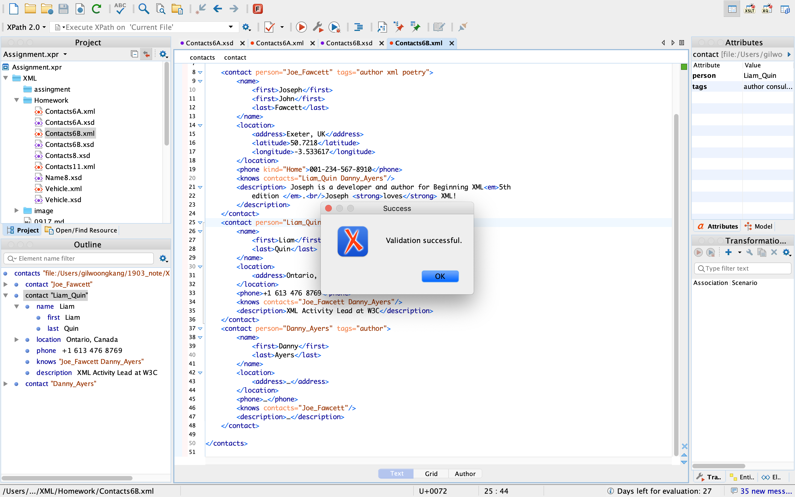
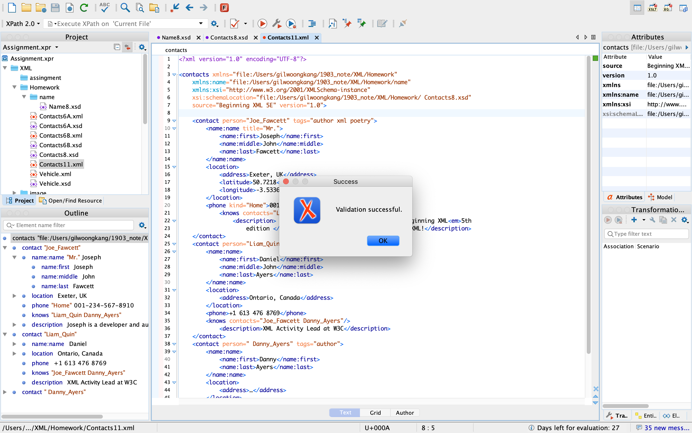
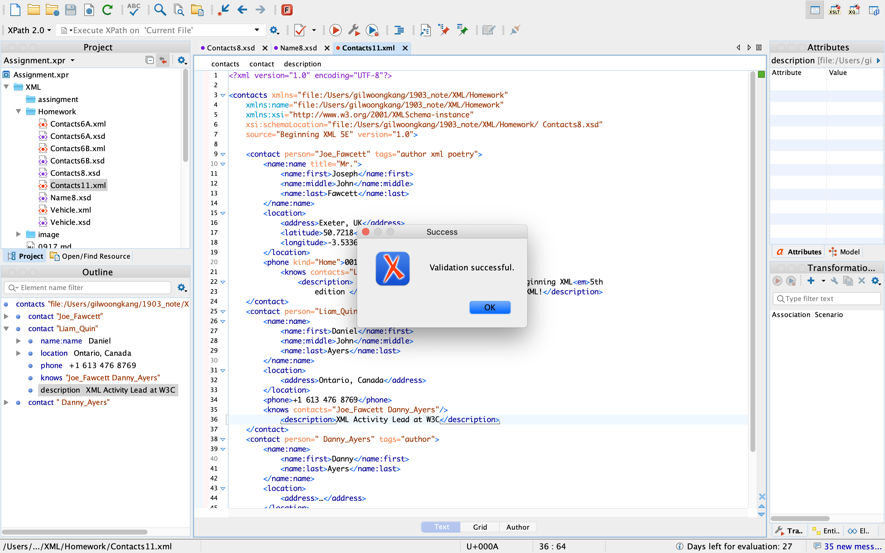
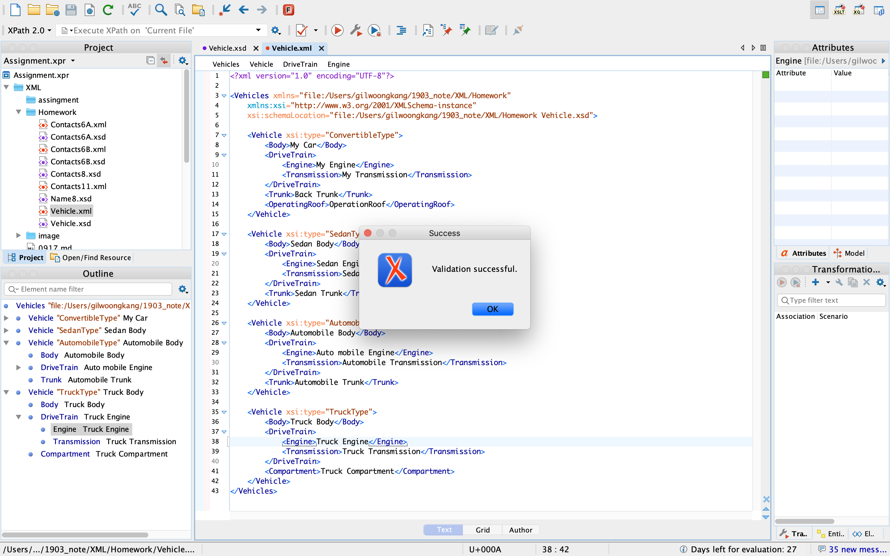

# **XML - Report**


### **0. 목차**


[TOC]


### **1. Contacts6.xsd, Contacts6.xml 를 이용**

네임스페이스는 "file:/Users/gilwoongkang/1903_note/XML/Homework" 로 이용했습니다.

#### 1-1.Contacts6A.xsd, Contacts6A.xml 파일 작성

##### Contacts6A.xsd

```xml
<?xml version="1.0" encoding="UTF-8"?>
<schema xmlns="http://www.w3.org/2001/XMLSchema"
    xmlns:contacts="file:/Users/gilwoongkang/1903_note/XML/Homework" 
    targetNamespace="file:/Users/gilwoongkang/1903_note/XML/Homework" elementFormDefault="qualified">
    
    <group name="NameGroup"> 
        <sequence>
            <element name="first" type="string" minOccurs="1" maxOccurs="unbounded"/> 
            <element name="middle" type="string" minOccurs="0" maxOccurs="1"/> 
            <element name="last" type="string"/>
       </sequence>
    </group>
    <complexType name="NameType">
        <group ref="contacts:NameGroup"/>
        <attribute name="title" type="string"/>
    </complexType>
    
    <complexType name="LocationType">
        <choice minOccurs="0" maxOccurs="unbounded">
            <element name="address" type="string"/>
                <sequence>
                    <element name="latitude" type="float"/>
                    <element name="longitude" type="float"/>
                </sequence>
        </choice>
    </complexType>
    <complexType name="KnowsType" >
        <attribute name="contacts" type="IDREFS"/>
    </complexType>
    <complexType name="DescriptionType" mixed="true">
        <choice minOccurs="0" maxOccurs="unbounded">
            <element name="em" type="string"/>
            <element name="strong" type="string"/>
            <element name="br" type="string"/>
        </choice>
    </complexType>
        
    <complexType name="PhoneType">
        <simpleContent>
            <extension base="string">
                <attribute name="kind" type="string" default="Home" />
            </extension>
        </simpleContent>
    </complexType>
    
    <simpleType name="ContactTagsType">
        <restriction base="string">
            <enumeration value="author"/>
            <enumeration value="xml"/>
            <enumeration value="poetry"/>
            <enumeration value="consultant"/>
            <enumeration value="w3c"/>
        </restriction>
    </simpleType>
    
    <simpleType name="ContactTagsListType">
        <list itemType="contacts:ContactTagsType"/>
    </simpleType>
    <attributeGroup name="ContactAttributes">
        <attribute name="version" type="decimal" fixed="1.0" />
        <attribute name="source" type="string"/>
    </attributeGroup>
    
    <element name="contacts">
        <complexType>
            <sequence>
                <element name="contact" minOccurs="0" maxOccurs="unbounded">
                    <complexType>
                        <sequence>
                            <element name="name" type="contacts:NameType"/>
                            <element name="location" type="contacts:LocationType"/>
                            <element name="phone" type="contacts:PhoneType"/>
                            <element name="knows" type="contacts:KnowsType"/>
                            <element name="description" type="contacts:DescriptionType"/>
                        </sequence>
                        <attribute name="tags" type="contacts:ContactTagsListType"/>
                        <attribute name="person" type="ID"/>
                    </complexType>
                </element>
            </sequence>
            <attributeGroup ref="contacts:ContactAttributes"/>
        </complexType>
    </element>
    
</schema>
```

##### Contacts6A.xml

```xml
<?xml version="1.0" encoding="UTF-8"?>

<contacts xmlns="file:/Users/gilwoongkang/1903_note/XML/Homework"
    xmlns:xsi="http://www.w3.org/2001/XMLSchema-instance"
    xsi:schemaLocation="file:/Users/gilwoongkang/1903_note/XML/Homework contacts6A.xsd"
    source="Beginning XML 5E" version="1.0">
    
    <contact person="Joe_Fawcett" tags="author xml poetry">
        <name>
            <first>Joseph</first>
            <first>John</first>
            <last>Fawcett</last>
        </name>
        <location>
            <address>Exeter, UK</address>
            <latitude>50.7218</latitude>
            <longitude>-3.533617</longitude>
        </location>
        <phone kind="Home">001-234-567-8910</phone>
        <knows contacts="Liam_Quin Danny_Ayers"/>
        <description> Joseph is a developer and author for Beginning XML<em>5th
            edition </em>.<br/>Joseph <strong>loves</strong> XML!
        </description>
    </contact>
    <contact person="Liam_Quin" tags="author consultant w3c">
        <name>
            <first>Liam</first>
            <last>Quin</last>
        </name>
        <location>
            <address>Ontario, Canada</address>
        </location>
        <phone>+1 613 476 8769</phone>
        <knows contacts="Joe_Fawcett Danny_Ayers"/>
            <description>XML Activity Lead at W3C</description>
    </contact>
    <contact person="Danny_Ayers" tags="author">
        <name>
            <first>Danny</first>
            <last>Ayers</last>
        </name>
        <location>
            <address>…</address>
        </location>
        <phone>…</phone>
        <knows contacts="Joe_Fawcett"/>
            <description>…</description>
    </contact>
    
</contacts>
```

##### Validation Check



#### 1-2 Contacts6B.xsd, Contacts6B.xml 파일작성

##### Contacts6B.xsd

```xml
<?xml version="1.0" encoding="UTF-8"?>
<xs:schema xmlns:xs="http://www.w3.org/2001/XMLSchema"
    xmlns="file:/Users/gilwoongkang/1903_note/XML/Homework" 
    targetNamespace="file:/Users/gilwoongkang/1903_note/XML/Homework" elementFormDefault="qualified">
    
    <xs:group name="NameGroup"> 
        <xs:sequence>
            <xs:element name="first" type="xs:string" minOccurs="1" maxOccurs="unbounded"/> 
            <xs:element name="middle" type="xs:string" minOccurs="0" maxOccurs="1"/> 
            <xs:element name="last" type="xs:string"/>
        </xs:sequence>
    </xs:group>
    <xs:complexType name="NameType">
        <xs:group ref="NameGroup"/>
        <xs:attribute name="title" type="xs:string"/>
    </xs:complexType>
    
    <xs:complexType name="LocationType">
        <xs:choice minOccurs="0" maxOccurs="unbounded">
            <xs:element name="address" type="xs:string"/>
            <xs:sequence>
                <xs:element name="latitude" type="xs:float"/>
                <xs:element name="longitude" type="xs:float"/>
            </xs:sequence>
        </xs:choice>
    </xs:complexType>
    <xs:complexType name="KnowsType" >
        <xs:attribute name="contacts" type="xs:IDREFS"/>
    </xs:complexType>
    <xs:complexType name="DescriptionType" mixed="true">
        <xs:choice minOccurs="0" maxOccurs="unbounded">
            <xs:element name="em" type="xs:string"/>
            <xs:element name="strong" type="xs:string"/>
            <xs:element name="br" type="xs:string"/>
        </xs:choice>
    </xs:complexType>
    
    <xs:complexType name="PhoneType">
        <xs:simpleContent>
            <xs:extension base="xs:string">
                <xs:attribute name="kind" type="xs:string" default="Home" />
            </xs:extension>
        </xs:simpleContent>
    </xs:complexType>
    
    <xs:simpleType name="ContactTagsType">
        <xs:restriction base="xs:string">
            <xs:enumeration value="author"/>
            <xs:enumeration value="xml"/>
            <xs:enumeration value="poetry"/>
            <xs:enumeration value="consultant"/>
            <xs:enumeration value="w3c"/>
        </xs:restriction>
    </xs:simpleType>
    
    <xs:simpleType name="ContactTagsListType">
        <xs:list itemType="ContactTagsType"/>
    </xs:simpleType>
    <xs:attributeGroup name="ContactAttributes">
        <xs:attribute name="version" type="xs:decimal" fixed="1.0" />
        <xs:attribute name="source" type="xs:string"/>
    </xs:attributeGroup>
    
    <xs:element name="contacts">
        <xs:complexType>
            <xs:sequence>
                <xs:element name="contact" minOccurs="0" maxOccurs="unbounded">
                    <xs:complexType>
                        <xs:sequence>
                            <xs:element name="name" type="NameType"/>
                            <xs:element name="location" type="LocationType"/>
                            <xs:element name="phone" type="PhoneType"/>
                            <xs:element name="knows" type="KnowsType"/>
                            <xs:element name="description" type="DescriptionType"/>
                        </xs:sequence>
                        <xs:attribute name="tags" type="ContactTagsListType"/>
                        <xs:attribute name="person" type="xs:ID"/>
                    </xs:complexType>
                </xs:element>
            </xs:sequence>
            <xs:attributeGroup ref="ContactAttributes"/>
        </xs:complexType>
    </xs:element>
    
</xs:schema>
```

##### Contacts6B.xml

```xml
<?xml version="1.0" encoding="UTF-8"?>

<contacts xmlns="file:/Users/gilwoongkang/1903_note/XML/Homework"
    xmlns:xsi="http://www.w3.org/2001/XMLSchema-instance"
    xsi:schemaLocation="file:/Users/gilwoongkang/1903_note/XML/Homework contacts6B.xsd"
    source="Beginning XML 5E" version="1.0">
    
    <contact person="Joe_Fawcett" tags="author xml poetry">
        <name>
            <first>Joseph</first>
            <first>John</first>
            <last>Fawcett</last>
        </name>
        <location>
            <address>Exeter, UK</address>
            <latitude>50.7218</latitude>
            <longitude>-3.533617</longitude>
        </location>
        <phone kind="Home">001-234-567-8910</phone>
        <knows contacts="Liam_Quin Danny_Ayers"/>
        <description> Joseph is a developer and author for Beginning XML<em>5th
            edition </em>.<br/>Joseph <strong>loves</strong> XML!
        </description>
    </contact>
    <contact person="Liam_Quin" tags="author consultant w3c">
        <name>
            <first>Liam</first>
            <last>Quin</last>
        </name>
        <location>
            <address>Ontario, Canada</address>
        </location>
        <phone>+1 613 476 8769</phone>
        <knows contacts="Joe_Fawcett Danny_Ayers"/>
        <description>XML Activity Lead at W3C</description>
    </contact>
    <contact person="Danny_Ayers" tags="author">
        <name>
            <first>Danny</first>
            <last>Ayers</last>
        </name>
        <location>
            <address>…</address>
        </location>
        <phone>…</phone>
        <knows contacts="Joe_Fawcett"/>
        <description>…</description>
    </contact>
    
</contacts>
```

##### Validation Check




### **2. Contacts8.xsd, Contacts11.xml를 이용**

#### 2-1 Contacts8.xsd, Name8.xsd, Contacts11.xml 파일 작성

##### Contacts8.xsd

```xml
<?xml version="1.0" encoding="UTF-8"?>
<schema xmlns="http://www.w3.org/2001/XMLSchema"
    xmlns:contacts="file:/Users/gilwoongkang/1903_note/XML/Homework"
    xmlns:name="file:/Users/gilwoongkang/1903_note/XML/Homework/name"
    targetNamespace="file:/Users/gilwoongkang/1903_note/XML/Homework"
    elementFormDefault="qualified">
    
    <import namespace="file:/Users/gilwoongkang/1903_note/XML/Homework/name" schemaLocation="./name/Name8.xsd"/>
    
    <complexType name="LocationType">
        <choice minOccurs="0" maxOccurs="unbounded">
            <element name="address" type="string"/>
            <sequence>
                <element name="latitude" type="float"/>
                <element name="longitude" type="float"/>
            </sequence>
        </choice>
    </complexType>
    
    <complexType name="PhoneType">
        <simpleContent>
            <extension base="string">
                <attribute name="kind" type="string" default="Home" />
            </extension>
        </simpleContent>
    </complexType>
        
    <complexType name="KnowsType">
        <attribute name="contacts" type="IDREFS"/>
    </complexType>
        
    <complexType name="DescriptionType" mixed="true">
        <choice minOccurs="0" maxOccurs="unbounded">
            <element name="em" type="string"/>
            <element name="strong" type="string"/>
            <element name="br" type="string"/>
        </choice>
    </complexType>
        
    <simpleType name="ContactTagsType">
        <restriction base="string">
            <enumeration value="author"/>
            <enumeration value="xml"/>
            <enumeration value="poetry"/>
            <enumeration value="consultant"/>
            <enumeration value="w3c"/>
        </restriction>
    </simpleType>
        
    <simpleType name="ContactTagsListType">
        <list itemType="contacts:ContactTagsType"/>
    </simpleType>
        
    <attributeGroup name="ContactAttributes">
        <attribute name="version" type="decimal" fixed="1.0" />
        <attribute name="source" type="string"/>
    </attributeGroup>
        
    <element name="contacts">
        <complexType>
            <sequence>
                <element name="contact" minOccurs="0" maxOccurs="unbounded">
                    <complexType>
                        <sequence>
                            <element ref="name:name"/>
                            <element name="location" type="contacts:LocationType"/>
                            <element name="phone" type="contacts:PhoneType"/>
                            <element name="knows" type="contacts:KnowsType"/>
                            <element name="description" type="contacts:DescriptionType"/>
                        </sequence>
                        <attribute name="person" type="ID"/>
                        <attribute name="tags" type="contacts:ContactTagsListType"/>
                    </complexType>
                </element>
            </sequence>
                <attributeGroup ref="contacts:ContactAttributes"/>
        </complexType>
    </element>
</schema>     
```

##### Name8.xsd

```xml
<?xml version="1.0" encoding="UTF-8"?>

<schema xmlns="http://www.w3.org/2001/XMLSchema"
    xmlns:target="file:/Users/gilwoongkang/1903_note/XML/Homework/name"
    targetNamespace="file:/Users/gilwoongkang/1903_note/XML/Homework/name"
    elementFormDefault="qualified">
    
    <group name="NameGroup">
        <sequence>
            <element name="first" type="string" minOccurs="1" maxOccurs="unbounded"/>
            <element name="middle" type="string" minOccurs="0" maxOccurs="1"/>
            <element name="last" type="string"/>
        </sequence>
    </group>
    
    <complexType name="NameType">
        <group ref="target:NameGroup"/>
            <attribute name="title" type="string"/>
    </complexType>
    
    <element name="name" type="target:NameType"/>
    
</schema>
```

##### Contacts11.xml

```xml
<?xml version="1.0" encoding="UTF-8"?>

<contacts xmlns="file:/Users/gilwoongkang/1903_note/XML/Homework"
    xmlns:name="file:/Users/gilwoongkang/1903_note/XML/Homework/name"
    xmlns:xsi="http://www.w3.org/2001/XMLSchema-instance"
    xsi:schemaLocation="file:/Users/gilwoongkang/1903_note/XML/Homework/ Contacts8.xsd"
    source="Beginning XML 5E" version="1.0">
    
    <contact person="Joe_Fawcett" tags="author xml poetry">
        <name:name title="Mr.">
            <name:first>Joseph</name:first>
            <name:middle>John</name:middle>
            <name:last>Fawcett</name:last>
        </name:name>
        <location>
            <address>Exeter, UK</address>
            <latitude>50.7218</latitude>
            <longitude>-3.533617</longitude>
        </location>
        <phone kind="Home">001-234-567-8910</phone>
            <knows contacts="Liam_Quin Danny_Ayers"/>
                <description> Joseph is a developer and author for Beginning XML<em>5th
                    edition </em>.<br/>Joseph <strong>loves</strong> XML!</description>
    </contact>
    <contact person="Liam_Quin" tags="author consultant w3c">
        <name:name>
            <name:first>Daniel</name:first>
            <name:middle>John</name:middle>
            <name:last>Ayers</name:last>
        </name:name>
        <location>
            <address>Ontario, Canada</address>
        </location>
        <phone>+1 613 476 8769</phone>
        <knows contacts="Joe_Fawcett Danny_Ayers"/>
            <description>XML Activity Lead at W3C</description>
    </contact>
    <contact person=" Danny_Ayers" tags="author">
        <name:name>
            <name:first>Danny</name:first>
            <name:last>Ayers</name:last>
        </name:name>
        <location>
            <address>…</address>
        </location>
        <phone>…</phone>
        <knows contacts="Joe_Fawcett"/>
            <description>…</description>
    </contact>
</contacts>
```

##### Validation Check



#### 2-2 Contacts8.xsd, Name8.xsd, Contacts11.xml 파일 수정

##### Contacts8.xsd

```xml
<?xml version="1.0" encoding="UTF-8"?>
<schema xmlns="http://www.w3.org/2001/XMLSchema"
    xmlns:contacts="file:/Users/gilwoongkang/1903_note/XML/Homework"
    targetNamespace="file:/Users/gilwoongkang/1903_note/XML/Homework"
    elementFormDefault="qualified">
    
    <include schemaLocation="Name8.xsd"/>	
    
    <complexType name="LocationType">
        <choice minOccurs="0" maxOccurs="unbounded">
            <element name="address" type="string"/>
            <sequence>
                <element name="latitude" type="float"/>
                <element name="longitude" type="float"/>
            </sequence>
        </choice>
    </complexType>
    
    <complexType name="PhoneType">
        <simpleContent>
            <extension base="string">
                <attribute name="kind" type="string" default="Home" />
            </extension>
        </simpleContent>
    </complexType>
        
    <complexType name="KnowsType">
        <attribute name="contacts" type="IDREFS"/>
    </complexType>
        
    <complexType name="DescriptionType" mixed="true">
        <choice minOccurs="0" maxOccurs="unbounded">
            <element name="em" type="string"/>
            <element name="strong" type="string"/>
            <element name="br" type="string"/>
        </choice>
    </complexType>
        
    <simpleType name="ContactTagsType">
        <restriction base="string">
            <enumeration value="author"/>
            <enumeration value="xml"/>
            <enumeration value="poetry"/>
            <enumeration value="consultant"/>
            <enumeration value="w3c"/>
        </restriction>
    </simpleType>
        
    <simpleType name="ContactTagsListType">
        <list itemType="contacts:ContactTagsType"/>
    </simpleType>
        
    <attributeGroup name="ContactAttributes">
        <attribute name="version" type="decimal" fixed="1.0" />
        <attribute name="source" type="string"/>
    </attributeGroup>
        
    <element name="contacts">
        <complexType>
            <sequence>
                <element name="contact" minOccurs="0" maxOccurs="unbounded">
                    <complexType>
                        <sequence>
                            <element ref="contacts:name"/>
                            <element name="location" type="contacts:LocationType"/>
                            <element name="phone" type="contacts:PhoneType"/>
                            <element name="knows" type="contacts:KnowsType"/>
                            <element name="description" type="contacts:DescriptionType"/>
                        </sequence>
                        <attribute name="person" type="ID"/>
                        <attribute name="tags" type="contacts:ContactTagsListType"/>
                    </complexType>
                </element>
            </sequence>
                <attributeGroup ref="contacts:ContactAttributes"/>
        </complexType>
    </element>
</schema>

        
```

##### Name8.xsd

```xml
<?xml version="1.0" encoding="UTF-8"?>

<schema xmlns="http://www.w3.org/2001/XMLSchema"
    xmlns:target="file:/Users/gilwoongkang/1903_note/XML/Homework"
    targetNamespace="file:/Users/gilwoongkang/1903_note/XML/Homework"
    elementFormDefault="qualified">
    
    <group name="NameGroup">
        <sequence>
            <element name="first" type="string" minOccurs="1" maxOccurs="unbounded"/>
            <element name="middle" type="string" minOccurs="0" maxOccurs="1"/>
            <element name="last" type="string"/>
        </sequence>
    </group>
    
    <complexType name="NameType">
        <group ref="target:NameGroup"/>
            <attribute name="title" type="string"/>
    </complexType>
    
    <element name="name" type="target:NameType"/>
    
</schema>

```

##### Contacts11.xml

```xml
<?xml version="1.0" encoding="UTF-8"?>

<contacts xmlns="file:/Users/gilwoongkang/1903_note/XML/Homework"
    xmlns:name="file:/Users/gilwoongkang/1903_note/XML/Homework"
    xmlns:xsi="http://www.w3.org/2001/XMLSchema-instance"
    xsi:schemaLocation="file:/Users/gilwoongkang/1903_note/XML/Homework/ Contacts8.xsd"
    source="Beginning XML 5E" version="1.0">
    
    <contact person="Joe_Fawcett" tags="author xml poetry">
        <name:name title="Mr.">
            <name:first>Joseph</name:first>
            <name:middle>John</name:middle>
            <name:last>Fawcett</name:last>
        </name:name>
        <location>
            <address>Exeter, UK</address>
            <latitude>50.7218</latitude>
            <longitude>-3.533617</longitude>
        </location>
        <phone kind="Home">001-234-567-8910</phone>
            <knows contacts="Liam_Quin Danny_Ayers"/>
                <description> Joseph is a developer and author for Beginning XML<em>5th
                    edition </em>.<br/>Joseph <strong>loves</strong> XML!</description>
    </contact>
    <contact person="Liam_Quin" tags="author consultant w3c">
        <name:name>
            <name:first>Daniel</name:first>
            <name:middle>John</name:middle>
            <name:last>Ayers</name:last>
        </name:name>
        <location>
            <address>Ontario, Canada</address>
        </location>
        <phone>+1 613 476 8769</phone>
        <knows contacts="Joe_Fawcett Danny_Ayers"/>
            <description>XML Activity Lead at W3C</description>
    </contact>
    <contact person=" Danny_Ayers" tags="author">
        <name:name>
            <name:first>Danny</name:first>
            <name:last>Ayers</name:last>
        </name:name>
        <location>
            <address>…</address>
        </location>
        <phone>…</phone>
        <knows contacts="Joe_Fawcett"/>
            <description>…</description>
    </contact>
</contacts>

```

##### Validation Check




### **3. Vehicle 스키마 및 인스턴스 작성**

#### 3-1. Vehicle.xsd

```xml
<?xml version="1.0" encoding="UTF-8"?>
<schema xmlns="http://www.w3.org/2001/XMLSchema"
    xmlns:db="file:/Users/gilwoongkang/1903_note/XML/Homework"
    targetNamespace="file:/Users/gilwoongkang/1903_note/XML/Homework" elementFormDefault="qualified">
    
    <complexType name="DriveTrainType">
        <sequence>
            <element name="Engine" type="string"/>
            <element name="Transmission" type="string"/>
        </sequence>
    </complexType>

    <complexType name="VehicleType">
        <sequence>
            <element name="Body" type="string"/>
            <element name="DriveTrain" type="db:DriveTrainType"/>
        </sequence>
    </complexType>

    <complexType name="AutomobileType">
        <complexContent>
            <extension base="db:VehicleType">
                <sequence>
                    <element name="Trunk" type="string"/>
                </sequence>
            </extension>
        </complexContent>
    </complexType>

    <complexType name="SedanType">
        <complexContent>
            <extension base="db:AutomobileType"/>
        </complexContent>
    </complexType>

    <complexType name="ConvertibleType">
        <complexContent>
            <extension base="db:AutomobileType">
                <sequence>
                    <element name="OperatingRoof" type="string"/>
                </sequence>
            </extension>
        </complexContent>
    </complexType>

    <complexType name="TruckType">
        <complexContent>
            <extension base="db:VehicleType">
                <sequence>
                    <element name="Compartment" type="string"/>
                </sequence>
            </extension>
        </complexContent>
    </complexType>

    <element name="Vehicle" type="db:VehicleType"/>
    
    <element name="Vehicles">
        <complexType>
            <sequence>
                <element ref="db:Vehicle" minOccurs="0" maxOccurs="unbounded"/>
            </sequence>
        </complexType>
    </element>
</schema>

```

#### 3-2. Vehicle.xml

```xml
<?xml version="1.0" encoding="UTF-8"?>

<Vehicles xmlns="file:/Users/gilwoongkang/1903_note/XML/Homework"
    xmlns:xsi="http://www.w3.org/2001/XMLSchema-instance"
    xsi:schemaLocation="file:/Users/gilwoongkang/1903_note/XML/Homework Vehicle.xsd">
    
    <Vehicle xsi:type="ConvertibleType">
        <Body>My Car</Body>
        <DriveTrain>
            <Engine>My Engine</Engine>
            <Transmission>My Transmission</Transmission>
        </DriveTrain>
        <Trunk>Back Trunk</Trunk>
        <OperatingRoof>OperationRoof</OperatingRoof>
    </Vehicle>
    
    <Vehicle xsi:type="SedanType">
        <Body>Sedan Body</Body>
        <DriveTrain>
            <Engine>Sedan Engine</Engine>
            <Transmission>Sedan Transmission</Transmission>
        </DriveTrain>
        <Trunk>Sedan Trunk</Trunk>
    </Vehicle>
    
    <Vehicle xsi:type="AutomobileType">
        <Body>Automobile Body</Body>
        <DriveTrain>
            <Engine>Auto mobile Engine</Engine>
            <Transmission>Automobile Transmission</Transmission>
        </DriveTrain>
        <Trunk>Automobile Trunk</Trunk>
    </Vehicle>
    
    <Vehicle xsi:type="TruckType">
        <Body>Truck Body</Body>
        <DriveTrain>
            <Engine>Truck Engine</Engine>
            <Transmission>Truck Transmission</Transmission>
        </DriveTrain>
        <Compartment>Truck Compartment</Compartment>
    </Vehicle>
</Vehicles> 
```

#### 3-3. Validation Check

