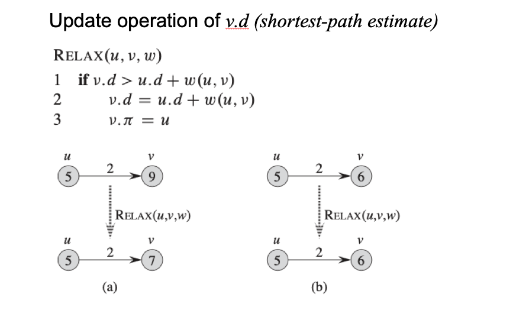
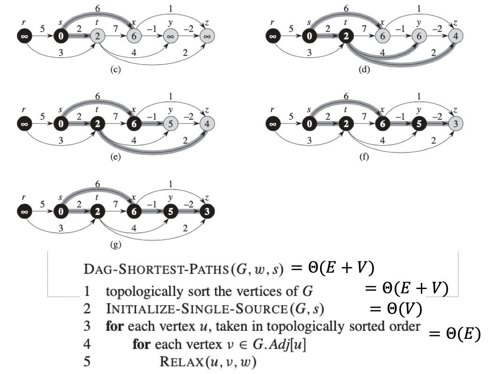
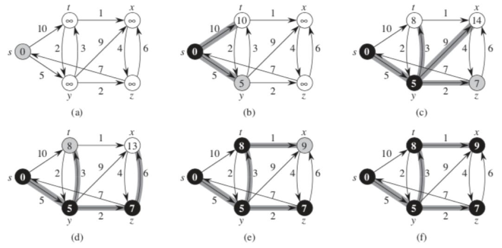

## 알고리즘

#### Single-Source Shortest Path

하나의 정점(시작점) 에서 각 노드에 대해 도달하는 최소 비용을 찾는 것이다. (SSP)

- Bellman-Ford algorithm

  음의 가중치를 허용하며, SSP를 구한다.

- Dijkstra’s algorithm

  음의 가중치를 허용하지 않으며 SSP를 구한다.

1. Single-destination shortest-paths problem : 모든 노드로부터 하나의 도착점까지의 최소값 추적

   에지 방향을 반대로 하고 SSP를 풀어 구한다.

2. Single-pair shortest-path problem : 주어진 출발,도착점에 대해 최단 거리를 찾는 문제. SSP를 풀면 그안에 해가 존재한다. 해당 문제만 푸는 알고리즘의 경우 가장 좋은 SSP의 worst-case와 점근적으로 같기 때문에 SSP로 풀어도 무방하다.

3. All-pairs shortest path problem

   모든 정점에 대하여 SSP를 푼다. 하지만 더 효율적인 방법도 존재하므로 참고할것 (Floyd-Warshall algorithm)

다익스트라 알고리즘의 경우 그리디 알고리즘을, 플로이드 워셜 알고리즘은 동적 프로그래밍을 이용해 구현한다.

##### 음의 가중치 그래프

만일 그래프에 음의 가중치를 가진 사이클이 존재한다면 SSP가 well-defined가 아니다. 즉 사이클에 대하여 경로상 비용의 합이 음수로 측정된다면 그것은 음수 사이클이라 칭하며 이것이 존재하면 최단거리 측정이 불가하다.

벨만포드 알고리즘의 경우 음의 가중치를 허용하기는 하나, 음의 사이클이 존재하는 경우에는 허가하지 않는다. 

다익스트라 알고리즘은 음의 가중치를 허용하지 않는다.

##### Shortest path tree

음수 사이클이 없는 가중치 방향그래프 G=(V,E)에 대하여 출발노드 s, 각 노드 v에 대하여 다음을 계산한다. 처음부터는 최단거리에 대한 값을 모르기 때문에 무한대에서 부터 시작하며 알고리즘을 수행함에 따라 값이 점차 작아진다. 최종적으로는 최단거리 수치와 점근적으로 같아진다. 

기본적으로 최단경로에 대한 연산에서는 Relaxation이 존재한다. 이는 업데이트와 같은 개념이다. 최단 경로에 대한 값을 최신화 한다.

모든 에지에 대하여 수행하므로 relax를 n-1번 수행하면 된다. 최단거리는 사이클을 포함하지 않으므로 노드를 2번 지나지 않는다. 따라서 최악의 경우라도 n-1번의 연산이 필요하다. 

사실 이렇게 구하는 방식이 벨만포드 방식이다. 이는 음수의 가중치 또한 구해낼 수 있다. 

##### Topological sort를 이용한 SSP

그래프에 directed acyclic graph인 경우에 사용 가능하다. 

##### 다익스트라 알고리즘

기본적으로 벨만포드 알고리즘같이 relax하는것이 같으나, 다익스트라 알고리즘은 방문했던 노드로부터 나가는 에지에 대해 최소가중치를 가진 에지만을 택해 traverse를 진행한다. 또한 다익스트라 알고리즘은 음의 가중치를 허용하지 않는다.

검은색이 확정. 회색이 방문에 대한 것이다. 이것은 relax된 노드를 두번 택할 필요가 없다. 