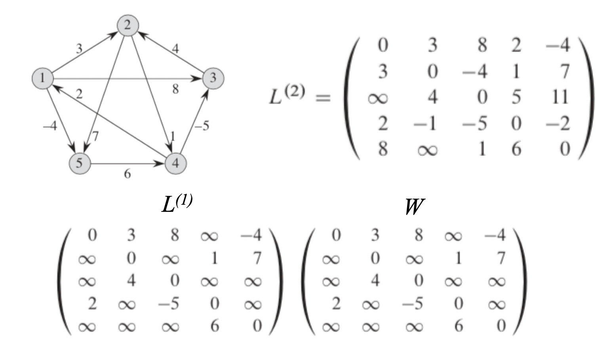
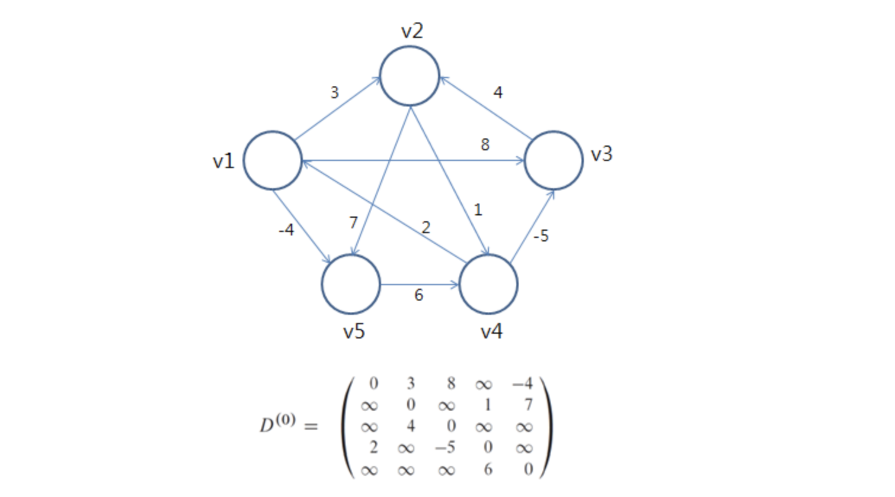
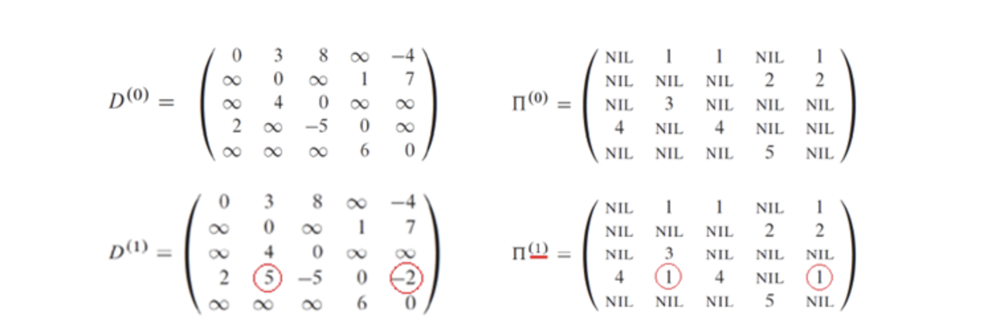
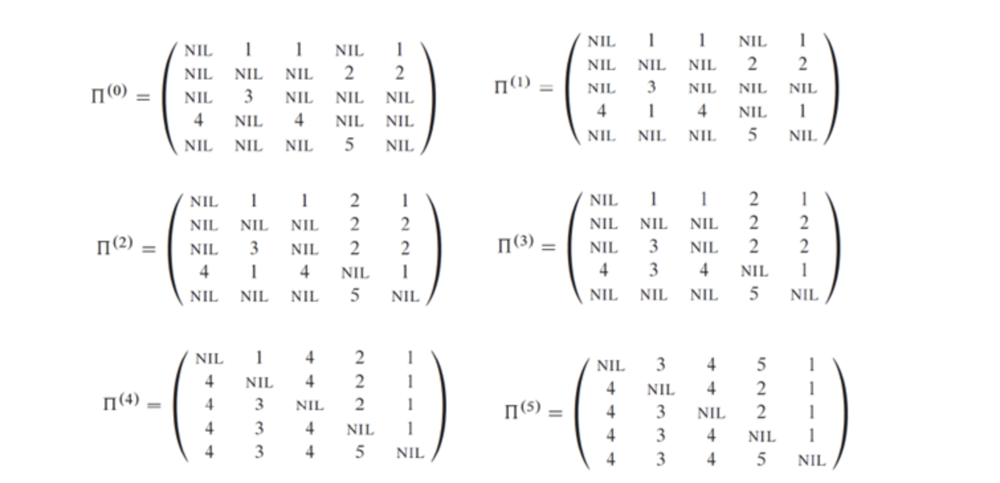

## 알고리즘

##### All Pair Shortest path(ASP)

모든 정점에서 시작하여 모든 정점에 대하여 최단거리를 찾는 알고리즘에 대한 것이다. 이것은 SSP를 구하듯이 구하는 방법이 있지만 이것은 효율이 매우 안좋다.($$O(V^3)$$ 이상임.) 때문에 다른 특수한 알고리즘을 이용한다.

##### Weight Matrix representation (인접행렬 이용)

인접행렬 W에 대하여 원소 $$w_{ij}$$ 는 정점 i로부터 j로 가는 경로에 대한 가중치의 값이다. 0일경우 동일 에지, 무한의 값인경우 에지가 존재하지 않음을 의미한다. 

##### ASP with Matrix Multiplication  : $$O(n^3log{n})$$

동적 프로그래밍의 응용버전의 행렬 곱셈 방법을 이용한 알고리즘.

$$l_{ij}^{(m)}$$ 의 의미는 정점 i로부터 j로 가는 패스중 m개 이하의 에지를 가진 최소 경로를 의미한다. 

인접행렬 w를 가지고,  $$l_{ij}^{(m)}$$ 은 $$Min(l_{ij}^{(m-1)},Min_{1\leq k \leq n}\{l_{ik}^{(m-1)} +w_{kj}\})$$ 이다. 풀어서 설명 하자면, 예를들어 2차 에지를 가진 행렬을 구하기 위해서는 1차 행렬의 동일 위치값과 아래의 값을 비교한다.

전 차항 행렬의 i행의 가로축 각각의 값과 인접행렬 의 j열 세로축 각각의 값을 더한 것중의 최소 값에 대하여 위에서 구한 전차항의 동일위치값 중 더 작은 값에 대하여 $$l_{ij}^{(m)}$$의 값을 부여한다. 

예를들어, 하단의 그래프에 대해 $$l_{12}^2$$ 를 구하면 다음과 같다.

$$l_{12} ^2 = min(l_{12}^1,min_{1\leq k\leq n}(l_{1k}^1 + w_{k2}))$$ 

풀어서 설명하면,l 2차 행렬의 (1,2)의 값은 1차 행렬의 (1,2)행의 값과 1차 행렬의 1행의 가로, 인접행렬의 2열의 세로값의 합을 각각 구한것 중의 최소와 비교해 더 최소인 것을 항으로 하는 것이다. 

단, l4의 경우 l2*l2로 구현하기 때문에 l3가 필요치 않다면 굳이 l3를 구할 필요가 없다. 

1. 전차항의 동일 위치값 구하기 
2. 전차항의 동일 해당 위치 가로의 값, 인접행렬의 동일 해당위치 세로의 값을 각각 더하기
3. 더한것들중 최소를 선택하기
4. 1의 값과 3의 값중 더 작은값을 택한다.

이 행렬곱셈 알고리즘은 시간복잡도가 $$O(n^4)$$ 이지만, 4차항의 경우 2*2로, 8차항은 4\*4로 처리가 가능하므로 $$\Theta(n^3logn)$$ 까지 줄일 수 있다. 

##### Floyd-Warshall algorithm : $$O(n^3)$$

두 정점에 대하여 최단 경로가 p 라고 할때, p의 양 끝점 (시작점, 도착점) 을 제외한 나머지 정점에 대한 집합을 최단 경로의 중간 정점 이라고 한다. 플로이드 워셜 알고리즘은 어떤 한 정점이 이 중간 정점 집합의 원소가 되는지 안되는지를 파악하는 것이다.

어떤 한 정점이 중간 정점 집합에 포함되어 더 비용이 적은 최단 경로를 만드는지 아니면 기존의 중간 정점 집합을 유지하는 것이 더 나은지를 판단하는 것이다.

이러한 알고리즘의 고려가 가능한 이유는 음의 가중치를 허용하기 때문이다. 

다음을 정의한다. 
$$
d_{ij}^{(k)} = Min(d_{ij}^{(k-1)},d_{ik}^{(k-1)} +d_{kj}^{(k-1)})
$$
$$d_{ij}^{(k)}$$ 를 구한다는 것은 어떠한 정점이 $$d_{ij}^{(k-1)}$$ 의 중간 정점 집합에 포함 되는 지 아닌지를 파악하는 것이다. $$d_{ij}^{(k)}$$ 가 $$d_{ij}^{(k-1)}$$ 와 같은 형태라면 새로운 정점이 포함되어도 가중치가 변하지 않는다는 의미이다. 반대로 새로운 정점을 중간 정점 집합에 포함하여 가중치가 낮아진다면 $$d_{ij}^{(k)} =. d_{ik}^{(k-1)} + d_{kj}^{(k-1)}$$ 이다. 

예를들어 다음과 같은 그래프가 존재한다고 한다면,

$$D^0$$ 의 경우 인접행렬이다. $$D^{(1)}$$ 에서 보면 (4,2)의 값이 변경되었는데 ,위에서 봤던 식을 적용시켜 나온 과정을 살펴 본다면
$$
d_{42}^{(1)} = Min(d_{42}^{(0)},d_{41}^{(0)} + d_{12}^{(0)}) 
$$
이므로 뒤에 것이 2+3 =5이므로 더 작은 값이므로 이것을 넣는다. k차수는 중간 에지가 몇 개 이하로 나타나는지를 나타내므로 중간 정점이 1개 이하인 (4,2) 의 최단 경로는 4->1 -> 2 가 되는 것이고 가중치는 5이다.

이 값은 최단 경로에 대한 **가중치** 이다. 최단 경로 그 자체를 구하려면 $$\pi$$ 를 추가 표현하여 얻어 낼 수 있다. 

$$d_{ij}^{(k)}$$ 에 대하여 이 값이 업데이트 되는 경우 $$\pi _{ij}^{(k)} = k$$ 가 된다. 

위의 그림럼 선행자 행렬을 구한다. 위 그래프에 대한 선행자 행렬의 결과는 다음과 같다.

예를 들어 4 정점에서 2정점의 최단 경로를 알고 싶은 경우, 결과 선행자 행렬은 위와 같으므로, 먼저 (4,2) 에 대한 값을 본다. 그러면 값이 3이고, (4,3)을 파악한다. 그러면 4가 나오고 (4,4)는 NIL이므로 끝낸다. Nil이 나오기 전의 값을 거꾸로 올라간다. 그러면 4,3,2가 나오고 이것이 최단 경로가 된다. 

1. (a,b) : a에서 b로 가는 최단 거리를 구하러면 $$\pi_{ab}^{(k)}$$ 의 값을 본다. 나온 값을 m1이라 하자. 
2. 그다음 $$\pi_{am_1}^{(k)}$$ 의 값을 본다. 나온 값을 m2라 하자.
3. $$\pi_{am_2}^{(k)}$$ 의 값을 찾는다.  이런 방식으로 NIL이 나올때까지 수행한다.
4. NIL로부터 거꾸로 나온 값을 파악한다. 
5. 도착지점을 넣어준다.