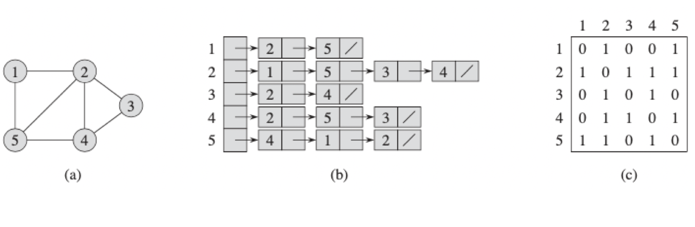
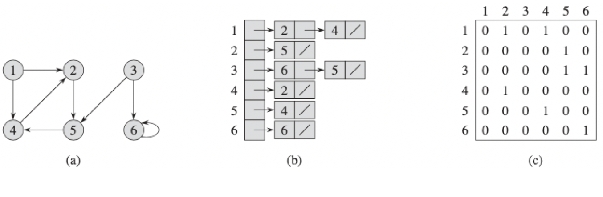
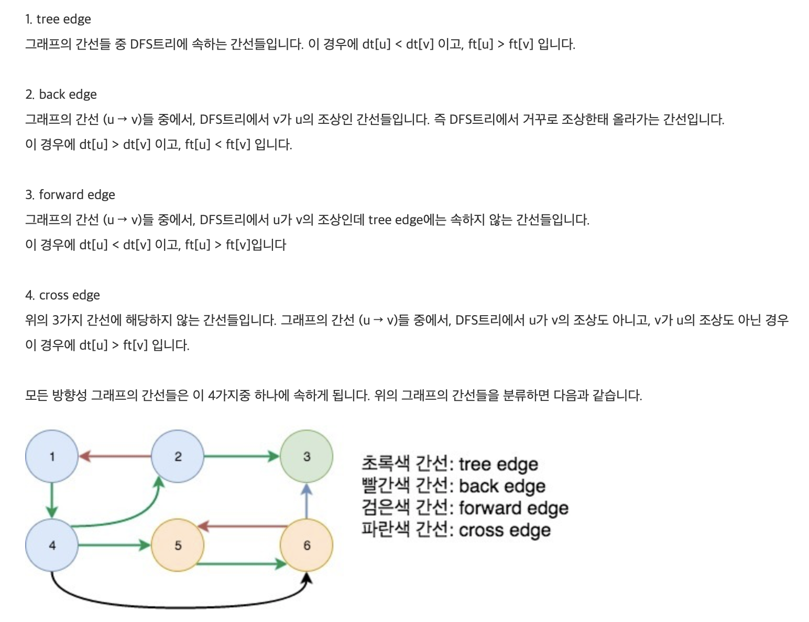

## 알고리즘

#### Graph Algorithm

##### 정의

노드들(또는 버텍스라고 부름) 이 있으며 이를 연결하는 에지(edge)들이 있다.  노드의 페어로 에지를 나타낸다.

1. 비 방향성 그래프(undirected graph)

   에지의 방향이 존재하지 않는다. 그저 연결되어 있음을 의미하며 쌍으로 표현한다.

   $$V = \{u,v\},E=\{(u,v)\}$$

2. 방향성 그래프(directed graph)

   에지가 방향이 존재한다. 

   $$V = \{u,v\},E=\{(u,v)\}$$

   한편 비 방향성 그래프는 양쪽 방향으로 방향성이 있는 방향성 그래프와 동일하므로 다음과 같이 표현할  수도 있다.

   $$V = \{u,v\},E=\{(u,v),(v,u)\}$$

- v에서 u 로의 path는 $$\sum^k_{i=0}{(v_0,v_1,v_2,...,v_k)}$$ 이다. $$v_0 =v,v_k=u,and (v_i,v_{i+1}\in E)$$ For $$i=0,1,2,...k-1$$ 

- 그래프 G에서 u가 u'에 도달하는 path p를 가진다면 u'은 u에 도달할 수 있다.
- path의 길이는 path의 에지의 개수로 정의 된다.
- 사이클이란 $$v_0 = v_k$$가 되는 경우를 말한다. 
- 모든 페어가 Path로 연결되었다면, 이 비 방향성 그래프는 연결되었다고 칭한다. 
- forest란 사이클이 없는 그래프이며, 트리는 연결된 사이클이 없는 그래프 이다.
- 에지에 가중치가 존재하는 그래프를 weighted graph라고 한다.

##### Tree

A connected acyclic graph. 노드 갯수 -1의 에지를 가진다. 모든 노드 페어에 대하여 하나의 경로만을 가진다. 하나의 에지를 추가하면 사이클 있는 그래프가 된다. 하나의 에지를 제가하면 연결이 끊어진 그래프가 된다.

##### Representation of a Graph 

그래프는 인접 매트릭스 또는 인접 리스트로 묘사 가능하다. 매트릭스의 경우 노드 i,j에 대해 $$a_{i,j}$$ 값이 1이라면 연결된 것이다. 가중치 그래프의 경우 1이 아닌 가중치 값이 들어온다. 인접 리스트의 경우 2차원 배열 형태로 표현된다. 

그래프가 n개의 노드를 가진다면 인접 매트릭스의 경우 $$\Theta(n^2)$$ 의 공간이, 인접 리스트의 경우 $$\Theta(E+V)$$ 의 공간이 필요로 한다. 

- Undirected Graph

- Directed Graph

##### Graph Traversal

BFS(Breadth First Search) 나 DFS(Depth First Search)를 이용하는 편.

##### BFS

$$O(V+E)$$ BFS는 시작 지점으로부터 도착점에 대한 가장 짧은 경로를 추적한다. 큐를 이용해 구현한다.

1. 현재 노드에 대하여 인접한 노드들을 큐에 넣는다.
2. 현재 노드를 빼고 다음 노드에 대하여 1을 재수행 한다.

##### DFS

모든 노드를 방문하고자 할 때 이용한다. 루트노드에서 부터 시작해 다음 분기로 넘어가기 이전에 해당 분기를 모두 파악하고 넘어간다. 미로를 찾는 문제와 같은것이 이 DFS를 이용한다. 

자기 자신을 호출하는 순환 알고리즘이며, 어떤 노드를 방문했는지 반드시 검사해 주어야 한다. 

##### Topological Sort

어떤 일을 수행하기 위한 순서를 찾는 것이라고 할 수 있다. 

1. 진입 차수가 0인 노드를 택하여 큐에 넣는다. 
2. 디큐 할때 진입 차수가 0인 것을 찾아 큐에 진입시킨다.
3. 모든 노드가 제거 될 때까지 반복한다.

##### Strong connected components

강결합 컴포넌트는 방향성 그래프에서 다음 두 조건을 만족할 경우 강결합 컴포넌트라고 한다.

1. SCC내의 임의의 두 정점 u, v사이의 u → v 경로와, v → u 경로가 항상 존재한다.

2. SCC내의 임의의 정점 u와, 외부의 임의의 정점 v 사이에, u → v 경로와, v → u 경로가 동시에 존재하는 경우는 없다

모든 방향성 그래프는 1개 이상의 SCC들로 분리 될 수 있다.

##### 오일러 투어

SCC에 대하여 각 정점에 한번 이상 갈 수 있지만 정확히 각 정점에 대하여 한번씩 방문하는 것을 뜻함. 이것은 $$O(E)$$ 이다.

