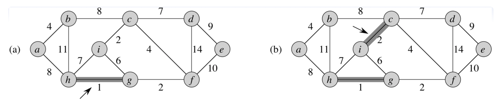
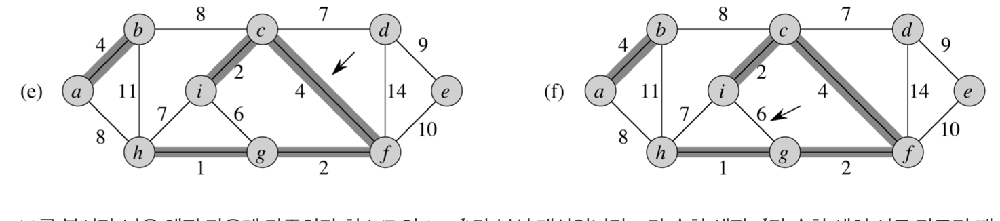

## 알고리즘

#### 최소신장트리(Mininum Spanning Tree)

##### 정의

그래프 내의 모든 정점을 포함하는 트리. 이 트리는 그래프의 최소 연결 부분 그래프이다. n개의 정점을 가진 그래프에 대하여 n-1개의 에지를 가진 그래프라면 이것은 필히 트리모양이 된다.  이것을 ST라고 칭한다. 이것은 사이클을 포함할 수 없다. 

비 방향성 가중치 그래프에 대하여 수행한다. 최소 신장 트리의 경우 스패닝 트리 중에서 가장 작은 가중치를 가진 트리를 칭한다. 우리는 두가지 알고리즘을 이용해 MST를 수행한다.

- Kruskal's algorithm
- Prim's algorithm

##### Generic-MST algorithm (Kruskal's algorithm)

분석 대상 노드에 연결된 엣지 가운데 가중치가 최소인 엣지를 고르되, 이렇게 추가된 엣지로 그래프가 트리 속성이 깨지지 않는지 여부를 체크하는 방식으로 작동합니다. 이때 가중치가 최소인 엣지를 *light edge*, 추가 엣지로도 트리 속성을 만족하고 있다면 해당 엣지를 *safe*하다고 합니다. 요컨대 크루스칼 알고리즘은 *safe*하고 *light*한 엣지를 반복적으로 찾아가는 기법입니다$$.^{[1]}$$

시작노드에 대한 값은 존재하지 않는다. (가장 작은 값을 기준으로 시작하기 때문)

1. 모든 에지에 대하여 가중치를 기준으로 오름차순 정렬을 수행한다.
2. 가중치가 가장 작은 에지에 대해 safe edge인지 파악하고 union연산을 수행한다.

(a) 를 보면 h,g 노드에 대한 에지가 가중치 1로 가장 작다. 또한 이 에지는 트리의 속성을 해치지 않으므로 safe하다. 둘을 유니온 연산한다. (b)를 보면 가중치가 2인 에지가 가장 작다. 그리고 해당 에지또한 트리의 속성을 해치지 않으므로 safe하다. 이렇게 계속 파악해가면서 set을 합치는 연산을 지속 수행한다.

(f) 를 보면 6이 가장 작은 가중치 지만, 해당 에지는 서로 다른 set을 연결하지 않는다. 이는 cycle이 생기게 한다는 뜻이고 트리의 속성을 해치는 것이므로 safe하지 않은것이다. 때문에 해당 에지를 택하지 않는다. 위와 같은 방식으로 모든 에지에 대해 검사를 수행한다.

##### Prim's Algorithm

Solution set과 non solution set으로 나뉜다.(이하 SS,NSS) SS에서 NSS로 연결되는 edge중 트리의 속성을 해치지 않으면서 최소 가중치를 가진 edge를 택해 SS로 넣는 방식의 알고리즘을 Prim's algorithm이라고 한다. SS로 모든 노드 가 진입한 경우에 알고리즘을 종료한다. 

##### 출처

1. https://ratsgo.github.io/data%20structure&algorithm/2017/11/28/MST/