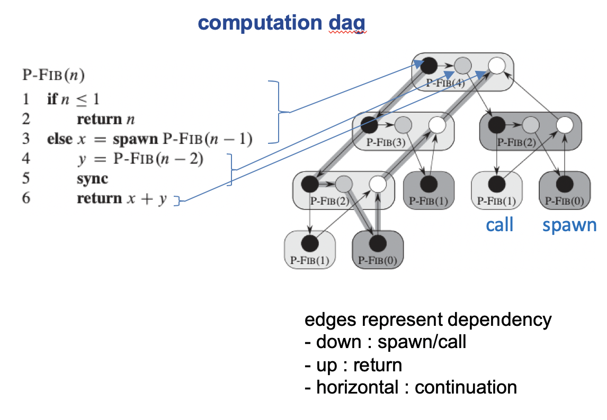
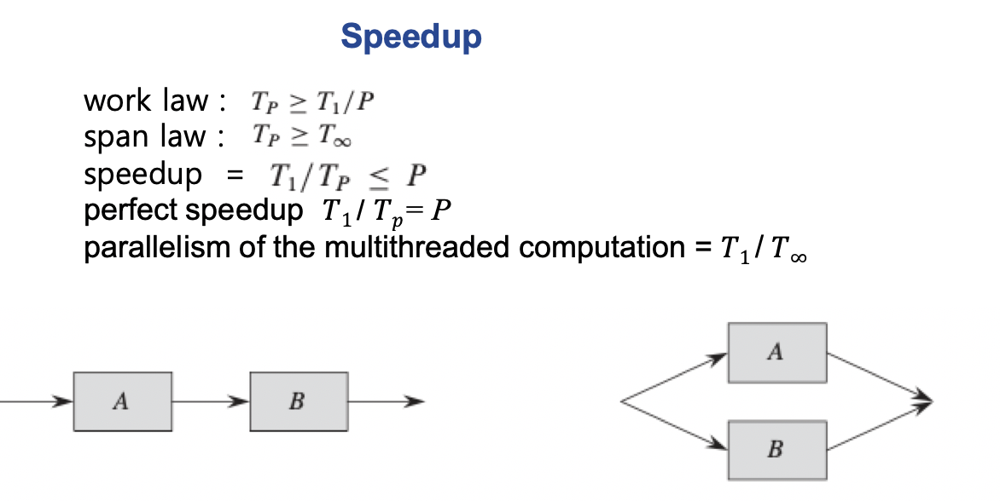

## 알고리즘

#### Multi thread

##### Computation dag

위 그래프를 하나의 프로세서로 처리하면 17의 시간이 소요되지만, span의 방식을 택한다면 critical pathdㅢ 개수만 세면 되므로 8로 줄어든다. (processor가 충분히 많을 때)

멀티 스레드 병렬처리의 계산 시간은 $$\frac {T_1} {T_\infty}$$ 이다.그러므로 parallelism 으로 처리하면 $$\frac{\Theta(n^2)}{\Theta(n)} = \Theta(n)$$ 이 된다. 

Matrix multiplication또한 Multithread로 처리한다면 본래 1개 스레드로 처리할때에는 $$\Theta(n^3)$$ 이지만 $$\Theta(n^2)$$ 로 처리 가능하다. 