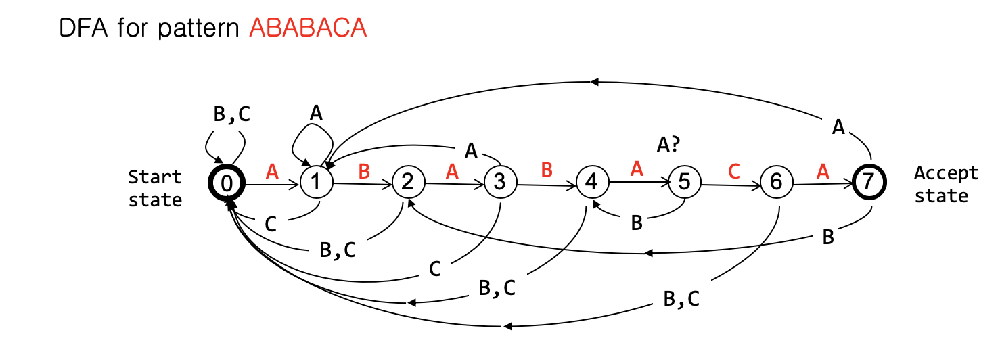

## 알고리즘

#### String Matching

##### Naive Algorithm (Bruth force)

문자열 패턴 P에 대하여 문자열 S내부에서 P를 찾아내는 것인데, 일일히 파악하며 나아가는 방식이다. : $$O(ps)$$ 만큼의 시간복잡도가 요구된다. 

##### Knuth,Morris,Pratt(KMP) Algorithm

이 알고리즘은 직전 파악했던 정보를 이용해 뒤로 넘어가는 방식을 취하는데 먼저 다음 두가지의 요소를 알아야 한다.

- suffix :  접미사. 뒤에서부터 읽기
- Prefix :  접두사. 앞에서 부터 읽기

문자열을 찾을때 일치 하지 않다면 찾는 패턴의 크기만큼 뛰어넘는다. 가 이 알고리즘의 중요 요소인데, 이것은 다음과 같은 문제가 존재한다.

> ABCDABCDABEAAAA 문자열에서 ABCDABE를 찾을 경우에는 인덱스 6에서 틀리기 때문에, 크기만큼 넘겨보자.
>
> **ABCDABC**DABEAAAA=> 크기만큼 건너뛰기ABCDABC**DABEAAA**A
>
> 인덱스 6 전에 인덱스 4,5의 요소 AB라는 녀석 => 찾을 문자열에 포함되는 녀석이 있다.
>
> 무작정 크기를 통해 넘기면 안되는 것을 확인했다.

때문에 패턴에 대하여 suffix와 prefix가 같은 최대 범위를 찾아 실패함수를 가지고 pi라는 배열을 이용해 건너뛰게 된다. 

Ex)

ABCDAB

A - 0

AB - 0

ABC - 0

ABCD - 0

ABCDA - 0

**AB**CD**AB** - 2

위 값이 pi에 들어가 있고 패턴을 문자열에 비교 할 때 어디까지 같았는지에 따라 그만큼 건너뛴다.

예를들어 ABABC라는 패턴이 존재한다고 하자. ABAB까지 일치 했는데  C에서 달랐다. 그러면 ABAB = 2 이므로 이 값만큼 건너 뛰고 다시 비교 알고리즘을 수행하면 된다. 

##### Deterministic Finite Automaton(DFA)

