### Compare Sort

1. Insertion Sort

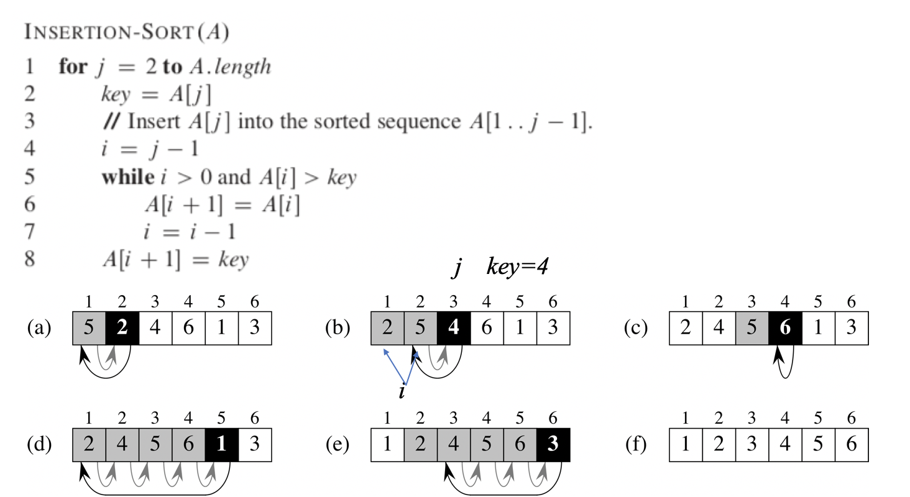

#### Divide And Conquer

1. Merge Sort

   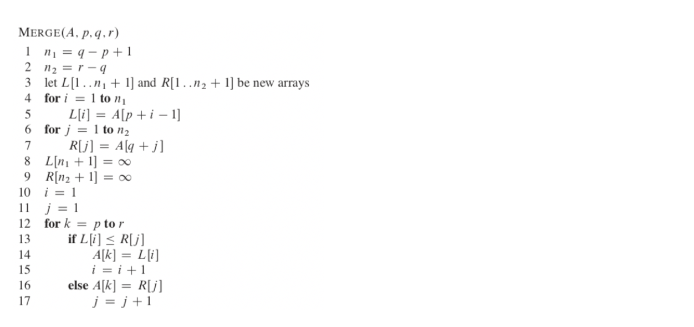

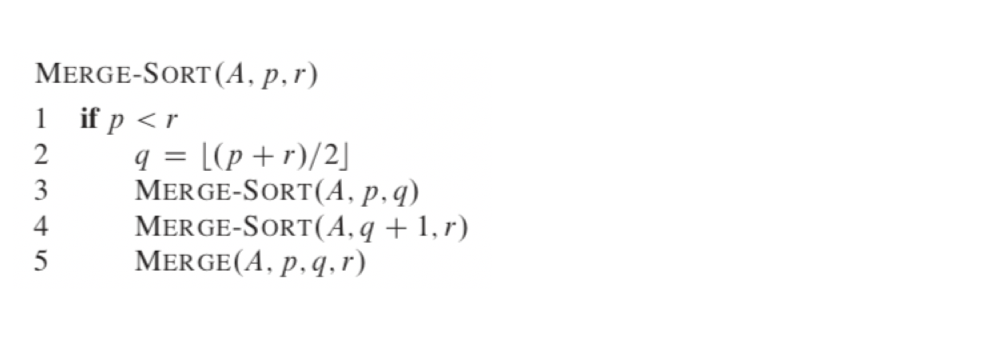

2. Brute-force (주먹구구)

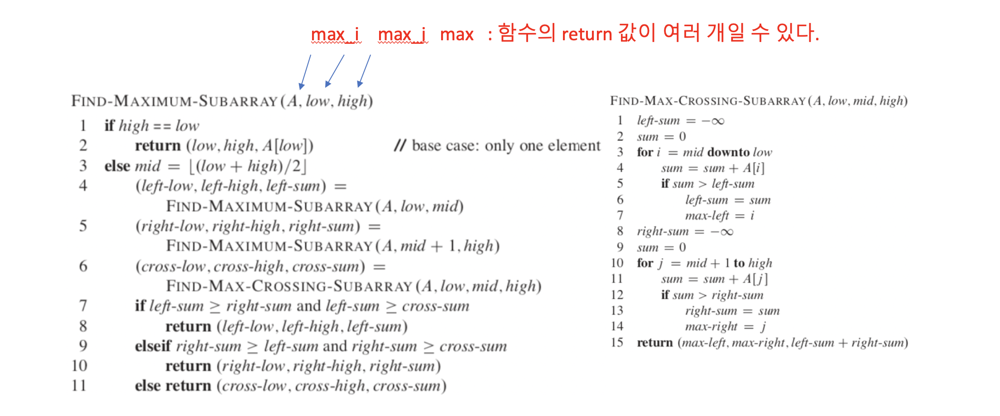

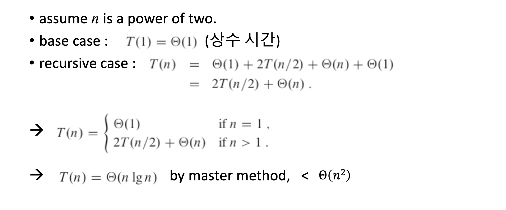

3. Matrix Multiplication

   - Brute force Matrix Multiplication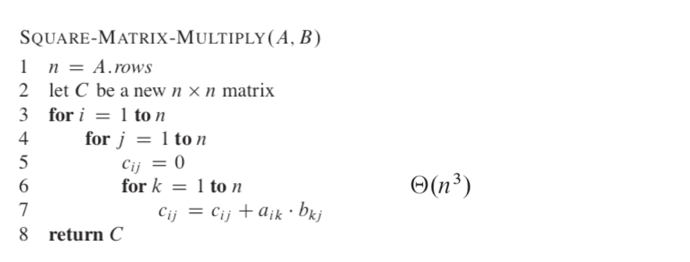

   - Strassen’s (Divide-and-Conquer) matrix multiplication

#### Recurrence

1. 치환법 (substitution method)

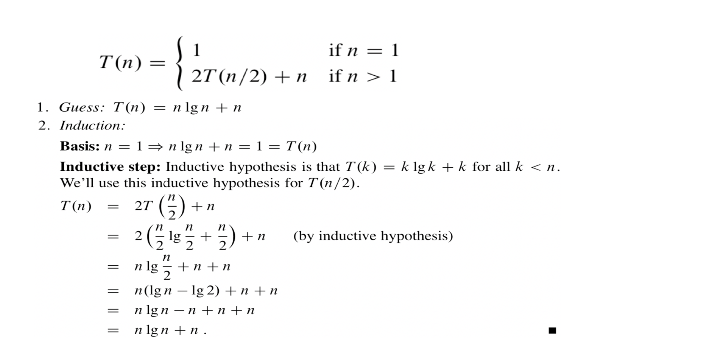

2. 재귀 트리 방법

3. 마스터 방법

#### 확률적 분석과 랜덤화된 알고리즘

1. 고용 알고리즘

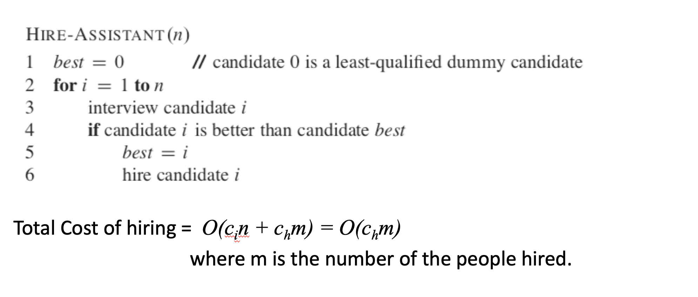$$O(c_hn)$$ -> 매번 다음 지원자가 이전 지원자보다 유능할 때 (Worst case)

2. 지표 확률변수의 예 - 동전 던지기

확률적 분석을 할 때는 입력의 분포에 따라 계산하여 average-case cost (or running time) 을 계산

랜덤화된 알고리즘을 분석할 때는 입력의 분포와 상관없이 expected cost (or running time) 을 계산 

#### Sort

1. Heap sort

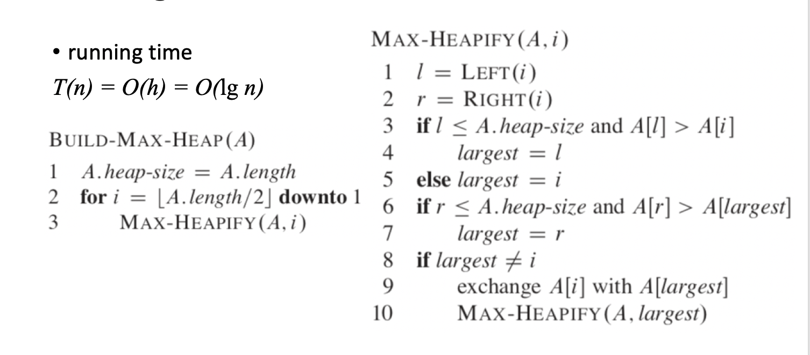

2. Quick Sort

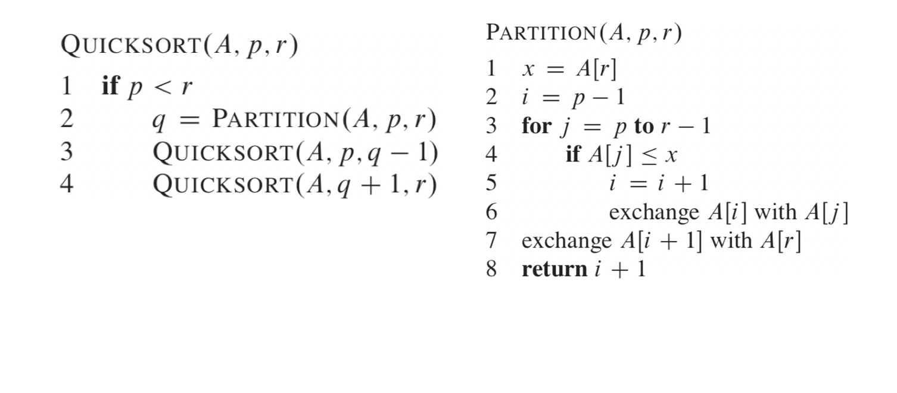

3. Counting Sort

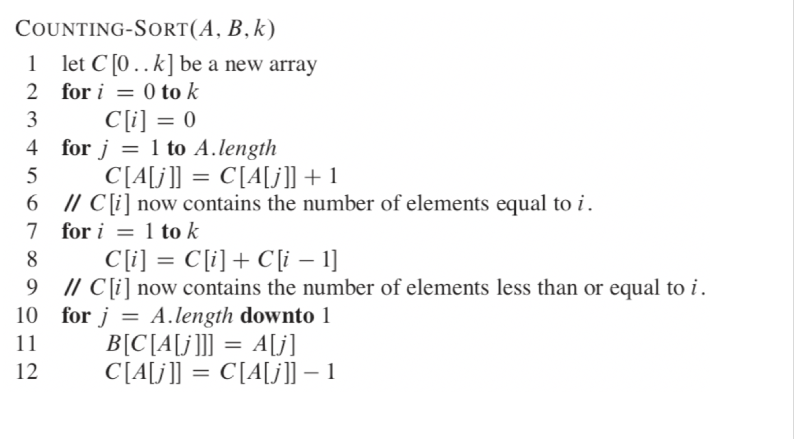

4. Radix Sort

5. Bucket Sort

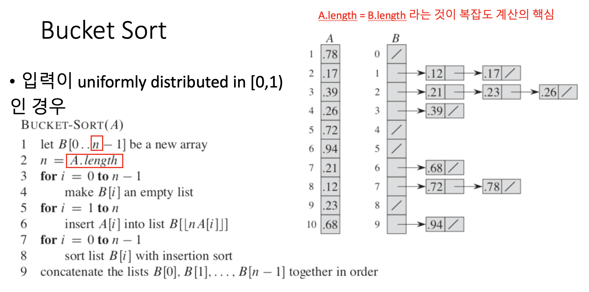

#### Dynamic Programming

- rod cutting

  1. Top Down

     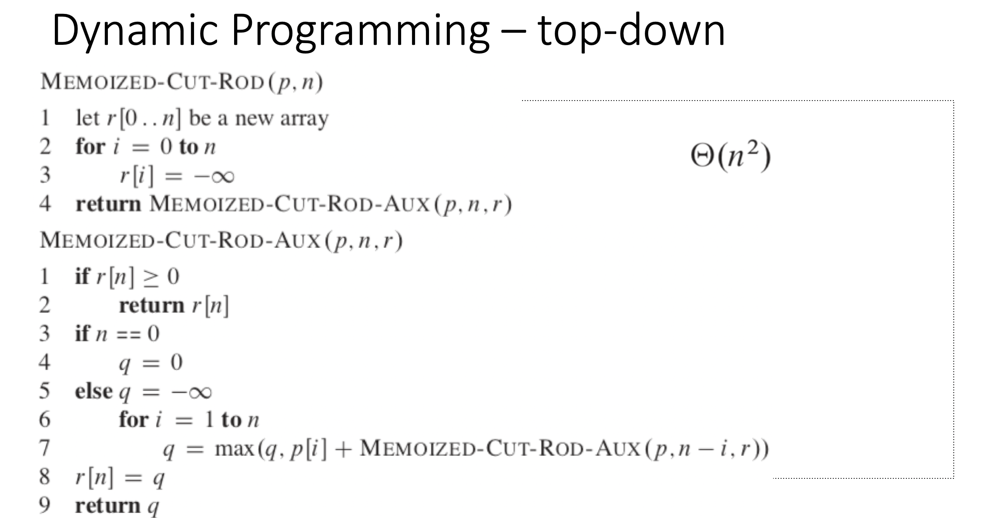

  2. Bottom Up

     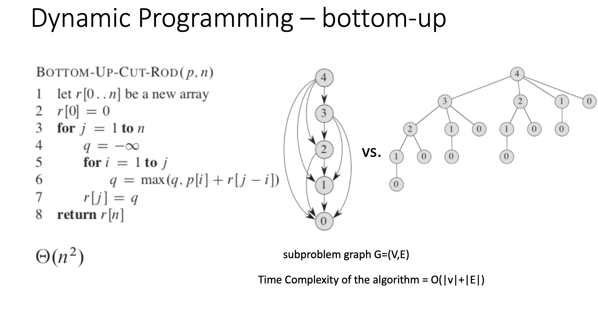

- matrix-chain multiplication

  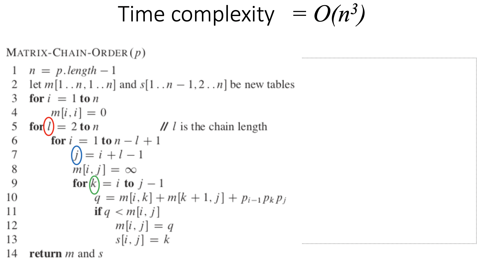

- longest common subsequence

