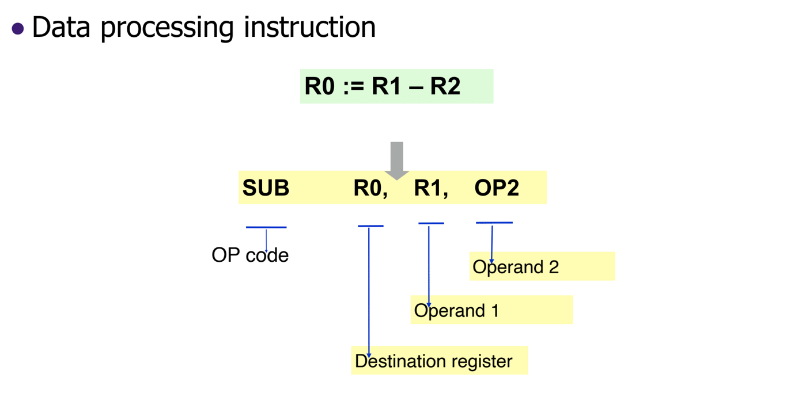
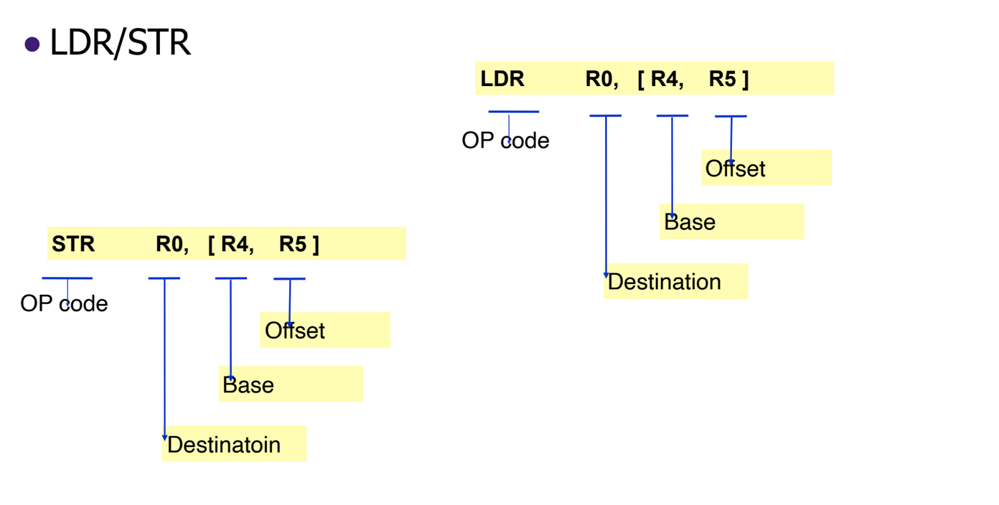
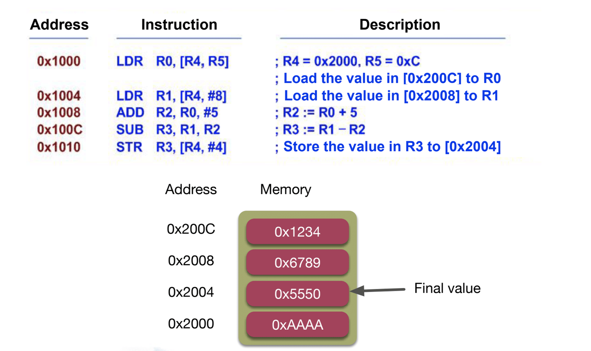
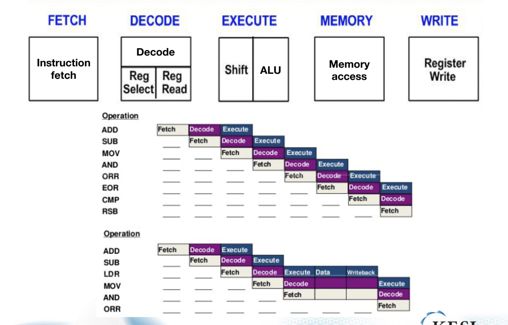
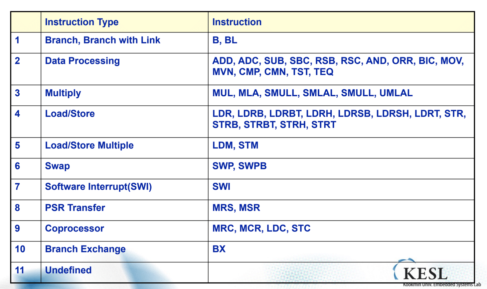
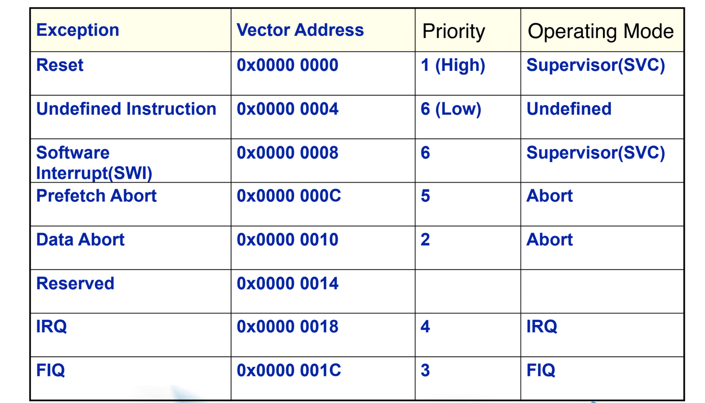

## 임베디드시스템설계

단답형 서술형 문제유형. 이번주 월 수 집중적. 실습내용이 평가되지는 않음. 이론에서 나오는데 난이도는 평이. 강의의 흐름에 대한 질문이 주를 이룰것.

1014

#### ARM

Acorn RISC Machine or Advanced RISC Machines

RISC기반의 아키텍쳐이다. CPU에 대한 도면을 판매한다. 일반적으로는 생산까지 해서 판매하는 경우가 많으나 ARM은 설계를 판매한다.

##### Programmer's model

프로그래머가 아닌 컴파일러를 위한 모델이라고 할 수 있다. 

Programmer's model Components

- Instruction set
- Data access architecture
- Operation mode
- Register architecture
- Exception Handling mechanism

ARM CPU구조는 다양한 버전이 존재하고, 회사들이 다양하게 변형하여 이용한다.

##### ARM Instruction

*ARM 시스템의 예*

ARM은 메모리 엑세스를 기본적으로 허용하지 않는다. 레지스터에 대한 것만 인정하는데 예외가 존재한다. STR/LDR 연산이다. 

- LDR

  메모리로부터 로드한다. 메모리 주소 지정을 레지스터로 수행한다.

- STR

  메모리에 대한 저장이다. LDR과 유사한 방식을 취한다.

이제 우리는 ARM에 대한 어셈블 인스트럭션을 대략적으로 바로 해석가능하다. 예시를 보자.

R4와 R5를 가지고 메모리의 값을 불러오고 연산을 수행한 뒤 저장하는 코드이다.

##### Pipelines

LDR같은 것을 만날 경우 읽은 값으로 수행해야 하므로 지연되어야 한다. 메모리가 엑세스 될 경우 CPU가 지연된다고 생각하면 된다. 

##### ARM Instruction Set

기본 32bit의 모드를 ARM Instruction 이라고 한다. 16bit에 대한 모드도 있는데, Thumb instruction이라고 하며 모바일 등에서 제약을 걸기 위해 다운그레이드 해서 이용하기도 한다 (전력 소모를 줄이는 등의 이유로 인해)

##### 32 Bit ARM Instruction Set

IS의 갯수가 많지 않다. 간결하고 적다. 크게 봤을때 10가지 정도로 구분 가능하다.

##### Operating Mode

ARM에서만 제공하는 특별한 기능이다. OS 및 사용자 자체도 이 구조를 알고 있어야 한다.  주로 Exception이라고 불리는 특별한 경우에대해 ARM CPU가 이 변화에 대해 수행한다. 

메모리 접근의 불가/가능 , 명령어 사용가능/불가 와 같이 해당 상황에 맞게 변화한다. 

- User mode

  일반 프로그램에 대한 명령 수행등이 나타난다. 기본적으로 제약이 많아지게 되는데 이는 유저에 대한 신뢰가 없기 때문이라고 볼 수 있다.

- FIQ / IRQ (Fast Interrupt Request / Interrupt Request)

  Interrupt 에 대한 모드

- SVC (supervisor)

  커널에서 사용하는 시스템콜 등의 인스트럭션을 위해 User mode에서 Supervisor로 전환하게 된다.

- Abort Mode

  memory access violations , 허가 받지 않은 메모리 엑세스가 발생한다.

- Undefinded Mode

  알지 못하는 Instruction이 발생한다면, 해당 모드가 발생한다.

- System mode

  주로 SVC에 먼저 진입하고 System모드로 진입한다. 주로 커널이 조심스럽게 다뤄야 하는 메모리 접근에 대해 이용할때 발생한다.

SWI라는 것만을 통해서 Normal mode(User mode) 에서 다른 Privileged mode 로 진입 가능하다. 대부분은 Normal mode에서 사용자가 이용하게 된다. 

Exception에 대해 각 Exception에 맞는 모드가 짝지어져 존재한다고 볼 수 있다. 시스템 콜에 대해 HW가 자동적으로 User mode 와 SVC 모드를 전환한다. ARM의 SWI명령어를 통해 시스템 콜에 접근한다.

##### Exception Vectors

어떤 이벤트가 발생하는 상황에 대해 미리 대응책을 마련해 놓고 이용한다.

- Reset 

  전원이 처음 인가됬을때, 또는 Reset에 대한 입력이 되었을때 발생한다. 실행에 대한 초기 수행이기 때문에 이것은 가장 높은 순위로 잡혀 있다. 리셋에 대한 핸들러를 여기에 작성하라는 의도가 아니라, 다른 곳에 여유롭게 작성한뒤 이곳에 Address만 적고 그곳에 이동하라는 Instruction을 작성한다. 때문에 빽빽하게 작성한다.

Exception이 발생한다면 해당 Exception에 대한 Vector Address로 이동해서 동작한다. 

FIQ가 실시간 성이 좀더 높은 Interrupt이기 때문에 순위를 IRQ보다 높게 잡는다. 신속한 대응이 필요한 Interrupt들이 들어간다. 그런데 보면 FIQ가 마지막 주소에 위치하는데, 이것은 **Branch를 제외하고 신속하도록 처리하게 하기 위함이다**. 총 3가지가 존재하는데 한가지 이유가 이것이다.

##### ARM Registers

30개의 레지스터가 존재하지만, 실제로 이용할 수 있는 레지스터는 더 적다. 

- PC : R15

- Current Program Status Register(CPSR)

  추가 여분으로 들어가게 되는 Register

- Saved Program Status Register(SPSR)

전용 레지스터를 FIQ에 대해 더 할당해 주어서 더 빠르게 처리 하도록 한다.(두번 째 이유)