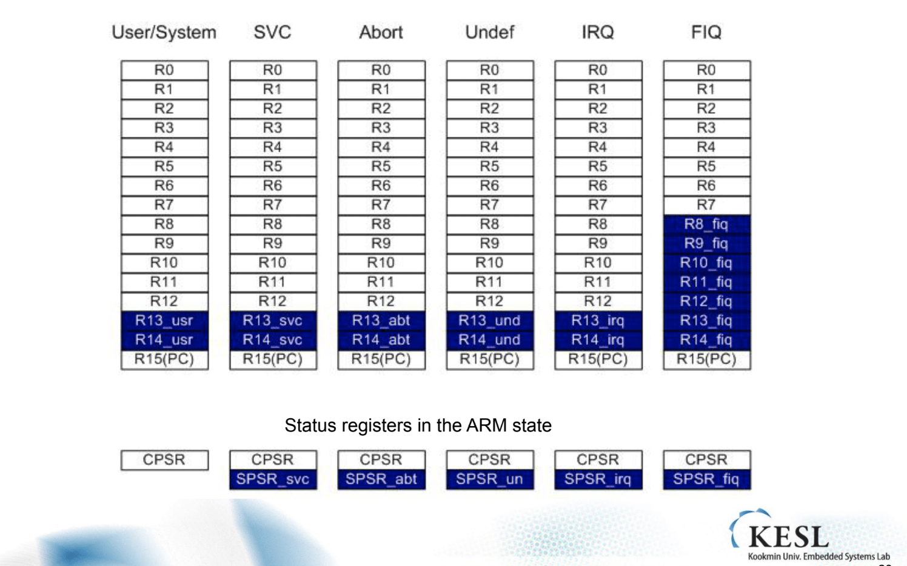
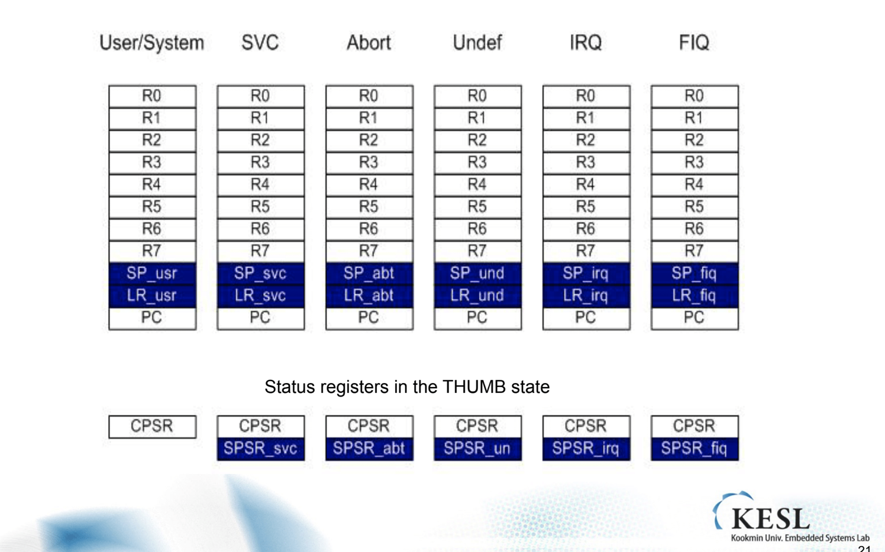

## 임베디드 시스템 설계

1016

##### 시험

시험범위는 1~5 Chapter 이며 큰 그림을 알고 있는지 1~2줄의 서술형 스타일의 문제 비중이 높다. 세세하게 디테일 높게 보지 않아도 된다. 그저 어떠한 흐름의 것이 존재하는지를 알면 된다.

##### Operating mode

ARM CPU는 큰 그림으로 normal mode 모드와 Operating mode가 존재한다. normal mode는 권한이 가장 적은 모드이다. 위험한 동작에 대한 방지 차원에서 이렇게 한다. MMU에서 지정된 Memory 주소 이외의 곳을 접근 하려고 한다면 접근 하지 못하도록 막는다. 

특별한 Exception에 대해서만 커널 모드에 진입이 가능하다. 이외의 경우에는 진입이 불가하며, 각 Exception에 대한 모드가 존재한다. 

##### Exception Vectors

##### FIQ

FIQ에 대한 우선권 세가지(IRQ에 비해)

1. 다른 Instruction은 Branch를 넣어 이용하게 만들었지만, FIQ는 맨 뒤에 두어 메모리를 넓게 사용해 즉각적으로 처리 하게끔 만들었다. 

2. Priority를 IRQ보다 한단계 높게 두어 먼저 처리하게 했다.

3. 더 많은 섀도우 레지스터를 가지고 다닌다. 

##### 다목적 범용 레지스터(General Purpose registers)

다양한 목적을 위해 접근 가능한 레지스터.

##### Special Register

PC와 같이 특정한 목적을 위해 이용되는 레지스터. 쉽게 접근 가능하지 않다. 

- CPSR(current Program Status Register)
- SPSR(Saved Program Status Register)

흰 색 셀은 범용 레지스터, 파란색은 섀도우 레지스터이다. 범용 레지스터의 경우 공유해서 사용해야 하기 때문에 기존에 돌아가던 프로그램에 Context에 대한 부분중 중요한 부분이 레지스터의 상태인데, 이것을 백업 시켜놔야 한다. 이것은 메모리로 가서 저장되었다가 다시 꺼내 이용한다.

그런데 파란색 섀도우 레지스터의 경우 계속 가지고 이용한다. 전용 레지스터 같은 것인데, 그 Exception이 가지고 다니는 Register이다. FIQ는 더 많은 섀도우 레지스터를 가진다.

##### Thumb Mode Register

