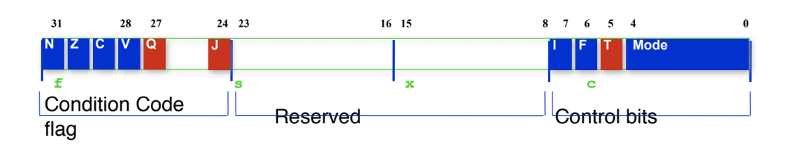
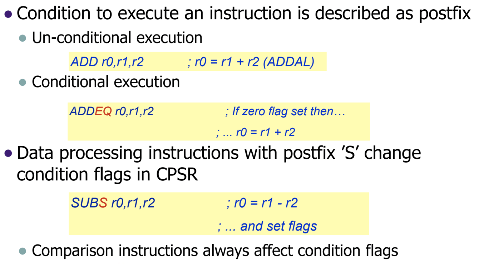
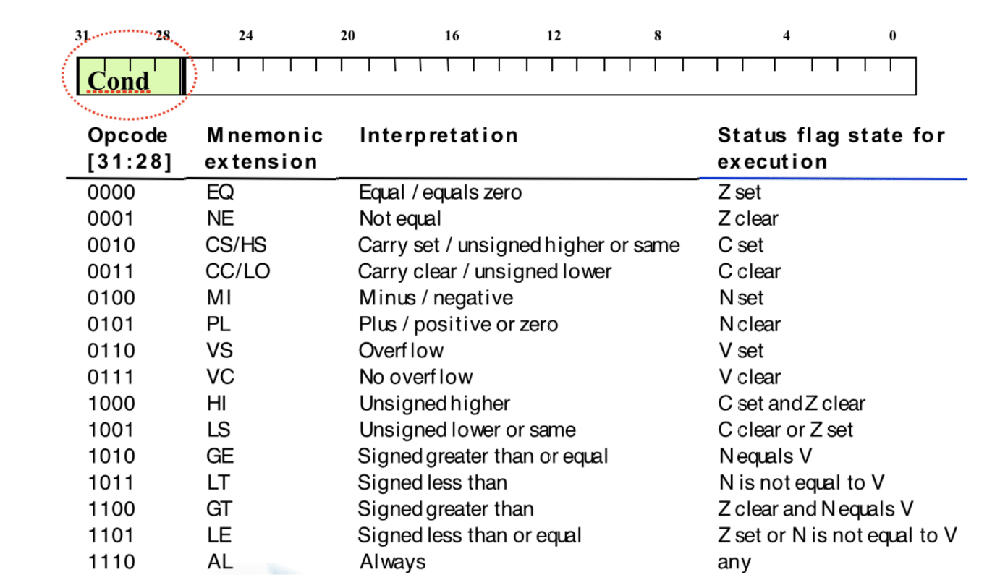
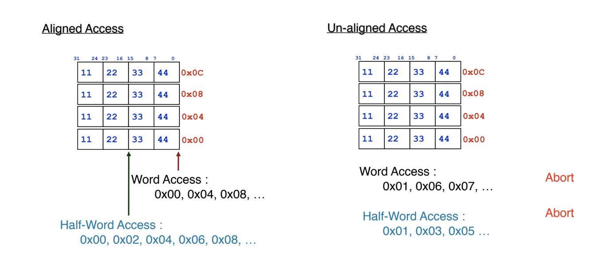
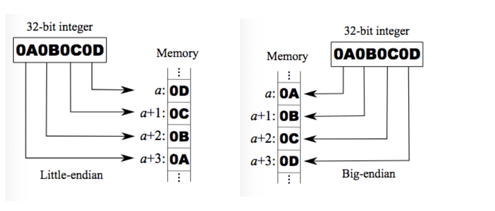

## 임베디드시스템설계

1028

##### ARM - Program Status Register

1CPSR 과 5 SPSR 이 있다. 이 PSR 내부에는 Condition flag와 Control bits가 들어있다.

##### Flag bits

직전 ALU 계산 결과의 값에 대한 플래그가 들어간다.

- N : 결과 음수값이였다.
- Z : 결과가 0이였다.
- C : Carry bit.
- V : Overflow bit.

추가 비트로 Q와 J 비트를 가진다. 좀 더 특별한 상황에 이용한다.

##### Conditional Excution - 16p

명령 수행 결과가 NZCV비트에 저장이 되는데, 이것을 가지고 일을 한다.

처음 경우에 대해서는 디폴트로써, 그냥 덧샘을 수행한다. 그런데 두번째 보면 EQ가 붙어있다. 이는 r1과 r2가 같으면 더하겠다는 instruction인데, 이런 instruction이용시 flag비트를 확인하는 것이다. 

만일 플래그 확인하지 않고 이용시, 자연적으로 브랜치가 발생하며 pipeline이 지연되며 연산이 늦어지는 결과가 나온다. 연산을 빠르게 수행하고자 최근 Condition에 대한 정보를 플래그 값으로 가지고 있고 연산에 대해 이용한다. 

세번째 instruction의 경우 결과를 CPSR에 반영하겠다는 것이다. 

instruction에 대해 opcode(31:28,4bits) 부분은 Condition field이다. 

instruction이 e로 시작한다면 always이다.

##### Control bits

- I/F bit : Enable/disable IRQ or FIQ
- T bit : Thumb mode on/off / Only controlled through 'BX' instruction.

##### Memory Architecture

- Endian

  Big / Little endian (ARM 둘다 지원함.)

- Data access types

  Byte: 8 bits , Halfword : 16 bits , word : 32 bits(in 32 bits Processor. 만일 64bit라면 64bit가 된다.)

- Aligned Access

  Alignment 이슈란 시작점에 대해서 4의 배수만큼의 주소에 대해 처리하는 것을 의미한다. 워드에 대한 엑세스는 4씩 주어야 (16진수에 대해서)Aligned하게 엑세스 한다고 말할 수 있다. (이렇지 않은, 예를들어 0x01과 같이 시작 주소가 주어진 것을 Un-Aligned Access라고 한다. 이경우 주로 Abort된다.)

##### Little-Endian vs BIg-Endian

엔디안 미스란, 1바이트보다 큰 값의 것을 저장하려고 할때 값이 분리되는 현상을 의미한다. 

즉 낮은거부터 들어가면(거꾸로 라면) little endian 큰거부터 들어가면 big엔디안이다.(1byte로 들어가기에 바이트 내부 순서는 뒤집히지 않는것에 주의)

