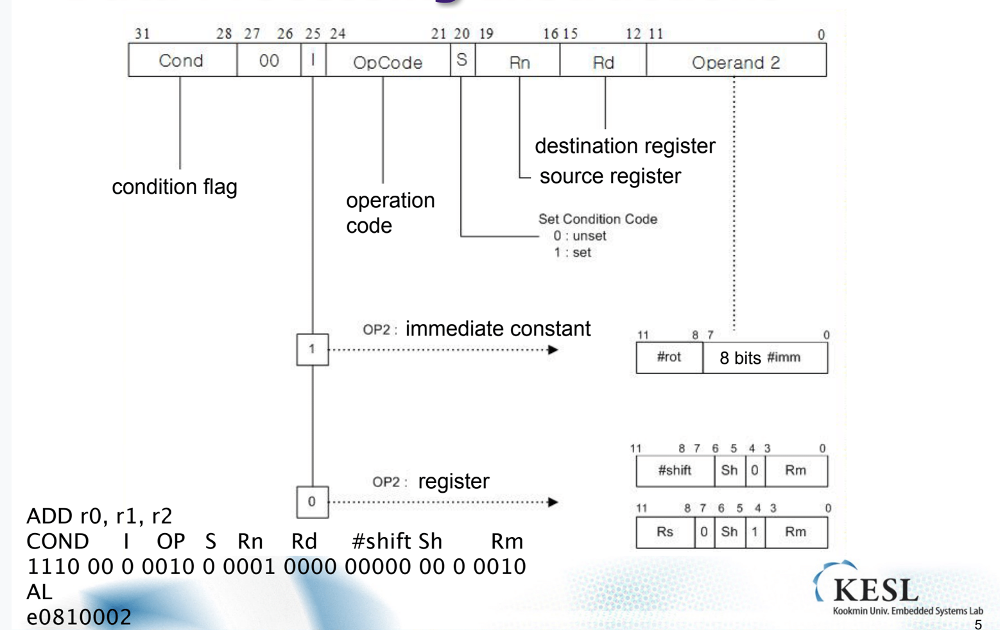

## 임베디드시스템설계

##### Data Processing Instruction

24~21 : Opcode 로 어떠한 instruction인지.

20 : Set..?

Rn = Register Source

Rd = Destination Register

Operand2 : 2가지로 나뉘는데 I bit가 이를 결정해서 사용하게 된다. shift기능을. 넣어놓은 Operand가 있다. 이용되는 경우가 존재하기 때문에 들어간다.

| opcode | inst | behavios                | explaination           |
| ------ | ---- | ----------------------- | ---------------------- |
| 0100   | ADD  | Rd = Rn + Op2           | Add                    |
| 0101   | ADC  | Rd = Rn + Op2 + Carry   | Add with Carry         |
| 0010   | SUB  | Rd = Rn - Op2           | Sub                    |
| 0110   | SBC  | Rd = Rn - Op2 -1 +Carry | Sub with Carry         |
| 0011   | RSB  | Rd = Op2 - Rn           | Reverse Sub            |
| 0111   | RSC  | Rd = Op2 - Rn -1 +Carry | Reverse Sub with Carry |

\#1 과 같이 표기해야 immediate인 것을 알아차릴 수 있다. 이것은 문법적인 것임.

•ADD r0, r1, r2 

•SUBGT r3, r3, #1 

•RSBLES r4, r5, #5

표에 표기된 inst가 전부가 아니고 여기에 몇가지 명령을 더해 쓴다.

자리올림수에 대한 이용을 하려면 add가 아니고 adds를 이용해야 한다. 자리 올림수의 값을 고려해서 덧샘을 하려면 마찬가지로 ADC명령을 이용해야 할 것이다. 

| opcode | inst | behavios          | explaination |
| ------ | ---- | ----------------- | ------------ |
| 0000   | AND  | Rd = Rn && Op2    | AND          |
| 1111   | ORR  | Rd = Rn \|\| Op2  | OR           |
| 0001   | EOR  | Rd = Rn XOR Op2   | Exclusive OR |
| 1110   | BIC  | Rd = Rn &&(! Op2) | Bit Clear    |

AND r0, r1, r2 

BICEQ r2, r3, #7 

EORS r1,r3,r0

##### Comparison Operations

해당 인스트럭션은 S를 붙여사용하지 않는다. 고정된 inst이다.

| opcode | inst | behavios               | explaination          |
| ------ | ---- | ---------------------- | --------------------- |
| 1010   | CMN  | CPSR flag = Rn + Op2   | Compare Negative      |
| 1011   | CMP  | CPSR flag = Rn - Op2   | Compare               |
| 1000   | TEQ  | CPSR flag = Rn EOR Op2 | Test bitwise equality |
| 1001   | TST  | CPSR flag = Rn AND Op2 | Test bits             |

CMP r0, r1

TSTEQ r2,\#5

이런 inst가 있다. 굳이 외울 필요는 없다.

| opcode | inst | behavios                  | explaination              |
| ------ | ---- | ------------------------- | ------------------------- |
| 1101   | MOV  | Rd = Op2                  | Move register or constant |
| 1111   | MVN  | Rd = 0xFFFFFFFFFF EOR Op2 | Move Negative Register    |

move에 넣을수 있는 immediate value는 특정 조건을 만족해야만 한다. (몇 bit 이내 등)

##### Shift

