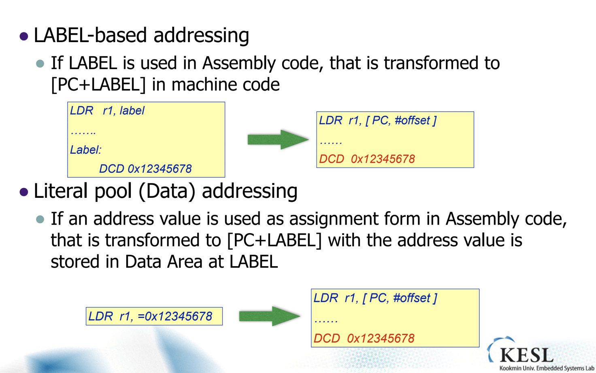

## 임베디드시스템설계

##### PSR (Program status register)

- MRS : move PSR to Register

  MRS{cond} Rd,\<PSR>

  \<PSR> : either CPSR or SPSR

- MSR: move Register to PSR

  MSR{cond} <PSR[_fields>],Rm

  \<PSR> : either CPSR or SPSR

  [_fields] : OSR 내부 구체적 필드. (Condition flag, control bits,...)

##### Load / Store

ARM은 RISC 아키텍쳐이다. Load/Store는 single, multiple이 존재한다.

##### Single Load/Store

| Access Unit     | Load inst | Store inst |
| --------------- | --------- | ---------- |
| Word            | LDR       | STR        |
| Byte            | LDRB      | STRB       |
| Halfword        | LDRH      | STRH       |
| signed byte     | LDRSB     |            |
| signed halfword | LDRSH     |            |

한 word가 4byte인 32bit 아키텍쳐라는 것을 상정한다. 

중간 정도의 데이터 바이트 예를들어 5의 위치에 있는 것을 읽으려고 한다면 4로 변환해서 읽어오거나 하는 방법을 이용한다. 

데이터 어볼트가 같은 경우도 존재하지만 이런 경우만 있다고 생각하자.

signed를 따로 둔 이유를 생각해보자. 왜 ARM 아키텍쳐는 signed를 따로 둘까. Quiz내도록 할것이다. 

사이즈는 기본적으로 word를 상정한다.

##### LDR 

- format

  LDR{cond}{size} destination,\<address> 

  \<address> : BASE:OFFSET

  레지스터에 대한 어드레싱은 어렵지 않다. 그런데 메모리 어드레싱이 문제다. 가장 쉬운 방법은 절대주소를 주는것이 쉽지만, 그렇게 쉽게 처리가 되지 않는다. 

  가상 메모리가 있고. OS도 사용하고 있다고 상정한다. 메모리에 대한 레퍼런스를 찾을 때 기준점에 대한 지점을 구하고 그곳에서 접근하는 방식을 취한다. 이러한 기준점(시작점)은 **base address**라고 한다. 이 기준점에서 부터 워드 기준으로 몇칸을 간다. 이런식으로 지점을 찾는다. 얼마나 떨어져 있는지를 **offset**이라고 한다. 이렇게 어드레스를 찾아 계산하는 것을 address mode라고 한다. 

- Usages

  Ex ) LDR R1, [R2, R4] 

##### STR

STR {cond} {size} src,\<address>

기본적으로 LDR과 반대 방향이라고 생각하면 이해하기 쉽다. 때문에 구체적으로 다루지 않고 넘어간다.

##### Addressing Modes in Load/Store

- Pre-Indexed

  계산을 그 즉시 해서 Source address를 만든다. 즉 inst실행 이전에 Address계산을 먼저 하고 시행한다.

  - [Rn,Offset]{!}

    !의 의미는 자동으로 업데이트 한다는 의미이다. address에 대하여 따로 수정하지 않아도 Rn에 offset만큼 더한 값이 자동으로 업데이트 되어 어드레싱한다.

- Post-Indexed

  먼저 레지스터의 주소를 일단 가져온 다음에 나중에 offset을 계산한다. 

  - [Rn],offset

		;template	code: store 0x11, 0x22, 0x33, 0x44 to mem[0x1000 ~0x100c]
		mov		R11, #0x1000  ; base addr
		mov		R12, #0x11
		str		R12, [R11, #0x0]
		mov		R12, #0x22
		str		R12, [R11, #0x4]
		mov		R12, #0x33
		str		R12, [R11, #0x8]
		mov		R12, #0x44
		str		R12, [R11, #0xC]
		
		mov		R4, #0x1000
		;pre		indexed
		;ldr		R0, [R4, #0x0]
		;ldr		R1, [R4, #0x4]
		;ldr		R2, [R4, #0x8]
		;ldr		R3, [R4, #0xC]
		
		;pre indexed auto
		mov		R5,#0x4
		;sub		R4,R4,R5
		;ldr		R0,[R4,R5]!
		;ldr		R1,[R4,R5]!
		;ldr		R2,[R4,R5]!
		;ldr		R3,[R4,R5]!
	
		;post indexed
		ldr		R0,[R4],R5
		ldr		R1,[R4],R5
		ldr		R2,[R4],R5
		ldr		R3,[R4],R5
##### PC-relative Addressing Mode

- Label-based addressing

  어셈블리 코드에서 라벨을 이용한다면, 기계어에서 자동으로 [PC+라벨]로 변환되어 적용된다. 

- Literal pool(Data) addressing

  =을 이용하여 주소값을 이용해도 어셈블러가 자동으로 해서 적용한다.

