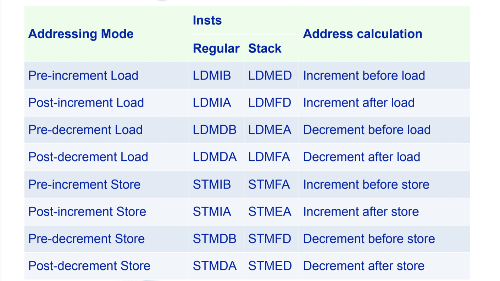
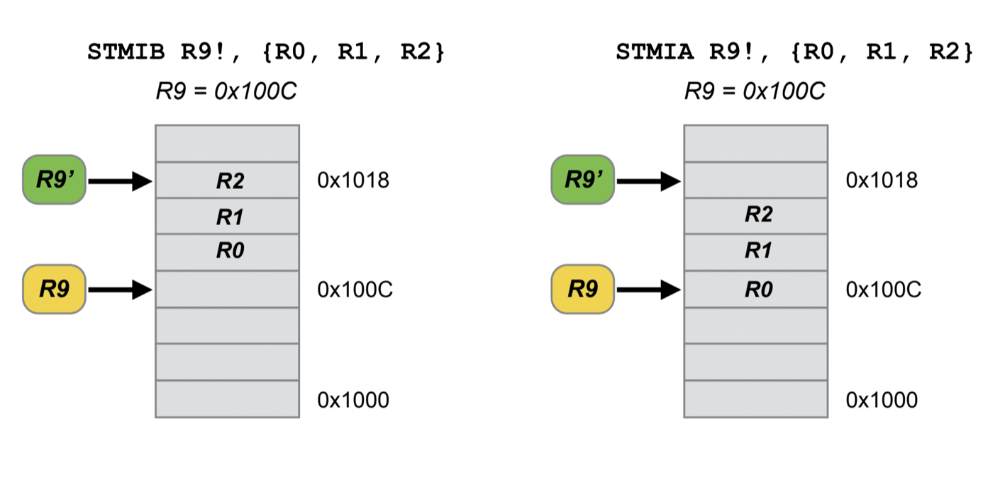
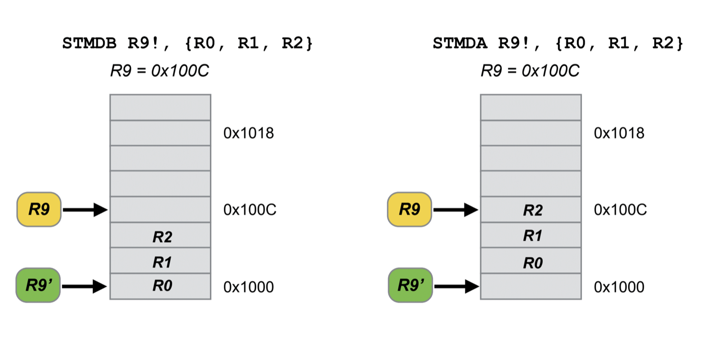

## 임베디드시스템설계

##### Block Transfer Load/Store - 8chap. 11p

ARM에서는 push와 pop의 기능이 명시되어 있지 않다. 가끔가다 보이는 것들이 있는데, 이는 어셈블러가 편의상 표기 해 주는 것이다. 

- LDM (Load multiple) (역 = STM)

  LDM{cond}\<address mode> base_register{!}, \<register list>

  어드레스 모드는 앞에서 배웠던 preindexed와 postindexed의 개념과는 조금 다르게 복잡한 편이다. 베이스 레지스터에 대한 업데이트를 할 것인지 아닌지를 !를 가지고 결정 가능하다. 

  - Address mode

    세가지 축을 가지고 명령어를 수행한다고 생각하면 된다. 먼저, 위로 상승하는 increament와 아래로 내려가는 decreament로 나뉜다. 그리고 ST냐 LD냐로 나뉘는 하나의 축이 있고, 지금 액션을 먼저 increament하고 수행할지, 아니면 먼저 읽고 increament할지 결정하는 축이 존재한다. 

    increament던 decreament던 offset이 존재하지 않고 word단위로 1이 offset으로 주어진다.

  - Register list

    16bit. 순서를 반영할 방법은 없다고 생각한다. 그저 집합의 것으로 생각하자. 내부의 것에 대해 체크해서 수행하는 정도이다. 

  Ex) LDMIA R0, {R1,R2,R3}

  로드 멀티플을 increament 방향으로 after 수행한다. R0가 가리키는 메모리 영역에서 R1,R2,R3 값을 순서대로 읽는다. 

  

스택을 높은 숫자에서 부터 내려오면서 이용하는 경우가 잦다. 0번지에 가까울수록 중요한 inst가 존재할 가능성이 높기 때문이다. (실제로 0번지는 reset에 대한 핸들링이 들어있기도 하다.)

저장할때 decreament방식을 이용했다면 읽을때는 반대로 increament할 가능성이 높다. 마찬가지로 after로 저장했다면 before로 읽어야 할 것이다. 하지만 이렇게 역으로 생각하기가 힘들어서 쌍을 미리 맞춘 inst가 있다. 이는 같은 함수지만 이름만 다른 것이다.

- F : Full , E : Empty - 현재 가리키는 지점에 대해 값이 들어있는지 아닌지(A냐 B냐에따라 달라짐.)

이것의 장점은 LD냐 ST냐에 따라 뒤 Address모드에 대한 이름을 바꾸지 않아도 된다는 것이다. 

방향 어드레스를 잘 생각하도 반대 inst가 어떻게 작동했을지를 생각하자.

E냐 F냐에 상관없이 일단 레지스터 수만큼 차이나는곳에서 부터인데, 그곳을 비울 것이냐 채울 것이냐의 차이이다. 이후에 낮은 곳에 대하여 레지스터 번호를 적어주면 된다. 

