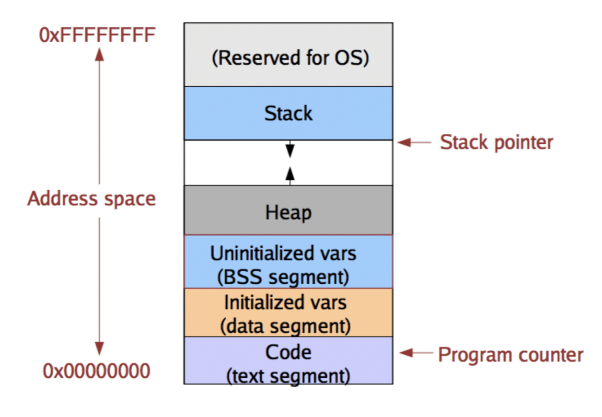
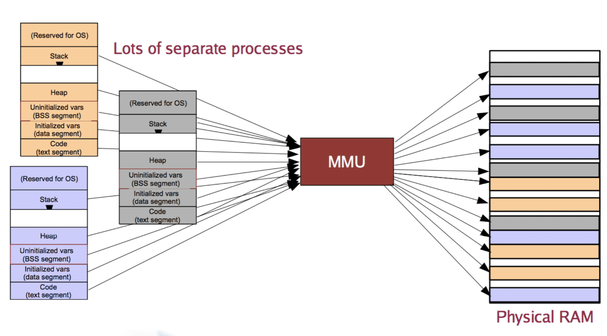
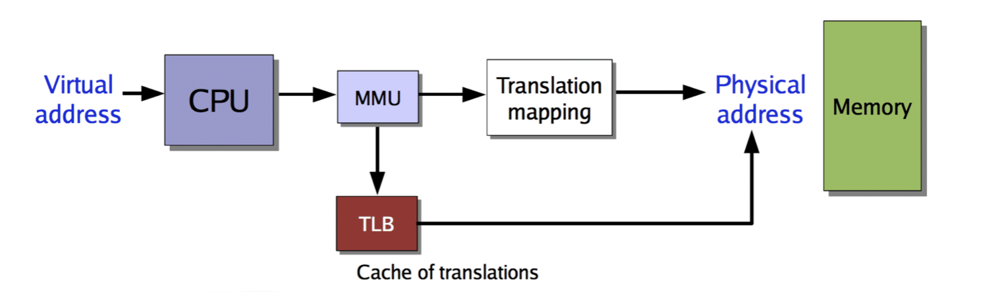

## 임베디드시스템 설계

간단한 1페이지 분량의 보고서를 제출한다. 시연 동영상을 촬영하여 같이 제출한다. 시연 1일 전까지. 보고서는 최대한 간단하게 작성할 것을 권고한다. 

#### Virtual Memory

본디 임베디드의 분야에서는 VM에 대한 이슈가 존재하지 않았다. 메모리 영역에 대해 온전히 모두 사용하였고, 직접 이용하는 방식에 대한 부분이였기 때문에 이용하지 않았다.

하지만 임베디드 하드웨어 성능이 올라가고 기능들이 추가되며 어려 기능들을 수행하려는 움직임이 보이게 되어 가상 메모리에 대한 부분을 다루지 않을 수 없게 되었다. 

- VM (OS)를 도입함으로써 임베디드에서의 발생하는 문제점

  리소스 관리 및 성능에 대하여는 좋아질 수 있지만 실시간성이 떨어진다. 

##### Memory Management

프로그래머에게 메모리 처리에 관해 모두 맡길 수 없기 때문에 프로그래머에게 편하게 이용가능 한 추상화 요인을 제공해야 한다. 

서로다른 두 프로세서간의 분리가 필요하고, 물리적 메모리와 프로세서 사이의 부족한 메모리 확보를 위해 VM을 이용하게 된다.

다음과 같은 기술이 필요하다

- Virtual address translation
- Paging and TLBs
- page table management
- page replacement policies

##### VM

1. 메모리 매니지먼트를 위한 기초 추상화를 OS에게 제공한다. 

2. Demand paging

   어떠한 페이지를 처음 쓰려고 하는 순간 그 페이지를 물리적 메모리에 할당 한 이후 접근 하도록 한다. 

자주 이용되거나 잘 이용되지 않는 영역에 대하여 관찰하기도 하고 영역 할당이 필요하지 않는 것에대해 패턴을 관찰 하는 등의 일도 수행한다.

시시각각 변하는 프로세스의 메모리 요구에 대하여 반응하고 대처한다. 프로세스간 isolation(분리)을 제공해야한다. 각 프로세스는 자기의 고유 공간을 가진다고 여긴다. 

- HW support

  MMU(memory management unit),TLB(translation lookaside buffer)

- OS support (mapping between VA to PA)

  page fault handler,page table

하드웨어로 구현하기에 옳은것은 하드웨어로. 애매한 것은 소프트웨어로 구현한다.

##### VA(Virtual Address)

한번 주소를 추상화 거쳐 이용하도록 한다. 

- VA != PA
- PA = MMU(VA)
- VA to PA mapping - Determined by OS

총 4gb의 메모리가 있다고 가정하자. 각각의 프로세서는 다음과 같이 그 4gb를 모두 이용하고 있다고 생각한다. 그것을 스위치 하면서 이용하는 것이다.

isolation : VA상황에서는 하나의 유저 프로세스가 다른 프로세스에 대하여 물리적인 접근을 접근할 권한 자체가 존재하지 않는다. 제한적 허용이 존재하기는 한다. (공유하는 작업에 경우)  

Relocation : 절대주소에 의존적이지 않은 주소들이 담겨있다..?

##### MMU & TLB

TLB는 MMU를 위한 V to P 어드레스 변환의 캐쉬이다. 

##### Paging

페이지단위는 4KB의 로 고정하는 편이다. 이것은 가상 메모리에서 공간을 고정적으로 나눈 것이다. 

피지컬 메모리는 페이지 프레임 단위로 나누어 이용하게 된다.