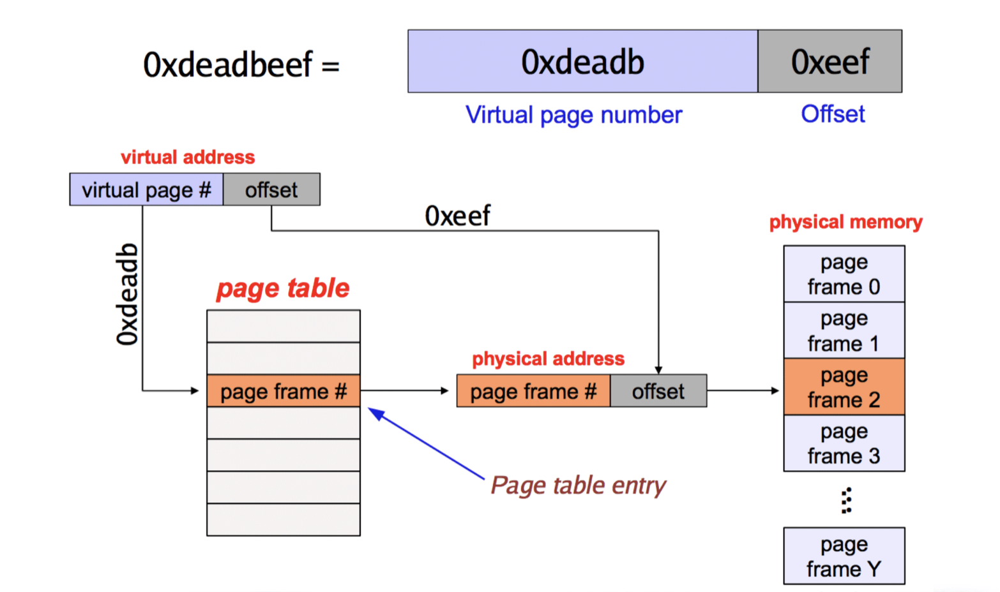
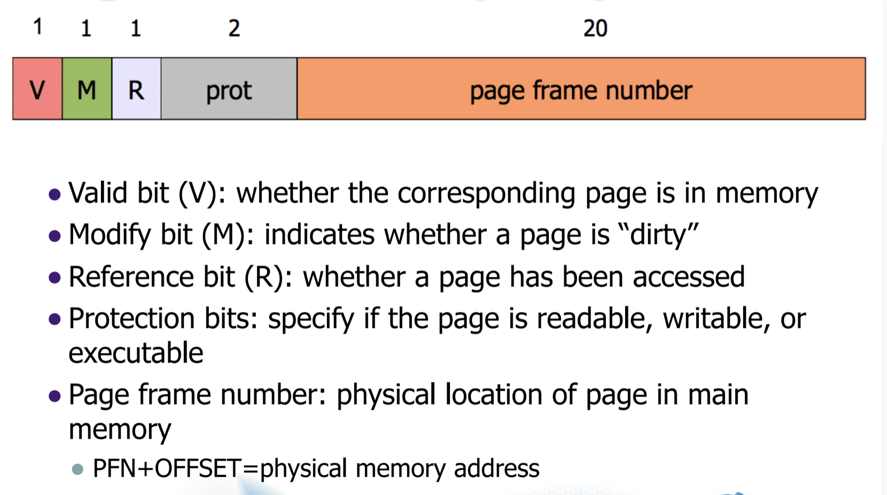

## 임베디드

##### Paging

frame은 page와 동일한 크기로 피지컬 메모리에서 다루는 단위로 생각하면 된다.

##### Page Tables

20bit + 12bit 로 이루어진 가상주소. 20비트에 대하여 피지컬 주소로 변환해주어야 한다. 그래야 접근해서 이용 할 수 있다.

12bit에 대하여 meta data를 기입가능 하다. (Read only나 기타 다른 정보에 대하여)

VA는 각 유저에게 보이는 private한 주소이다. 페이지 테이블에 대한 구조도 user마다 제공되는 것이 옳다. 

프로세서마다 페이지 테이블을 넣어주는 것은 용량의 문제로 메인 메모리에 넣어놓는것이 어렵다. 그렇다면 페이지 테이블을 어디에 기억해 놓는것이 옳은가 ?

하드디스크에 접근시키기에는 속도가 너무 느려 옳지 않다. 때문에 메모리 종류여야 하지만 하드디스크는 옳지 않다. 일단 메모리에 넣는다고 생각하자. 많은 단위를 적용해야 하지만 일단은 그렇게 한다고 생각하자.

MMU가 이 페이지 테이블에 대한 주소를 가지고 있어야 하는데, CPU내부 특별한 레지스터이 페이지 테이블에 대한 시작 주소를 가지고 있다. 때문에 MMU는 바로 이 레지스터의 값을 가져와 페이지 테이블에 대한 정보를 엑세스 한다.

##### TLB

캐시 미스로 인해 메모리에 접근하는데 접근하려면 VA를 피지컬 메모리로 변환해야 한다. 이를 변환하기 위해 메모리로 접근해야하는 상황이 발생하는데 이는 옳지 않으므로 TLB라는 캐시를 이용하여 처리한다. 

페이지 접근에 대하여 메인 메모리에서 가져올때 가져와 인덱스를 저장하는 곳이라고 생각하면 편하다. 컴퓨터의 처리상 한번 처리한 주소에 대하여 근처에 있는 주소또한 처리할 확률이 높기 때문에 한번에 얼마의 인덱스를 한번에 가져온 뒤 이곳에서 변환하여 이용한다. 

TLB이용시 오버헤드가 100%이던 것을 획기적으로 줄일 수 있다.

LRU 또는 NRU와 같은 (or Random)매커니즘을 이용해 주소를 새로쓴다

##### VAT

4KB 페이지 전제 Virtual page number + Offset (20 + 12)

- 일반적인 (가상의) 주소

##### ARM Processor Features

CO-processor based additinal features ARM은 메모리 어드레싱으로 접근이 아닌 CPU의 장기처럼 되어있으며 특별한 시그널로 접근하여 이용한다. 

범용 레지스터로 값을 복사해서 읽어와 이용한다. 

CO-processor 가 MRC나 MCR 초기셋팅? 한다

락다운이라는 것을 이용해 캐시의 특정 부분에 대하여 고정하게 한다. 크리티컬한 섹션에 대해 즉각 처리 가능하도록 캐시 락다운이 지원된다.

- Direct mapped

  해당 주소 인덱스에 대해 캐시가 빌때까지 기다린다.(다른 캐시인덱스가 비어도 기다린다.)

- Set associative

  인덱스를 몇개 더 묶어서 분리하여 처리한다. 

- fully associate

  모든 인덱스를 1개의 세트로 보고 빈자리가 있다면 바로 간다. 

##### Write Buffer

블락/언블락 : CPU가 명령을 주고 기다려야 하는지.

write는 언블락이다. 던저주고 스토리지가 알아서 처리해주기 때문이다. 외려 read가 블락이다. 값이 와야 처리하기 때문이다.