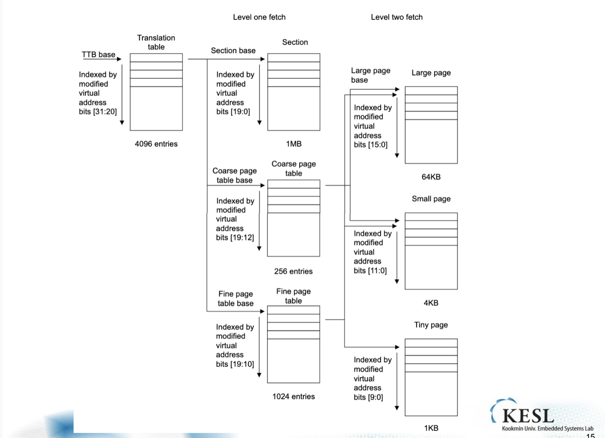
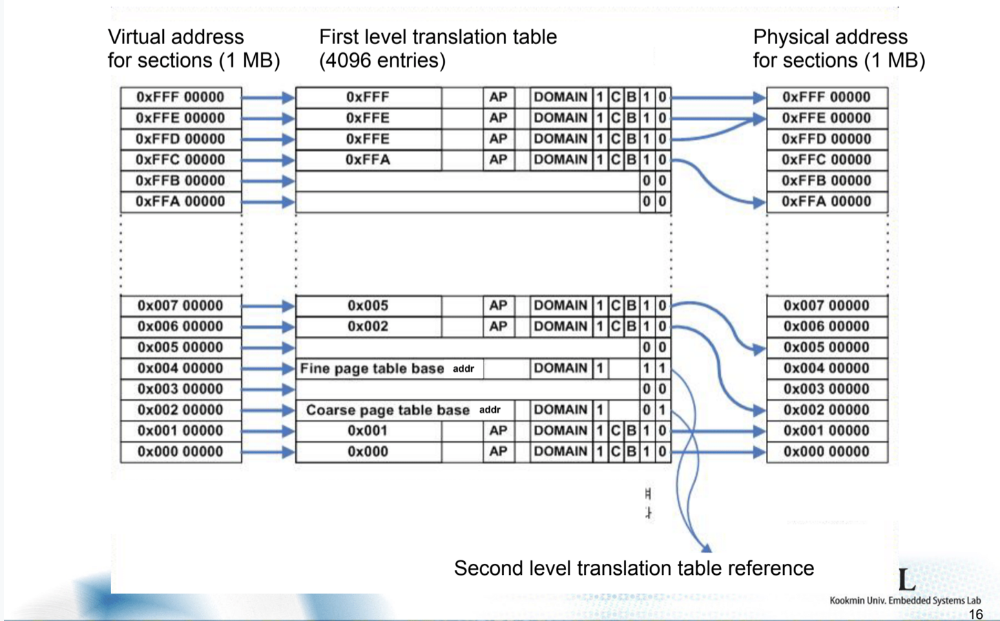
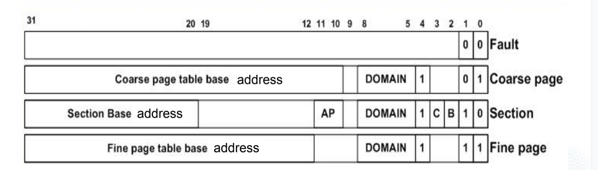
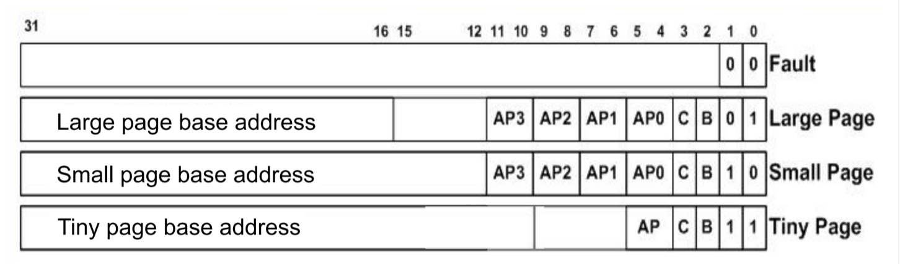
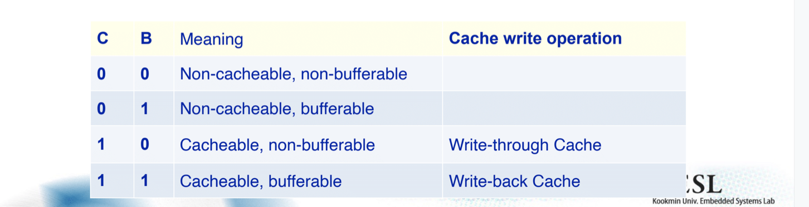
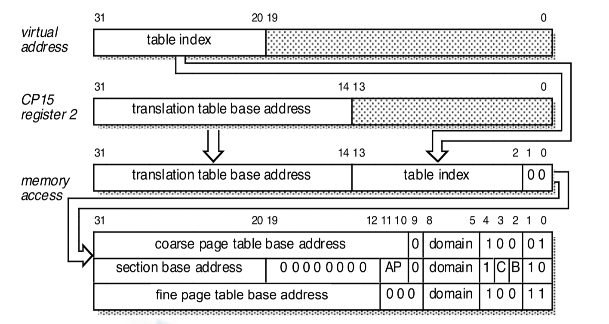
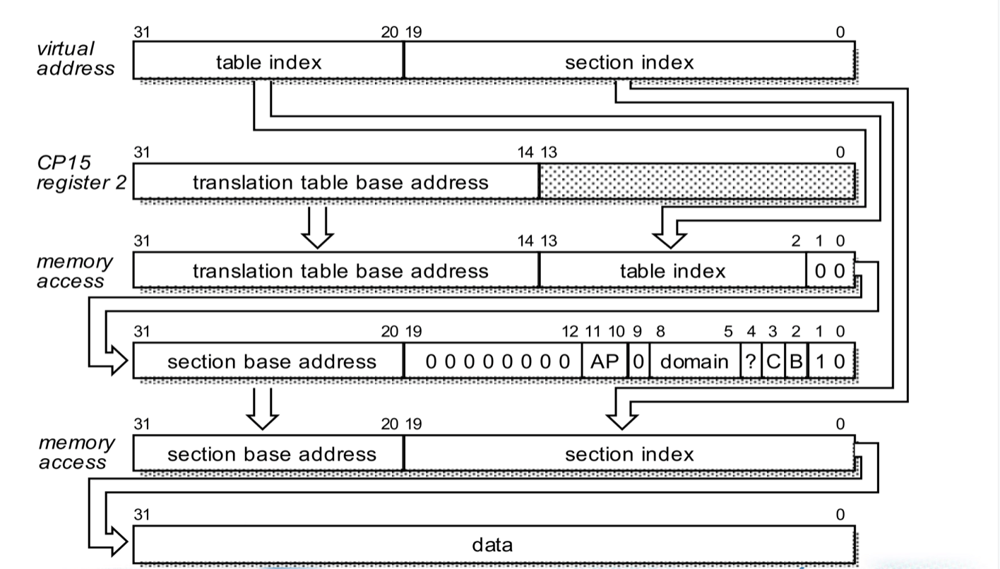
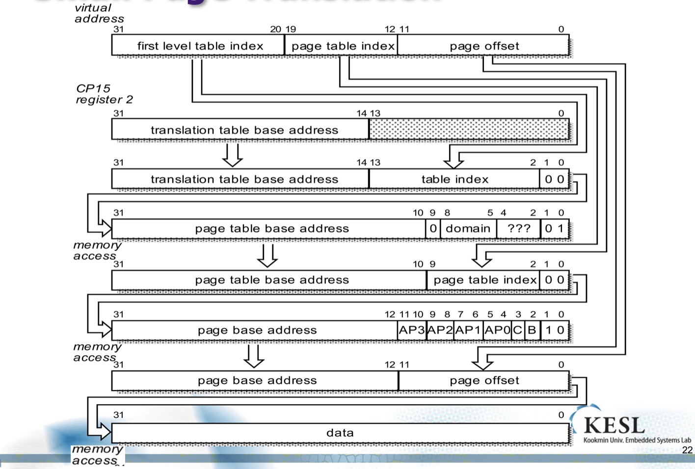

## 임베디드

1202

##### Write buffer

read의 최적화는 쉽지 않다. 시퀀셜하게 처리 되어 있는 코드를 보고 CPU가 다음 것을 읽겠구나 하고 추측하는 방향으로 가야 한다. 즉, 미래를 예측 하는 방향의 최적화를 진행해야 하는데, write의 경우 일단 보내놓고 최적화 하는 방향이 존재하기 때문에 Read에 비해 수월하다. 

##### Special Cache Control

캐시에서 먼저 피지컬한 어드레스, 또는 VA를 찾아서 가지고 있는 것이 어떻겠느냐 하는 부분인데, 우리는 중요하게 다루는 것이 아니므로 깊게 다루지는 않는다.

##### Page Sizes in ARM

- Section : 1MB page

- Tiny page : 1KB page

- Small page : 4KB page (typical page size)

- Large page : 64KB page

페이지 사이즈에 따라 권한을 설정하는등 다른 의미를 부여 할 수 있다. 

섹션이 관리하기 가장 간단한 형태. 1MB이므로 20bit를 offset으로 이용하고 12bit의 인덱스를 가진다. Hex 값 주소가 있다고 할 때 앞에서 3자리가 index가 된다. 

Page Table중 index에 대한 값을 적어놓은 부분이 존재한다. 

책에 대한 시작 주소를 기억해야 한다. 4KB로 align된다고 가정한다. 시작 주소에 대하여 0x000을 앞에 넣어놔야 한다. 

책의 entries는 4096개 한 페이지는 4byte. 이므로 총 16KB 를  가지고 있는다. 

TTBA, 스타트 어드레스의 값은 어떤 레지스터에 기록되어 있다. 이 레지스터를 실제로 사용하는 것은 MMU로 매번 메모리 엑세스를 할 때 이 베이스 포인터를 엑세스 하고 찾아가서 파악하게 되는 것이다. 

만일 페이지의 사이즈를 1MB가 아닌 4KB로 쪼개야 한다고 한다면, 반대로 뒤집히게 되고 책 entries가 늘어나서 사이즈가 4MB로 늘어난다.(1MB * 4B)

유저 프로세서마다 이 페이지 테이블을 가져야 한다. 앞의 1MB였을 때에 비해 4KB단위로 했을때 용량이 매우 늘어나기 때문에 구현하기가 어렵다. 

64bit 운영체제 에서는 5단계의 단계를 가지고 구성한다.

##### Address Translation

좌측 VA for section을 보면 FFF까지 올라간다. 4096개의 index이다. 중간에 보면 빈 페이지가 존재한다. 이 페이지에 접근 할 경우 페이지 폴트가 발생한다. 하위 2비트에 대하여 00이 존재하고 11,10등 있는데, 00은 폴트 10은 이용 11 및 01은 Second level translation table 을 안내하는 것이다. 

1. 페이지 폴트
2. Section에 속한 페이지
3. Fine page or Coarse page

의 경우가 존재한다. 

##### Level 1 Descriptor

다음 네 종류중 하나가 등장한다.

이는 ls비트의 0번째 1번째를 보고 파악이 가능하다. 

Coarse 의 경우 다른 페이지 테이블로 넘어가는데 이 책ㄷ은 256의 entries를 가지며 총 사이즈는 256 * 4B가 될 것이다. 1MB의 공간 내부에 256 * 4KB() or 16*64KB로 나누어 이용한다.

Fine의 경우 1024의 entries를 가진다. 총 사이즈는 1024 * 4B, 1MB를 1024 * 1KB로 나눈다.

처음 12bit를 우리는 섹션에서 index를 파악하는데 이용했다. 그런데 만일 Coarse의 경우 8bit를 더 파악해야 PA를 알 수 있다.(256개의 index가 추가 되므로.) 때문에 만일 0xDEADBEEF라는 주소가 있다면 초기 DEA로 가서 섹션 주소를 본다.  그런데 Coarse이다.  그러면 8bit를 더본다. DB이므로 총 DEADB를 확인 한 것이고 이것을 바꾸어서 피지컬 메모리에 접근한다. 

tiny page를 표현할 방법이 Coarse에 존재하지 않으므로 이것을 이용하려면 Fine page를 이용해야 한다. 총 1024의 entries를 가진다. 

small page나 large page가 Fine방식을 이용할 수 있으나 낭비가 심하기 때문에 이용하지 않는다. 

##### Level 2 Descriptor 

ARM에서는 2 level이 끝이므로 여기서 정보를 찾아야 한다.

##### Caching and write Buffer Control

C와 B 비트를 이용해서 캐쉬와 버퍼에 대한 컨트롤을 파악한다.

처음 섹션에 대한 페이지는 4096 고정. 32bit의 크기. 여기서 정보를 파악한다. 만일 한단계 더 내려가야 하면 다음을 파악하게 된다.

Coarse인지 Fine인지를 보게 된다. 여기서 Small page, Large page, Tiny page인지가 파악된다. 

Coarse든 Fine이든 1MB 즉 한섹션 단위를 관리하도록 설계 되어있다. 

## 임베디드

1204

##### First-Level Translation

CP15 : Translation table의 베이스 어드레스를 가진 특별한 레지스터로부터 책이 어디에 위치해 있는지를 가져오고 VA로부터 책의 몇 페이지에 존재하는지를 따온다.

하위의 두비트는 항상 0 두개로 고정이다. 이 이유는 페이지가 주로 4개 바이트의 합으로 이루어지는데 이것을 구분하지만 가져 올 때에는 첫 주소에 대하여 가져오기 때문에 항상 00이다. 

제일 하단에 대한 것이 만들어 지는데 제일 하위 두비트가 페이지 폴트의 경우 00으로 입력되고 나머지 경우에 대하여는 01,10,11 중에서 입력된다. 

섹션에서 바로 찾아오는 경우 중간에 보면 0이 10개가 들어있는데, 우리는 이것을 보고 책의 사이즈를 추측 해 볼 수 있다. 

##### Section Translation Sequence

베이스 주소와 페이지 인덱스를 따온다. 그래서 가봤더니 섹션에 대한 어드레스가 나왔고 하위 두비트를 봤더니 10이다. 이것은 바로 가져온다는 것이므로 상위 12비트에 대한 값만 VA에서 PA로 변환하여 넣고 나머지 20비트에 대한 값을 본래 VA에서 가져와서 넣는다. 

##### Small page Translation

초기 상황은 섹션 트랜슬레이션과 비슷하다. 먼저 섹션인지 라지페이지인지 스몰인지 잘 모른다. 그러므로 상위 12비트를 가져가고 CP15로 부터 베이스 어드레스를 가져와 합쳐서 메모리를 엑세스 한다. 그러고 봤더니 하위 두 비트가 01이다. Coarse페이지 유형이므로 한단계 더 들어가야만 한다는 것을 알았다. Coarse의 경우 10~31까지가 page table base address이다. 그리고 스몰 페이지의 경우 256의 인덱스를 가진다. 그러므로 이에 대한 인덱스가 필요하므로 원래의 VA에서 8비트를 다시 따온다. 두개를 합쳐서 주소를 만들고 메모리 엑세스를 시도한다. 그러면 이번에는 피지컬 어드레스가 나오게 된다. 그러면 이 PA와 본래 VA에서 이용했던 20비트를 제외한 12비트를 가져와 붙여서 메모리 피지컬 메모리 엑세스 한다. 

1레벨의 책자를 가볍게 유지하고, 소책자들을 그때 그때 필요 할 때 생성함으로써 메모리의 효율적인 이용이 가능하며, 오버해드를 줄일 수 있다. 

