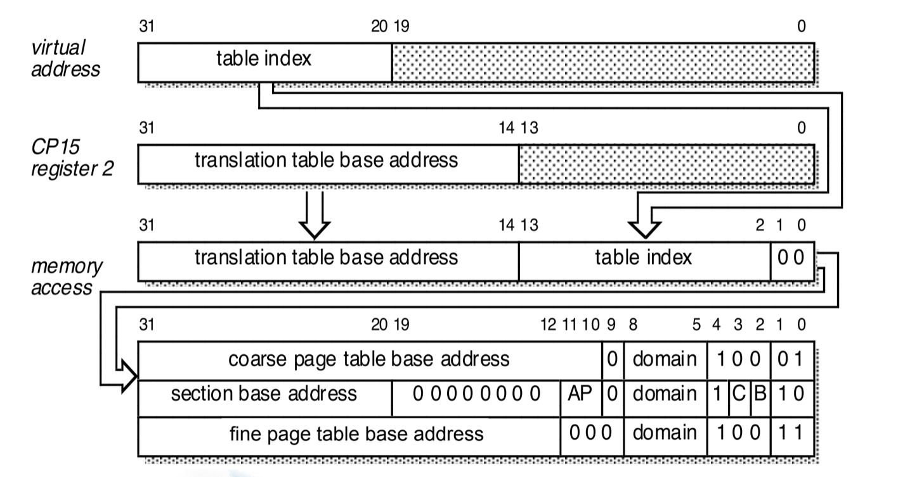
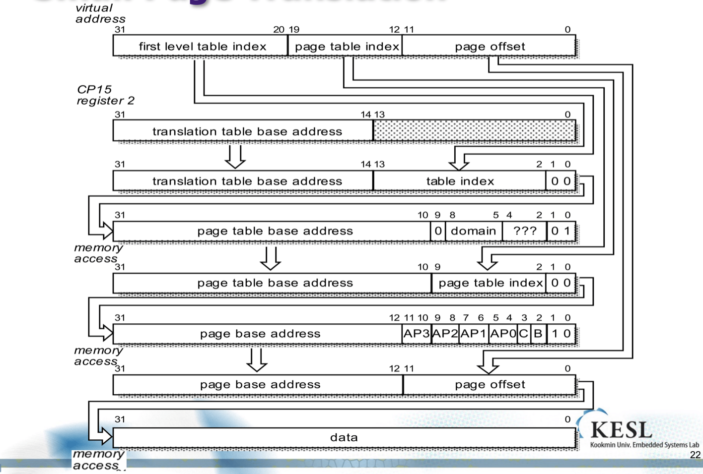

## 임베디드

1204

##### First-Level Translation

CP15 : Translation table의 베이스 어드레스를 가진 특별한 레지스터로부터 책이 어디에 위치해 있는지를 가져오고 VA로부터 책의 몇 페이지에 존재하는지를 따온다.

하위의 두비트는 항상 0 두개로 고정이다. 이 이유는 페이지가 주로 4개 바이트의 합으로 이루어지는데 이것을 구분하지만 가져 올 때에는 첫 주소에 대하여 가져오기 때문에 항상 00이다. 

제일 하단에 대한 것이 만들어 지는데 제일 하위 두비트가 페이지 폴트의 경우 00으로 입력되고 나머지 경우에 대하여는 01,10,11 중에서 입력된다. 

섹션에서 바로 찾아오는 경우 중간에 보면 0이 10개가 들어있는데, 우리는 이것을 보고 책의 사이즈를 추측 해 볼 수 있다. 

##### Section Translation Sequence

베이스 주소와 페이지 인덱스를 따온다. 그래서 가봤더니 섹션에 대한 어드레스가 나왔고 하위 두비트를 봤더니 10이다. 이것은 바로 가져온다는 것이므로 상위 12비트에 대한 값만 VA에서 PA로 변환하여 넣고 나머지 20비트에 대한 값을 본래 VA에서 가져와서 넣는다. 

##### Small page Translation

초기 상황은 섹션 트랜슬레이션과 비슷하다. 먼저 섹션인지 라지페이지인지 스몰인지 잘 모른다. 그러므로 상위 12비트를 가져가고 CP15로 부터 베이스 어드레스를 가져와 합쳐서 메모리를 엑세스 한다. 그러고 봤더니 하위 두 비트가 01이다. Coarse페이지 유형이므로 한단계 더 들어가야만 한다는 것을 알았다. Coarse의 경우 10~31까지가 page table base address이다. 그리고 스몰 페이지의 경우 256의 인덱스를 가진다. 그러므로 이에 대한 인덱스가 필요하므로 원래의 VA에서 8비트를 다시 따온다. 두개를 합쳐서 주소를 만들고 메모리 엑세스를 시도한다. 그러면 이번에는 피지컬 어드레스가 나오게 된다. 그러면 이 PA와 본래 VA에서 이용했던 20비트를 제외한 12비트를 가져와 붙여서 메모리 피지컬 메모리 엑세스 한다. 

1레벨의 책자를 가볍게 유지하고, 소책자들을 그때 그때 필요 할 때 생성함으로써 메모리의 효율적인 이용이 가능하며, 오버해드를 줄일 수 있다. 

