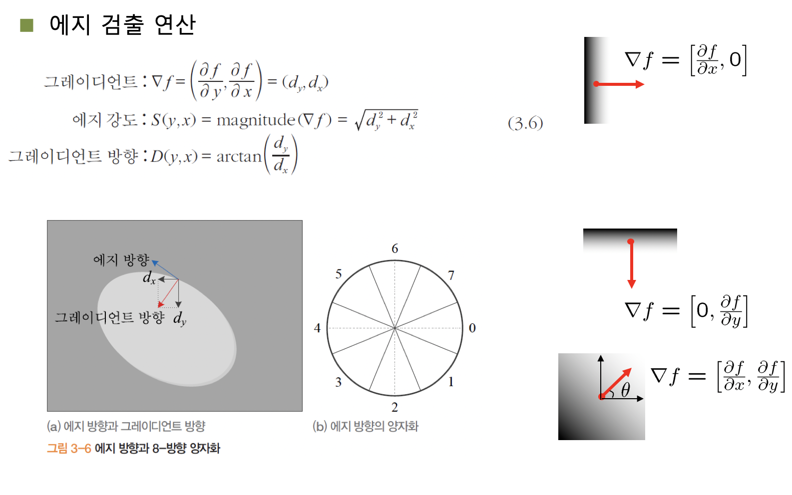
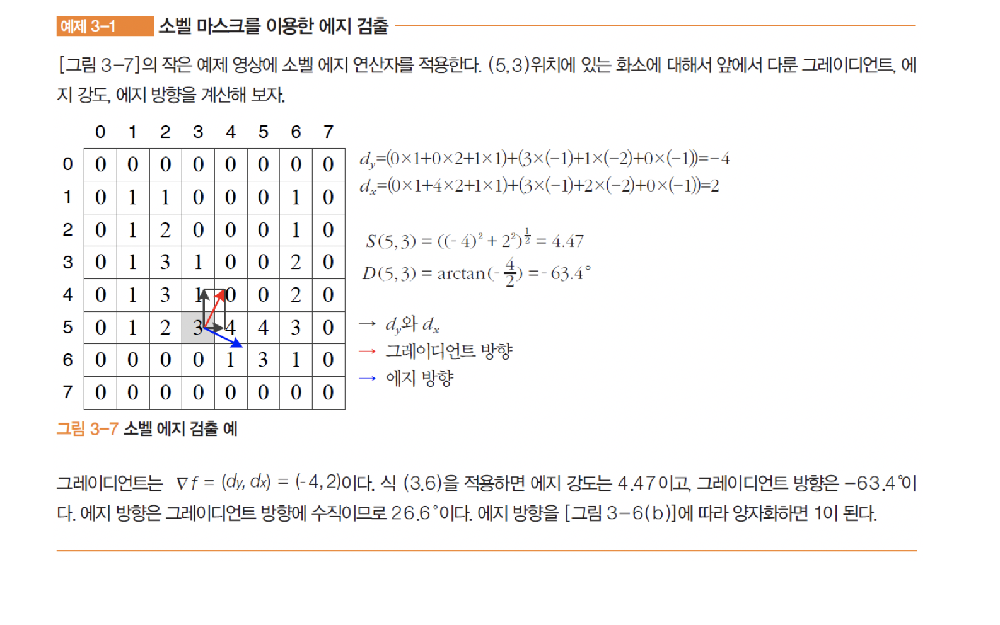
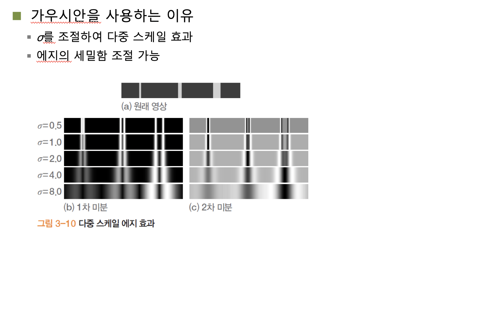
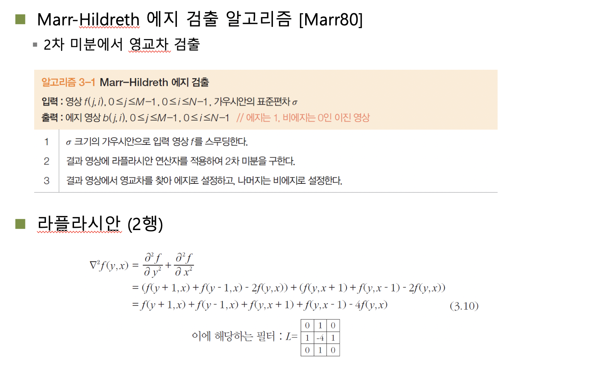
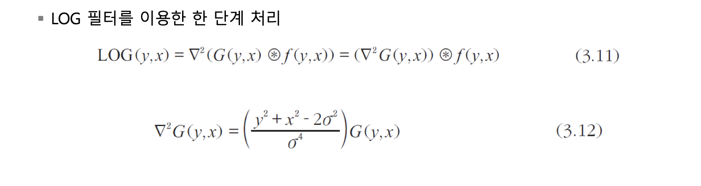
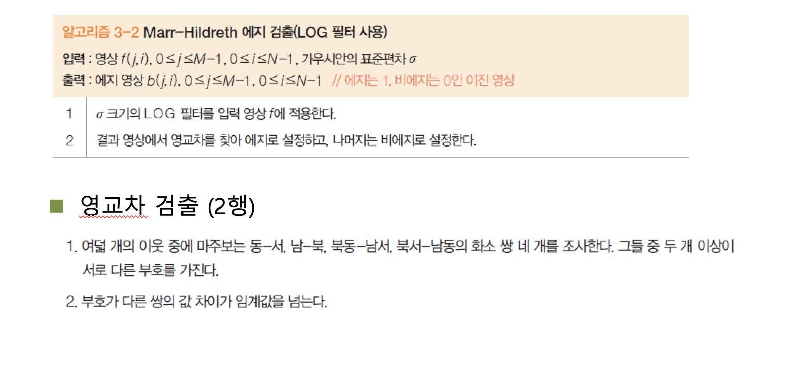
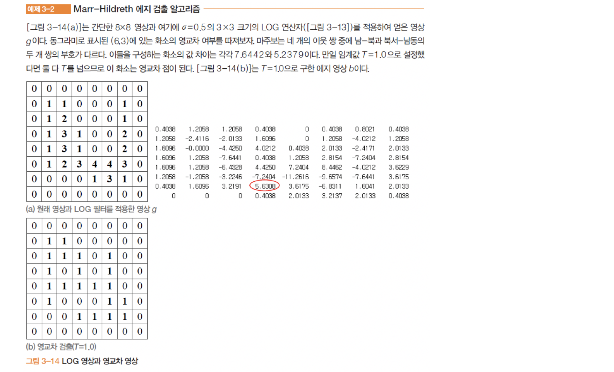

## 컴퓨터비전

1014

##### 에지 검출의 기초

물체의 경계는 변화가 크다는 것을 기반으로 명암,컬러,텍스쳐 변화량을 측정해서 변화량이 큰 곳을 에지로 검출한다.

##### 디지털 영상의 미분

- 1차 미분

$$
f'(x) = \frac{df}{dx} =\frac {f(x+\Delta x)-f(x)} {\Delta x}=f(x+1) - f(x)
$$

엣지는 두종류인데, 

- 계단 에지
- 램프 에지

계단 에지에 대해서는 1차 미분에 대해서 검출이 가능하지만 램프에지에 대한 변화는 알아챌 수 없다. 2차 미분을 해봐야 한다. 

- 2차 미분

$$
f'(x) = \frac{d^2f}{dx^2}=f(x+1)+f(x-1)-2f(x)
$$

​	이에 해당하는 마스크 = 1 / -2 /1

1차 미분으로 봉우리를 검색해서 찾는방법, 2차 미분에서 영교차를 찾는 방법 두가지가 존재할 것이다.

1차 미분을 통해 변화량이 존재하는 곳에 대한 봉우리가 생기고 그곳을 에지로 잡는다.

##### 노이즈 추가의 문제

영상의 효과를 주기 위해 잡음을 추가한다면 노이즈가 섞여 에지 검출에 문제가 생긴다.

먼저 잡음을 줄여야 한다. 영상에 대해 가우시안 필터를 씌우고 1차 미분을 적용해본다.

##### Derivative Theorem of convolution

1차 미분을한 가우시안 필터에 영상을 컨볼루젼 하면 같은 결과를 얻을 수 있다.

편 미분한 수치를 한번만 적용하면 되므로 이전의 방법보다 더 빠른식간에 결과를 도출 할 수 있다.

현실에서는 잡음 때문에 스무딩이 필요하다. 
$$
f'(x) = \frac {df}{dx} = \frac {f(x+1)-f(x-1)}{2}
$$
이에 해당하는 마스크 = 1/0/1

***주어진 영상에 대해 소벨 에지를 적용해서 5 바이 3에 대한 소벨 에지를 적용한 결과가 어떤 것인가 ? - 중요***

##### 영교차 이론

미분은 잡음을 증폭시키기 때문에 스무딩 적용이 중요하다. 때문에 가우시안을 이용한다.

시그마 값을 잘 조정해야 올바른 값을 찾을 수 있다.

시그마 값을 잘못 조정하면 오히려 잡음이 심해질 수 있다.

- 2차원 가우시안

$$
G(y,x) = \frac {1}{2\pi \sigma ^2}e^{- \frac {y^2+x^2}{2\sigma ^2}}
$$

- 이산 공간에서 구현

  마스크 크기가 자긍면 오차, 크면 계산 시간 과다

  6a와 같거나 가장 작은 홀수 - 예를들어 시그마 = 3.0이면 19*19마스크를 적용한다.

##### LOG 필터

좌 우 상 하의 변화량이 검출되면, 에지로 인식하겠다.

입력 영상에 가우시안 G를 적용한 후 결과에 라플라시안을 다시 적용하는 두 단계의 비효율성.

- 계산 시간 과다.

- 이산화에 따른 오류 누적

LOG필터를 이용해 한단계 처리한다.

