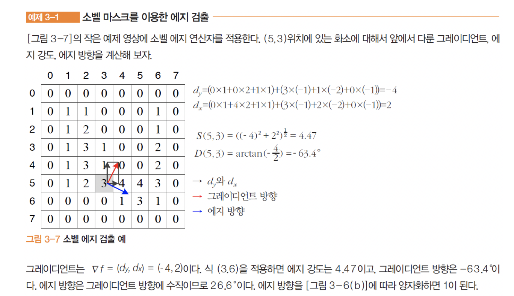
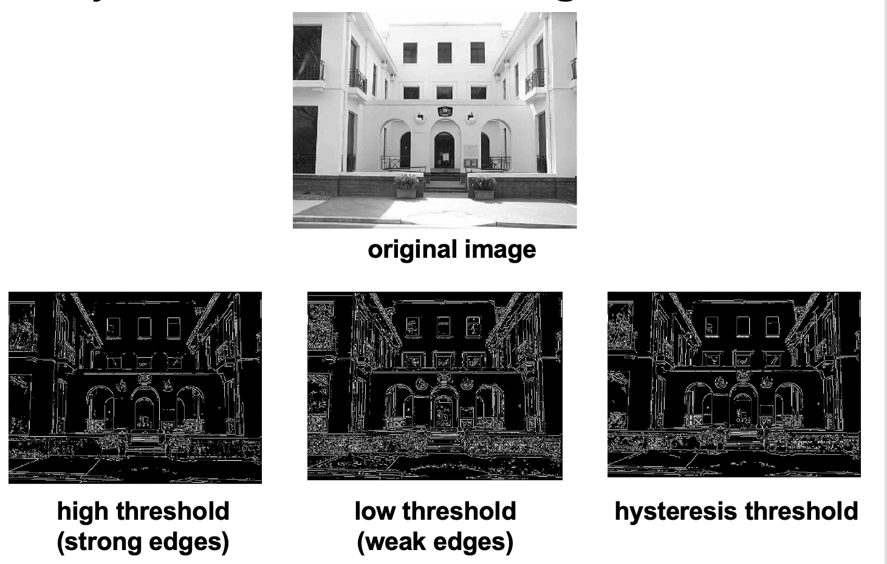
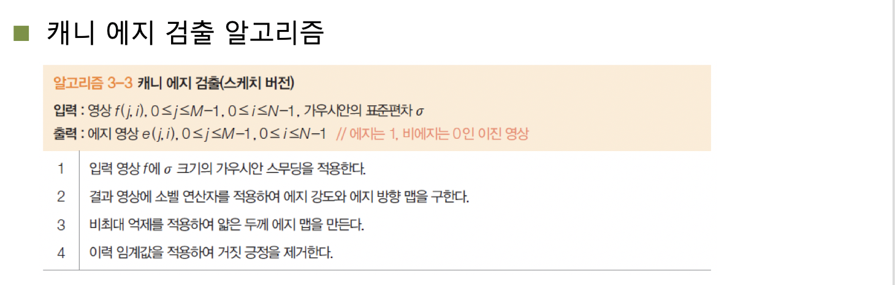
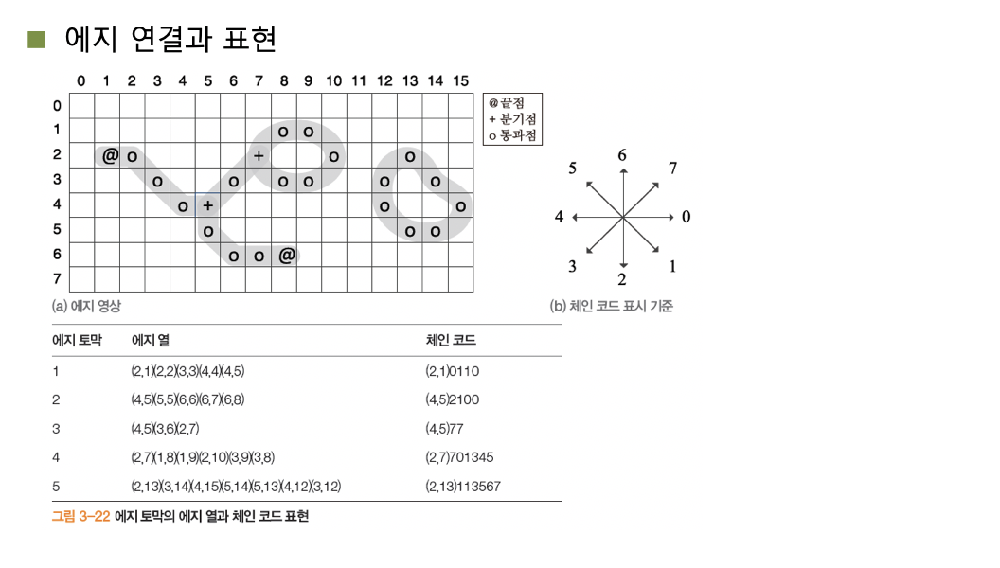
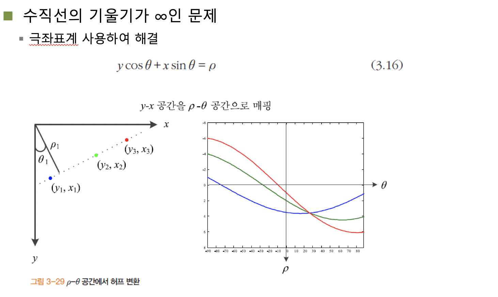
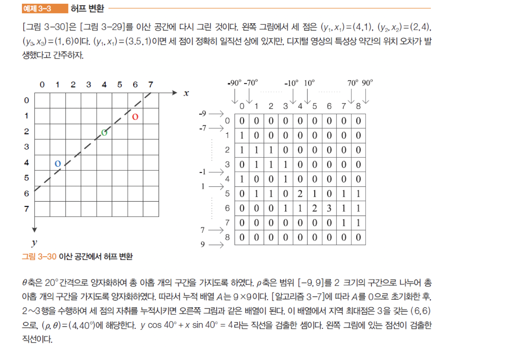
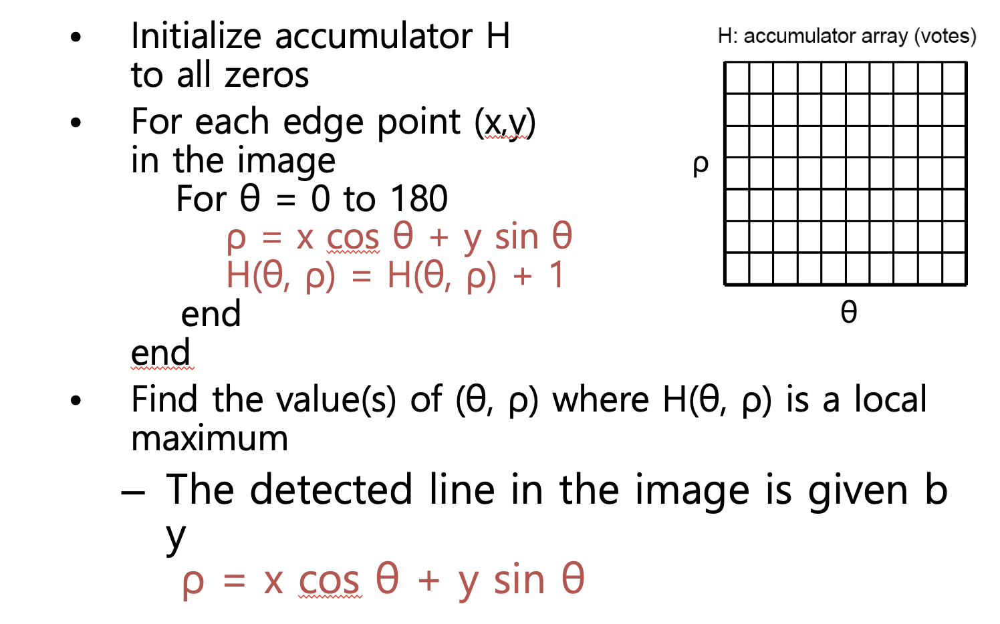

## 컴퓨터비전

1016

그레이디언트란 x방향 y방향으로 얼마나 바뀌었나(얼마나 미분하느냐) 하는 그런 값이라고 볼 수 있다. 

##### 소벨 에지 연산

##### Canny edge detector

그레디이언트 크기값의 도출로 에지를 알 수 있다. 거짓에지라는 것이 있는데, 에지가 아닌곳이 에지로, 에지인 곳이 에지가 아닌것이 나온것이 있다. 

에지가 두껍게 나온 곳에 대하여 한줄로 얇게 만들어 주는 작업이 필요하다 - Non Maximum suppression

끊어진 부분에 대해서는 연결을, 두꺼운 부분에 대해서는 얇게. Threshold를 낮추면 에지가 잘 드러나게 되는데 계속 낮추다 보면 거짓 에지가 검출이 된다. 때문에, 높은 threshold에서 시작해서 점점 낮추면서 진짜라고 생각하는 값에 대해서 에지를 검출한다.

세가지 기준이 있다. 

- 최소 오류율 : 거짓 긍정(에지가 아닌데 에지로 나온것)과 거짓 부정(에지인데 에지가 아니게 나오는 것)이 최소여야 한다. 즉 거짓 에지에 대한 값을 최소로 유지해야 한다. 

- 위치 정확도 : 검출된 에지는 실제 에지의 위치와 가급적 가까워야 한다.

  가운데를 정확하게 추출하기 위해 두번 미분을 수행하면 된다. 

- 에지 두께 : 실제 에지에 해당하는 곳에는 한 두께의 에지만 생성해야 한다. 에지 검출 이후 옆 값 검출해서 존재하면 제거하는 식으로 계속 깎아 나가는 방법이 있다.

컬러 에지에 대한 검출은 RGB채널 각각 에지 검출은 한 다음 OR연산으로 구현한다. 

- 디 젠조 방법

  RGB값에 대한 에지검출의 정확도를 높이기 위해 x,y,xy의 방향에 대한 에지를 검출해서 적용한다.

##### 시험

5문제 ~ 6문제 나옴 간단한 주어진 영상에 대해서 책에 나온거 보면 5바이5 10바이10같이 영성을 주어지고 주어진 알고리즘에 대한 결과를 도출하거나 알고리즘을 적용하는거 처럼 문제가 나온다. 즉 책 및 실습 등에서 해본 알고리즘에 대한 적용 결과 

카메라 지오그래픽 히스토그램 이진화에 대한 실습 라벨링 구하는것 각종 필터 컨볼루젼 에지 검출에 대한 미분적용 구하기 등 

기본적으로 슬라이드에 나오는 개념만 나오긴 하지만 슬라이드를 다 안다고 아는 것이 아닌 더 구체적으로 알아야 하는 것도 존재한다. 

실습에서 오픈소스 이용과 같은 방식으로는 중간/기말 문제 풀수 없음.

---------- 중간고사 ------------

#### 선분 검출 

##### 허프 Transform

에지들을 가지고 선분을 표현해야 하는데 어떻게 하면 근사적으로 잘 표현할 수 있을 것인가에 대한 것이다. 

주어진 데이터에 대한 특성은 유지하면서 근사적 값 추출을 위해 수행한다. 

분기점, 끝점을 기준점으로 토막내어 라벨링을 수행해 나열한다. 토막 낸것을 토대로 직선의 방정식을 그려본다.

##### 선분 근사

두 끝점을 먼저 잇는다. 그 이후 직선으로부터 가장 먼 곳에 다시 점을 찍고 잇는다. 그후 다시 직선으로 부터 가장 먼 곳을 찾는다. 재귀적으로 반복하면 여러 직선들을 도출 할 수 있다. 

##### Hough Transform

에지 연결 과정없이 선분을 검출한다. 영상 공간 y-x를 기울기 절편 공간 b-a로 매핑한다.

에지가 끊어지게 검출되는 것에 대하여 점들을 이용해 근사적으로 선분을 구하고자 한다. 

각 점에대한 극좌표계를 구하고, 세 곡선이 겹치는 한 지점에 대한 값을 이용해 직선의 그래프를 도출할 수 있다. 

그래프가 지나는 곳에 대해 수치를 올리고 가장 높은 수치를 가지는 곳을 채택. 

##### Voting schemes

여러개의 극좌표계에 대해 가장 많은 극좌표계가 지나는 점에 대해 직선의 방정식을 그리는 것이다. 

몇개의 점들에 대해 극좌표계에서 $$\theta$$ 값과 $$\rho$$ 값을 뽑는다면 직선의 그래프를 그릴 수 있다.

직선에 대해 하나의 점으로 지정할 수 있고, 반대로 점에 대해 직선을 나타낼 수 있으며 두개의 점에 대해 두 점에 대한 직선이 지나 만나는 곳을 점으로 찾고 그 점을 가지고 직선을 그릴수 있다는 것이다. 

$$\theta$$ 값이 0부터 180까지 증가할때의 $$\rho$$값을 추출해 매핑시킨다. 그값을 토대로 값을 추적해 찾는다.

즉, 에지에 대한 모든 점들에 대해 직선을 그리고 파악하는 것이 아니고, 몇개의 점들을 뽑아 그것들에 대한 가장 겹치는 부분을 채택하고, 그 값에 대한 $$\theta , \rho $$ 값을 이용, 직선의 방정식을 도출한다. 이것이 허프 트랜스폼의 중요 요소라고 볼 수 있다. 

카메라 각도도 중요한 요소인데, 각도에 따라 너무 멀리본다면 잡음이 많아 문제고, 가까이 본다면 너무 근시안적인 문제로 속도를 낼수가 없으므로 적당한 각도로 보는 것이 중요하다.

허프 트랜스폼만 잘 써도 불필요한 에지를 제거하고 원하는 에지에 대해 검출할 수 있다. 