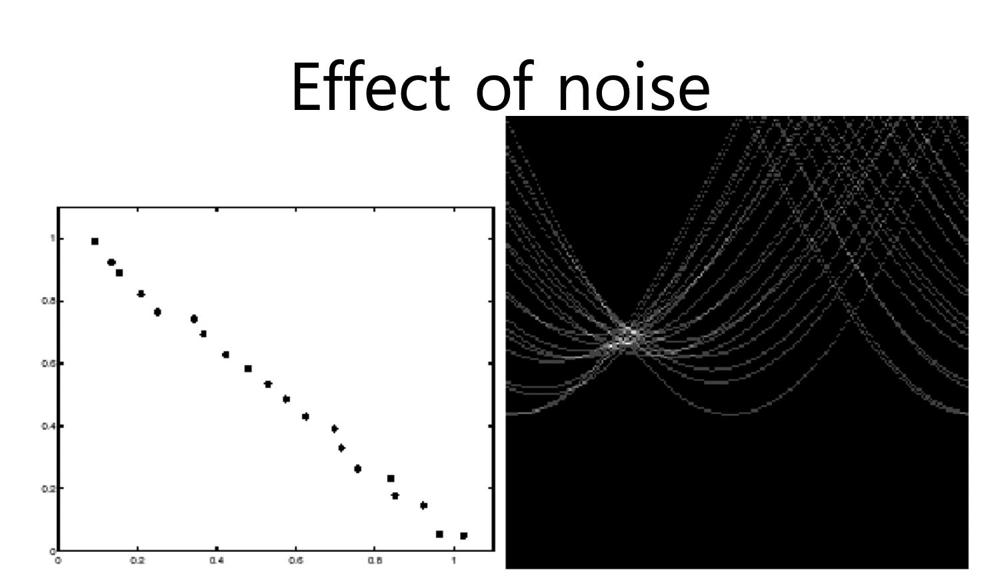
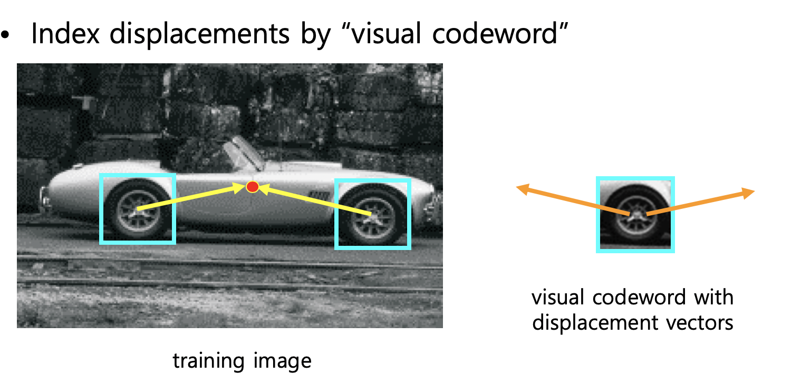
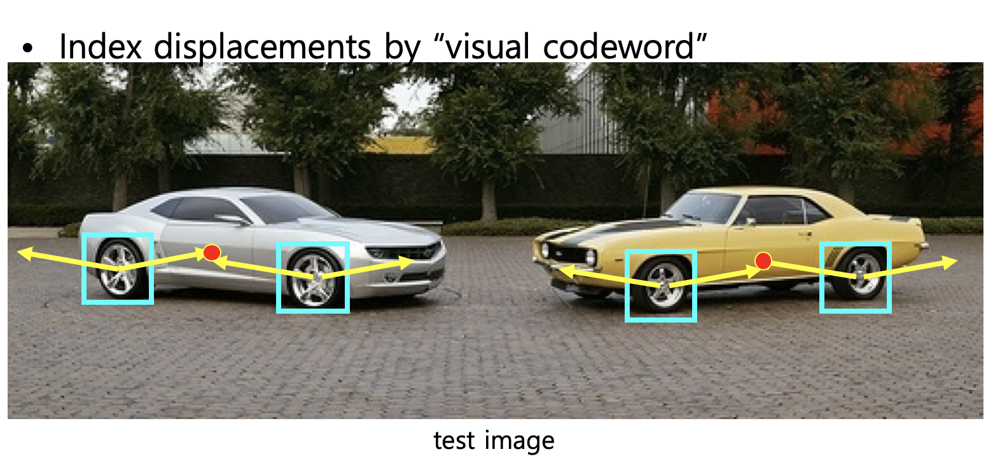
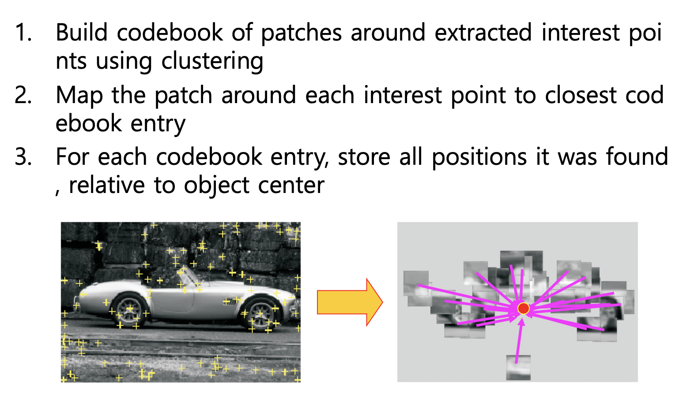
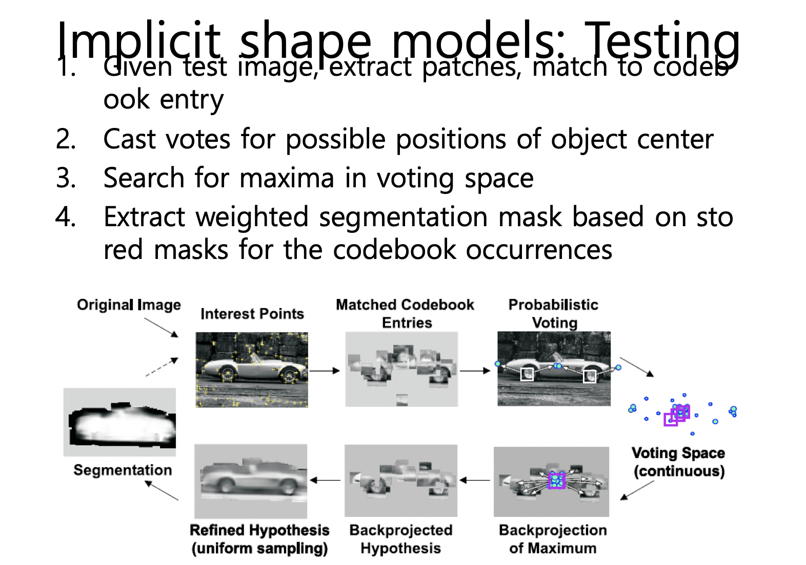
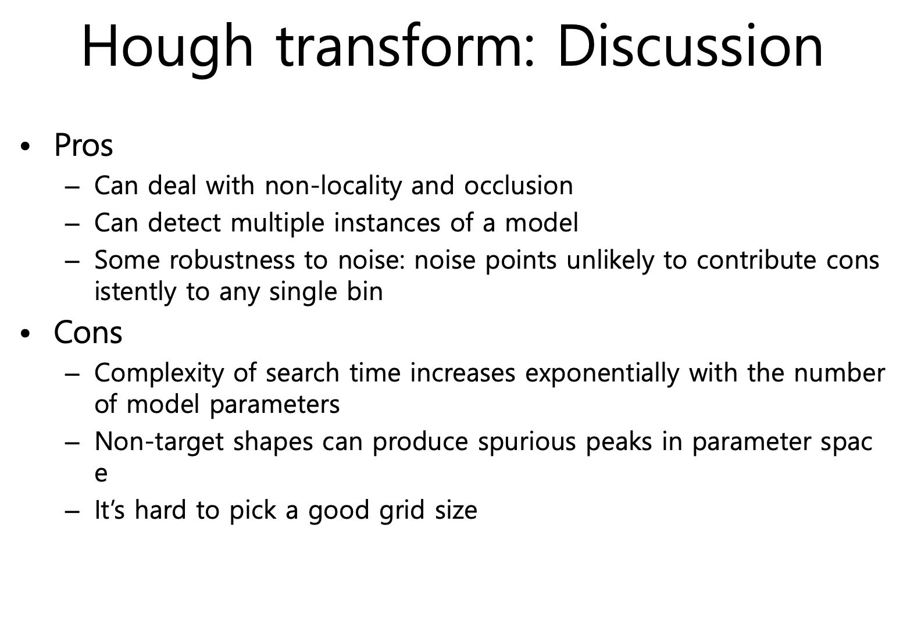

## 컴퓨터비전

1028

##### Hough transform

점이 모이는 곳, 직선의 방정식을 구해 에지를 구해낼 수 있다. 

##### Effect of noise

잡음이 들어간다면, 하나의 직선의 방정식으로 나타나지 않으며 voting 또한 한점으로 나타나질 않는다.

아웃라이어를 지정하거나, quantitation(값을 단위로 나누어 구분) 하는 방법이 존재한다(단, 정확한 값이 아니게 되기 때문에 오류가 존재할 수 있다. + 원하지 않는 노이즈또한 들어 올 수 있다.).

##### Hough transform for circles

특징을 뽑아 보팅 방향에 대해 보팅하고, 가장 높은 보팅이 된 곳에 원하는 물체가 있을 가능성이 높다. 원도 에지 라인에 대해서 그레이디언트 방향으로 보팅해면 원의 중심을 검출하는 등의 방법이 가능하다.

*바퀴 특징에 대한 모델*

*보팅된 영역의 중심이 물체의 중심이 되게 하는 알고리즘.*

*Hough transform이 이렇게 인식과 같은 것으로 가능함을 보여줌.*

유사 특징들을 뽑고, 뽑은 특징들에 대해 보팅한 뒤 보팅이 가장 많이 겹치는 곳에 대해 적용한다. 이것은 사람에도 적용 가능한데, 눈에 대해당하는 특징들을 많이 뽑는다.(코나 입또한 뽑는다.) 이후 이것들에 대한 평균들을 뽑아서 (보팅 해서)얼굴 인식을 할 수 있는것이다. 

자동차, 사람 뿐만아니라 다양한 물체에 대해 모두 적용 가능하다.

부분 가려진 것에 대해서도 잘 찾는다는 것이 보팅 알고리즘의 가장 큰 장점일 것이다. 

보팅 알고리즘은 Supervised Running 이다. 이것은 사람이 컴퓨터에게 물체에 대한 특성을 미리 알려주고, 많이 찍히는 곳에 대해 이렇게 하라는 것을 미리 알려주는 것이다. (Unsupervised Running은 반대로 알려주지 않고 찾아내는 것이다. - 딥러닝 등, semivised도 존재.)

##### 

#### Ransac

주어진 여러 집합이 있는데, 대략적으로 만족하는 직선의 방정식을 찾는 것이 목표이다. 랜덤하게 직선의 방정식을 만든다는 의미이다. 점들에 대해 몇%이상 들어온다면 이것을 이용하겠다고 선언한다. 

직선을 그리는데에는 두가지 방법이 있을 수 있다. 

1. 오차가 최소화가 되는 직선을 뽑는다.  하지만 이것은 시간이 너무 오래걸린다. 또한 아웃라이어에 대해 굉장히 예민하다. (최소제곱법)
2. 랜덤한 직선을 그리고 추측해서 이용한다 (RANSAC)

##### 그리는법

먼저 랜덤하게 두개의 점을 선택해 직선을 그린다. 그리고 일정 범위에 대해 점이 얼마나 들어오는지 파악한다. 만약 만족하지 않는다면 다시 두점을 뽑아 재시행 한다.

일정 % 이상 만족 할 때까지 이를 반복 시행한다. 

RANSAC은 최소제곱법과 달리 직선이 하나가 아닌 여러개가 나올 수도 있다. 

입력값으로 점들의 집합과 오차범위를 입력해주어야 한다.