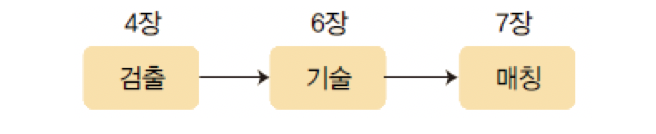
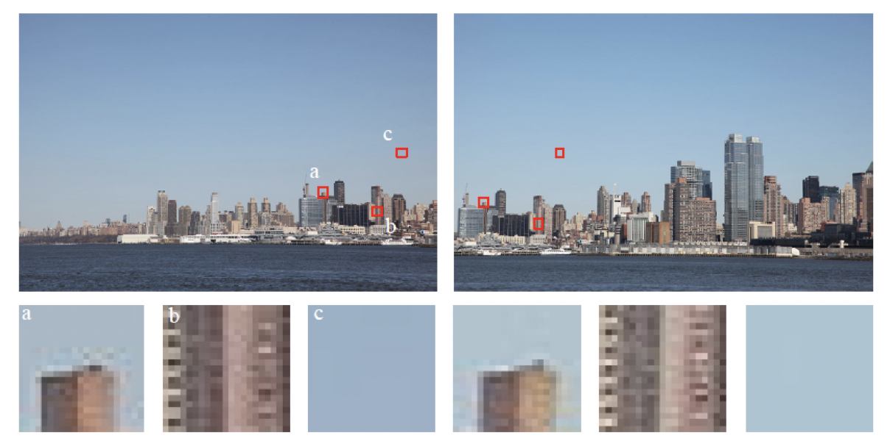
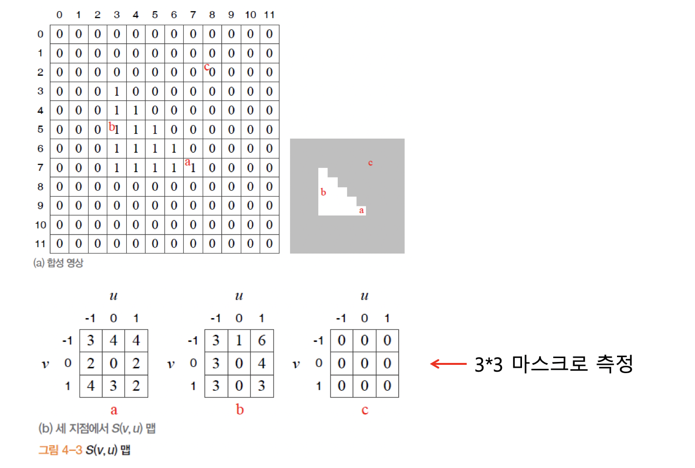
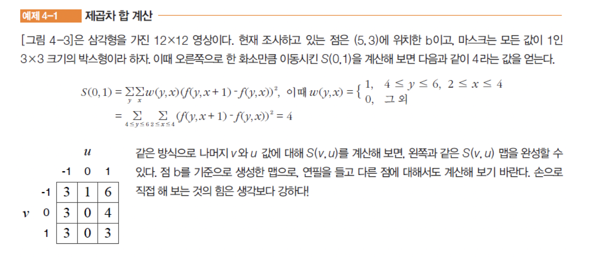
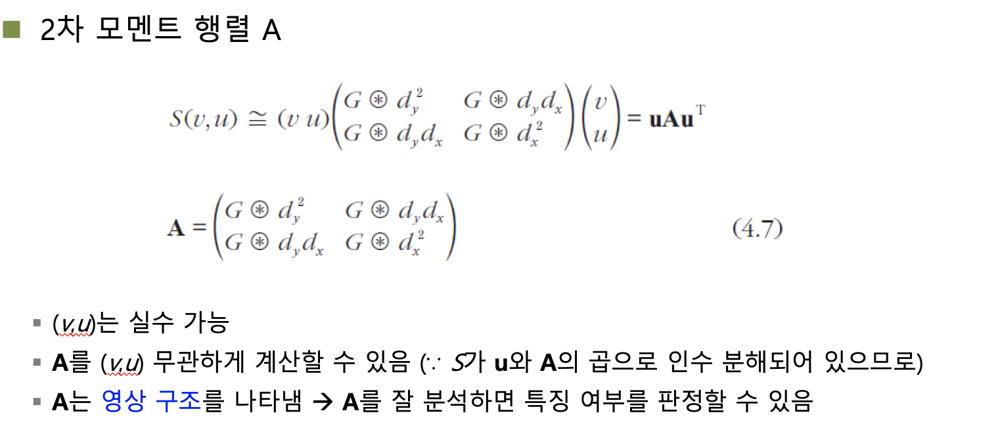
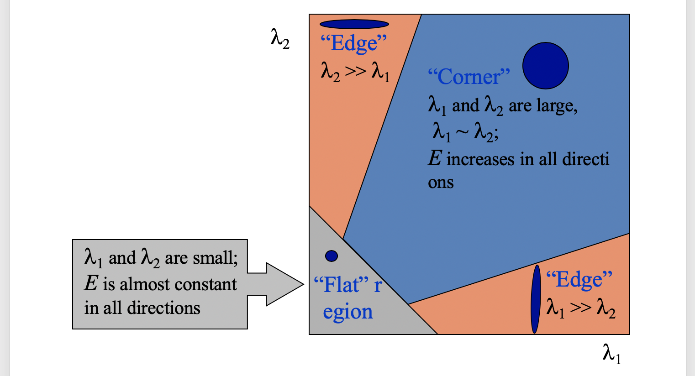

## 컴퓨터 비전

1104

##### 대응점 찾기

같은 장면을 다른 시점에서 찍은 두 영상에서 대응하는 점의 쌍을 찾는 문제. 파노라마, 물체인식/추적, 스테레오 등 컴퓨터 비전의 중요한 문제 해결의 단초이다.

##### 특징 검출

우리는 에지를 배웠었는데, 이 에지를 가지고 특징점으로 쓰기에는 정보가 많이 부족하기 때문에 이용하기가 어렵다. 

다른 곳과 두드러지게 달라 정보 추출이 원활한 곳이여야 한다.  코너 검출이라는 곳이 존재했지만, 이는 2000년대 들어와 많이 사라졌는데, 어디에서 보느냐에 따라 코너가 될수도, 아닐수도 있어서 사라졌다.

우리는 지역 특징(Local feature)이라는 새로운 특징으로 검출을 수행한다.

##### Local Feature

$$<위치,스케일,방향,특징 벡터>=((y,x),s,\Theta,x)$$ 로 표현한다.

지역 특징은 **반복성,분별력,지역성,정확성,적당한 양,계산 효율** 을 특성으로 만족해야 한다.

여러 방향으로 밝기 변화가 나타나는 곳일수록 점수가 높다.

c점은 대응점을 찾기가 매우 어려울 것이다. b에 대해서는 c보다 낫지만 역시 명암값 변화가 적어 파악하기 어렵다. a에 대해서는 명암 값의 차이가 확연히 드러나기 때문에 a점이 특징점이 될 수 있다. 좌,우,상,하 방향에 대해 3방향 이상 눈에 띄는 특징점이 발견 된다면 이는 특징점으로 이용할 수 있다. 

##### Corner Detection

- flat : 모든 방향에 대하여 값변화가 없다.
- edge
- Corner : 세방향 이상에서 명암값의 차이가 일어나는 곳을 뜻함.

#### 이동과 회전에 불변한 특징점 검출

##### 모라벡 알고리즘

제곱차의 합으로 밝기 변화 측정.

3바이 3 마스크의 각 값은 본인 위치에서 방향으로 있는 숫자만큼 뺀것의 제곱수의 합이다. 예를들어 위의 우측값은 4의 경우는 해당 위치의 3바이 3 박스에 대하여 현재위치 우측값에 있는것을 뺀 값의 제곱의 합이 4인것이다. 

이렇게 얻은 결과로써 해당 영역의 특징을 얻을 수 있다. 
$$
S(v,u) = \sum_y \sum _x{w(y,x)(f(y+v,x+u) - f(y,x)^2)}
$$
한 화소만큼 이동하여 네 방향만 본다는 문제와 잡음에 대한 대처방안이 없다는 문제가 존재한다.

##### 해리스 코너

테일러의 확정을 대입해서 이용했다. x,y에 대한 분산치 값을 이용함으로 특징을 뽑아냈다.

