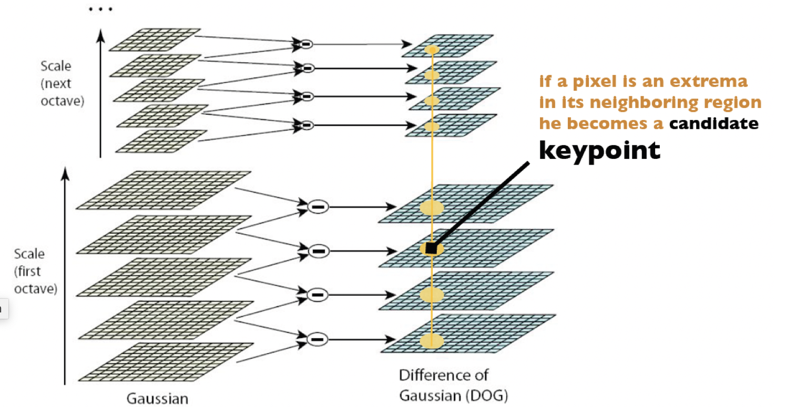
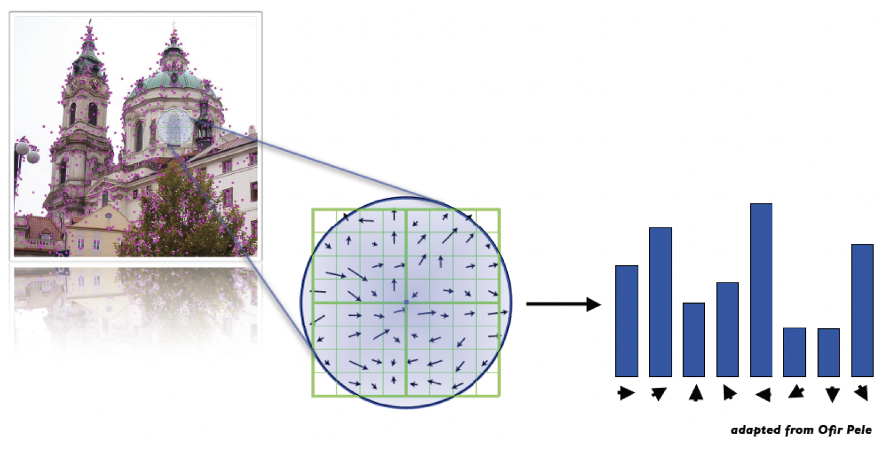
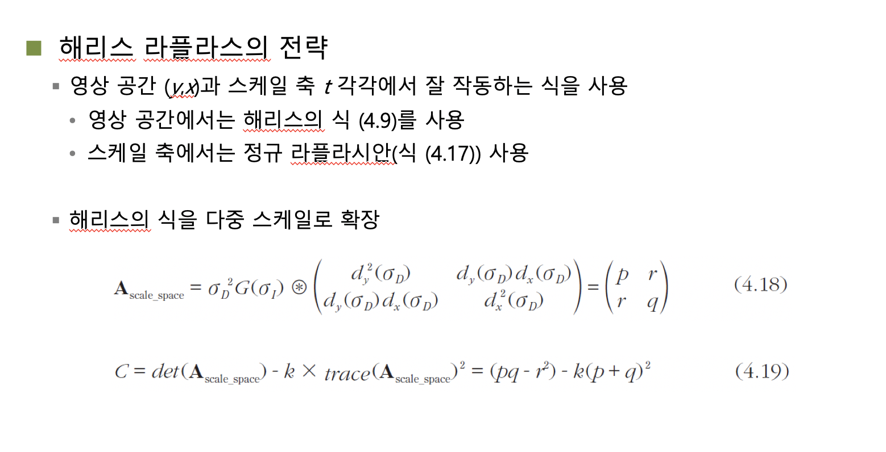
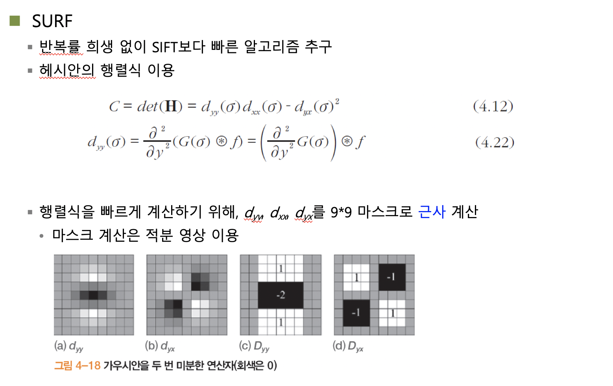

## 컴퓨터비전

1113

#### SIFT

##### 스케일공간 - 15p

1. 하나의 영상내에서 가우시안을 적용해 주변이 변하더라도 동일하게 되는 것을 찾아보자. 명암값이 뭉개지더라도 주변값에 비해 분명하게 다른 명암값을 가져야 한다는 것.

2. 크기에 대한 변화가 있더라도 명암값의 차이에는 변화가 없어야 한다는 것이다. 

처리시간이 많이 걸릴수도 있다는 단점이 존재한다. 

가우시안 적용한 것에대한 층계를 옥타브라고 표현한다. 인접 상위 옥타브 영상에 대하여 현재 옥타브 영상과의 차이값을 구한다. 이렇게 하면 변화가 존재하는 영역들을 뽑아 볼 수 있는데 , 이것을 Difference of Gaussian(DOG) 라고 한다. 

$$G (\frac {\sigma f}{\sigma x})$$ 였는데, 이는 2번 연산 하므로, $$\frac {\sigma G} {\sigma x} f$$ 로 하면 한번만 연산한다.

DOG를 하는 이유는, flat한 부분을 제외하고 에지나 변화가 있는 부분만 뽑아내기 위해 시행하는 것이다. 이렇게 뽑아낸 것들이 특징점에 대한 후보군이라고 볼 수 있다.

각 옥타브를 통해 얻어는 DOG들에게서 공통으로 나타나는 특징점을 찾아낸다. 만일 일부가 다른 값이 나오거나 나오지 않는다면 특징이 아니라고 생각해 볼 수 있다. 

Key point : 공통으로 나타낸 점들을 지칭하는것.

그런데 너무 많은 키포인트가 나나타므로 몇가지를 지운다.

- low contrast
- Edges

##### 정리

1. 인풋 이미지에 대해 피라미드 이미지를 만든다.

   Ex) 이미지가 1/2씩 줄어드는 피라미드 이미지 

2. 해당 피라미드 이미지들에 대해 가우시안을 시그마 값에따라 적용하고 DOG를 수행한다. 

   Ex) 이미지에 대해 $$\sigma =1일때,\sigma=2일때...$$ 도출하고 DOG뽑는다.

3. 이렇게 얻은 DOG에서 키포인트들에 대해서 동일하게 적용되는 점들을 뽑아낸다. 

4. 이후 에지영역 등 필요하지 않은 점들에 대해 제거한다.

찾아놓은 키포인트들을 중심으로 어떤 방향으로 그레이디언트 방향이 크게 변하는가를 찾아야 한다. 키포인트를 중심으로 명암값들의 방향이 어느쪽으로 많이 변하는가를 표현한다.

##### 스케일 공간 찾기

빙법이 두가지 이다. 

- 키포인트를 찾고 주변 영상들 간 변화 방향에 대해 128개의 어레이를 만들고 표현한다. 

- 헤리스 라플라시안 전략. 2차원 가우시안을 씌운것에 대해 해리스 코너를 뽑은것.

##### 위치와 스케일 계산

키포인트는 <*y*,*x*,*o*,*i*> 정보를 가짐 (옥타브 *o*의 *i* 번째 DOG 영상의 (*y*,*x*)에서 검출)

미세 조정 (부분 화소 정밀도)을 거쳐 <*y’,x’*,*o*,*i'*>로 변환됨

위치와 스케일 계산 식 적용

##### DOG를 구하는데 너무 시간이 오래걸려서 비슷한 필터를 씌워보자는 전략을 내게 됌.

미리 필터를 만들어 놓고 적용해서 바로 이용하면 시간을 줄일 수 있을 것이다. - SURF 검출

