## 컴퓨터 비전

A4 4장 ~ 5장 간단한 보고서를 작성하여 12/15까지 제출 할 것.

##### 푸리에 기술자

기저함수들에 대한 것에 대해 계수의 변화를 결합하여 원하는 신호값을 추출해 낼 수 있다. 그렇다면 기저함수를 어떻게 알아낼까

- 테일러 급수

- 오일러 & 푸리에

  코사인과 사인의 합으로 모든 값의 표현이 가능할 것이다. 

  오일러공식

  $$e^{ik}=cosk+isink $$    $$i= \sqrt{-1}$$

##### A Sum of Sinusoid

- $$Asin(wx+\pi)$$

진폭에 대한 값을 지속적으로 줄여서 더한다면 원하는 타겟을 구할 수 있지 않을까.

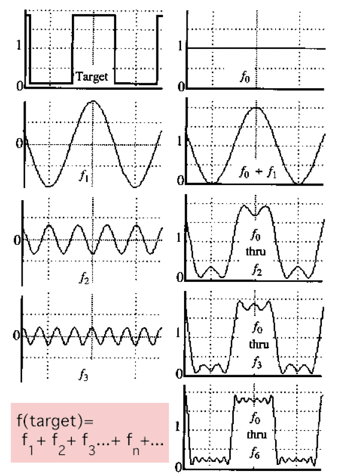

주어진 영상 $$f(x)$$ 에 대하여 푸리에 트랜스폼을 거치면 $$F(w)$$ 로 변화하고 이것은 주파수에 대한 표현이 된 것이다

모든 값에 대하여  $$Asin(wx+\pi)$$ 의 값으로 타겟을 구할 수 있을 것이다. 

$$F(w) = R(w)+il(w)$$ (실수부 + 허수부)

이것은 반대로 복원이 가능하다. ($$F(w) ==> f(x)$$) 푸리에 트랜스폼에 대한 반대 수행. 

이 반대방향 수행을 가지고 압축에 대한 원리를 논할 수 있다. 본래 매우 방대한 데이터가 필요하지만 실제 jpg같은 파일을 보면 그렇지가 않은데, w값을 가지고 원하는 값을 추측해서 이용한다. 

주파수 도메인으로 변화 헸을때 사람이 볼 수 있는 값과 계수들만 이용하며 inverse또한 마찬가지로 수행하기 때문에 용량이 적게 수행된다. Ex 

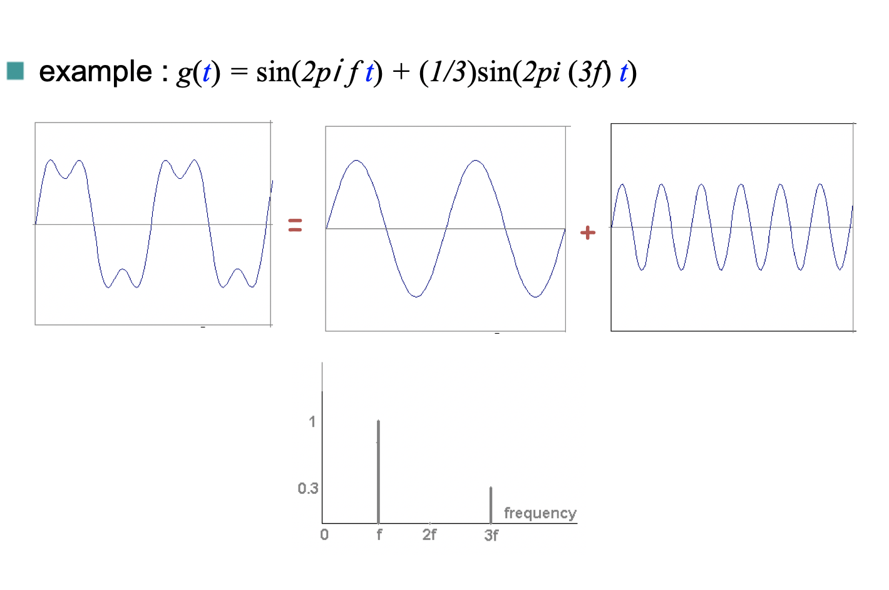

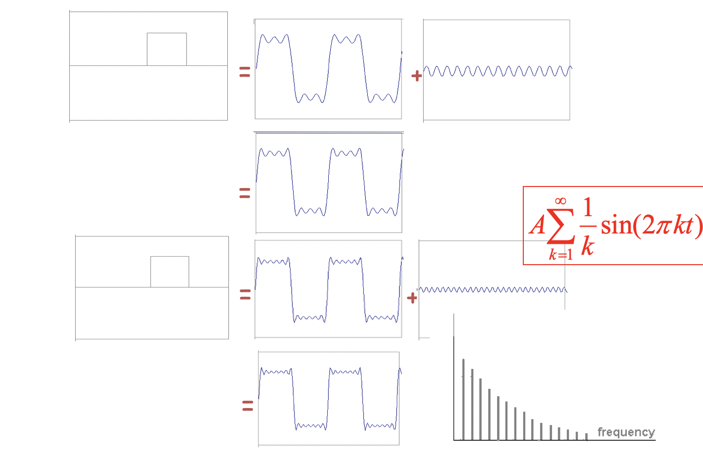

해당 작업의 반복으로 원하는 함수를 추출해 이용한다. 

스패셜 도메인에서 컨볼루젼 연산을 하는것에 대해 주파수 도메인으로 변경한다면 이것은 곱하기다. 공간 도메인에서 컨볼루젼 하려면 복잡한데, 주파수 도메인으로 변환한다면 곱하기만 하면 되기 때문에 이렇게 하곤 한다.

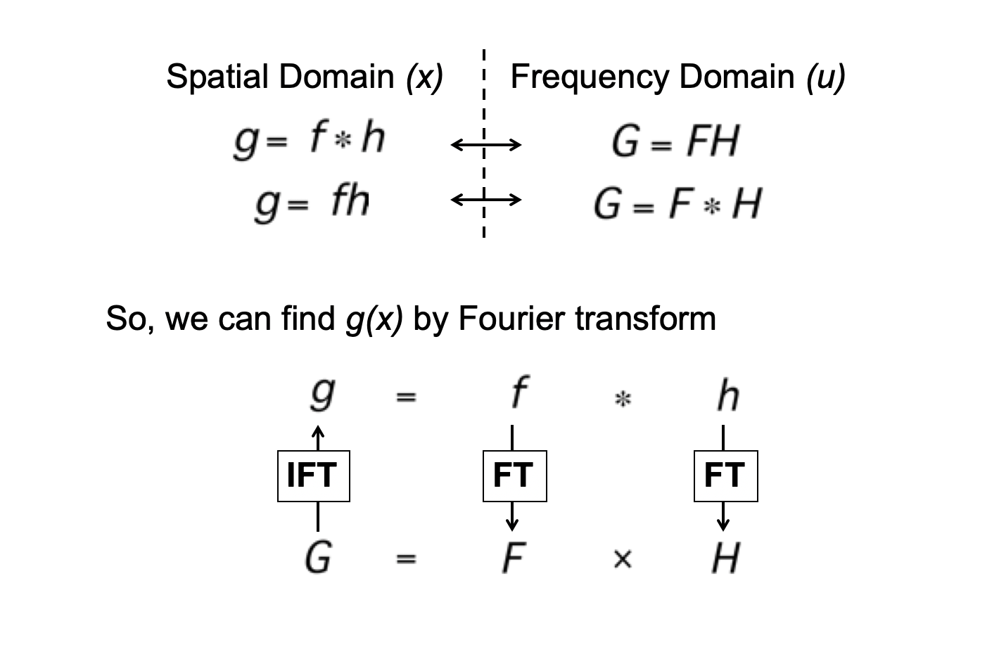

때문에 스무딩 목적으로 가우시안 커널을 적용할 때 픽셀단위 적용할 것 없이 그냥 주파수 도메인 변경 후 바로 곱하면 끝이다. 

##### Low pass filtering

플랫한 영역의 정보만 남는것. 

원본 영상에 대하여 주파수 도메인을 그리고 이것의 낮은 주파수만 남기는 것이다.  이것을 수행하면 에지가 사라져 영상이 뿌옇게 보이는 효과가 나타난다.

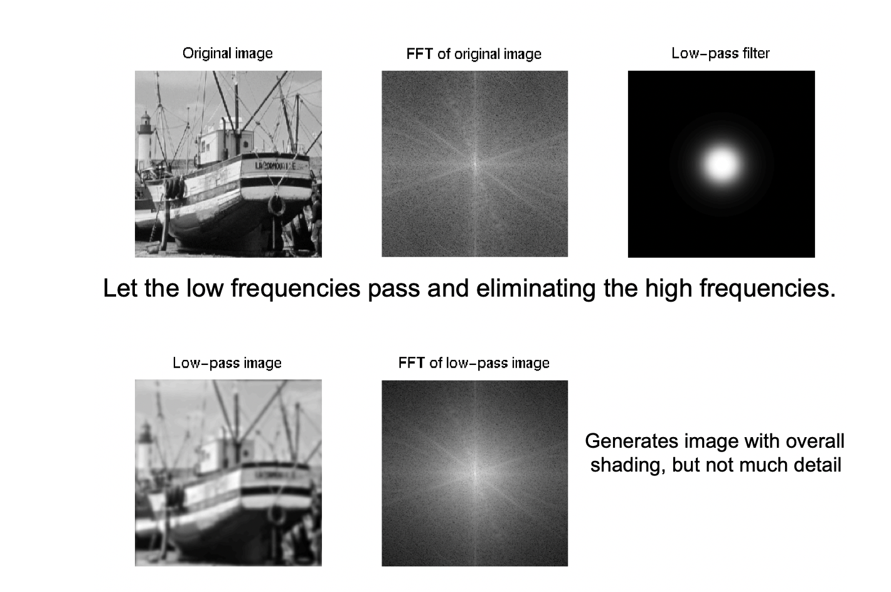

의외로 에지나 코너에 대한 연산보다 로우패스가 얼굴 연산이 더 잘 되었는데, 특징점을 잡는 것이 로우패스의 영역과 많이 관련되어 있는 것이다. 

하이 패스 필터링은 반대로 높은 주파수의 영역만을 가져와 나타낸다. 이것은 에지들을 나타내게 된다.

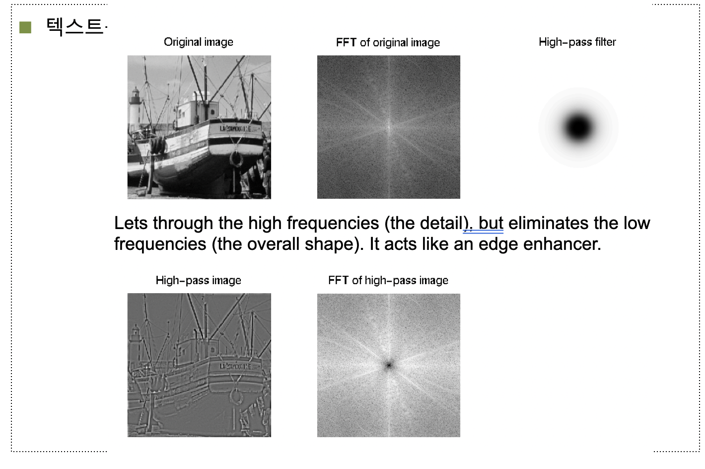

#### 텍스쳐

##### 전역 기술자

불확실성이 가장 높을때 엔트로피가 가장 높다고 할 수 있다. 명암차이가 가장 클때를 엔트로피, 가장 적을 대는 유니폼이라고 한다.

분산값이 적으면 유니폼, 크다면 엔트로피에 대한 것이다. 유니폼이 하다면 엔트로피가 줄어들고 엔트로피 하다면 유니폼 값이 줄어든다.

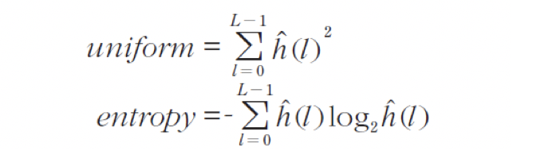

전역 기술자는 지역적인 정보를 반영하지 못한다.

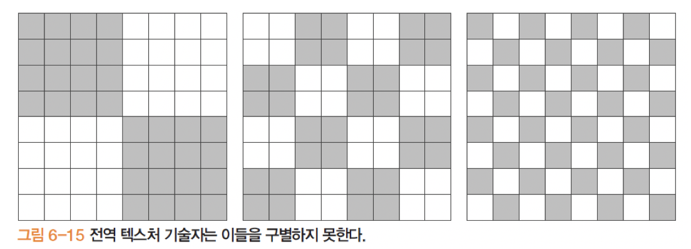

##### 지역 관계 기술자

화소 사이의 이웃 관계를 규정하고, 그들이 형성하는 패턴을 표현함.

- 동시 발생 행렬

  이웃 관계를 이루는 픽셀에 대한 추적

  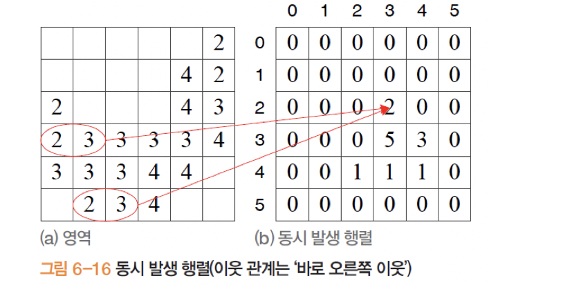

어떤 화소들이 동시에 많이 발생하는지를 파악 할 수 있다. 영상의 특성을 파악 할 수 있을 것이다. 

**지역 이진 패턴** (중요)

 3 3 윈도우에서 가운데값을 스레시 홀드로 기준잡고 그거보다 작으면 0 그거보다 크면 1을 준다. 그리고 표현함.

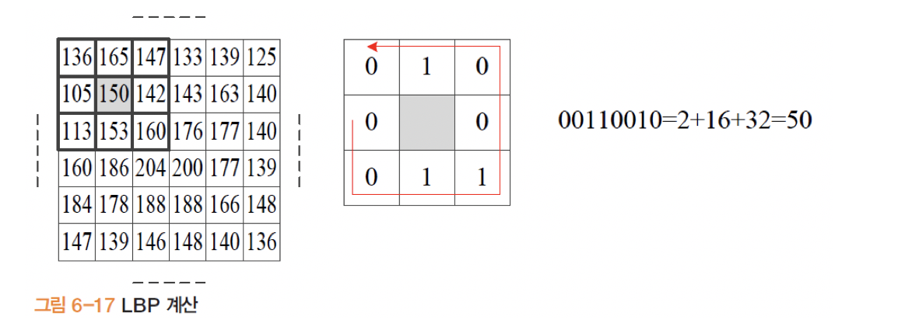

주변 값들에 대한 관계를 하나의 값으로 파악 가능하며 9개의 값을 하나의 값으로 줄이기 때문에 차원도 많이 줄어들게 된다. 

##### 지역 삼진 패턴

마찬가지로 값을 기준으로 하는데 스레시 홀드값을 하나둔다. 그리고 값을 추정해 낸다.

1. 본래값 - 스레시 홀드 보다 작은것

2. 본래값 + 스레시 홀드 보다 큰것

3. 사이값

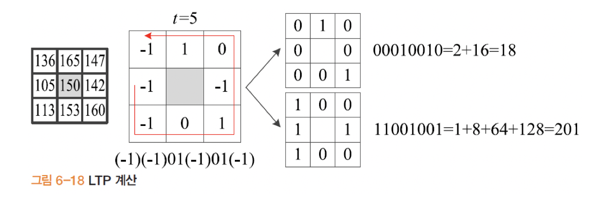

8이웃만 보면 스케일 변화에 대한 대응을 하기 어려우므로 다양한 이웃을 이용하여 스케일 불변에 대한 대응이 필요하다.

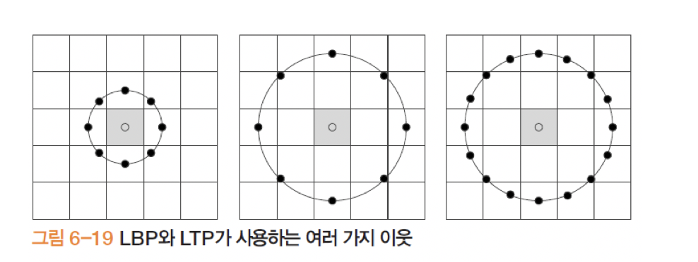

#### 주성분 분석

차원 축소를 어떻게 할 것이냐에 대한 문제이다. 

x나 y에만 국한되도록 차원을 줄인다면 정확한 위치 파악에 대한 문제가 있었다. 주어진 데이터 평균을 구하고 분산을 구하고 장축에 대하여 값을 구한뒤 우측 아래대각선 같은 도표를 이용하여 겹치지 않도록 축소한다.

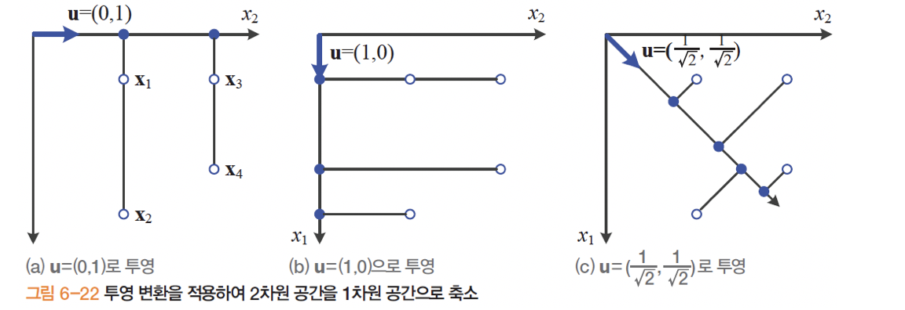

최대 분산값 추측에 대한 내용을 파악 해야한다.

