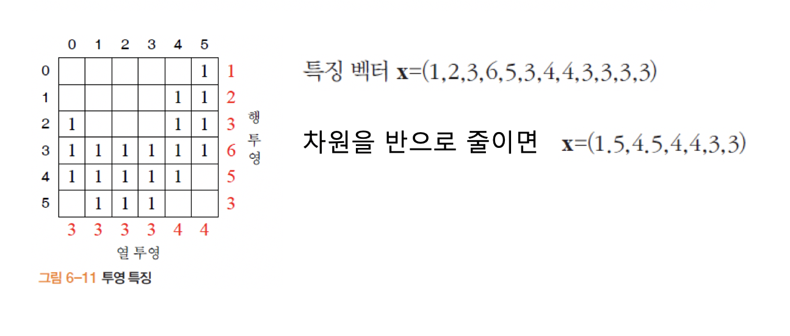

## 컴퓨터비전

##### 리뷰

SIFT : 스케일의 변화에 영향을 받지않는 특징을 찾아보자는게 SIFT의 중요한 이슈였다. 스케일 변화에 대한 계층을 옥타브라고 했었고, 옥타브에 대한 영상들을 구해서 특징점을 찾았다. 

가우시안의 시그마를 적용한 영상들을 옥타브에 컨볼루젼 했는데, 시그마 수치를 변환하면서 적용하여 잡음에 대한 스무딩을 한 영상들을 가지고 특징점을 찾았다. 

영상들에게서 특징점들을 뽑아 수치 변화를 측정한다.  코너와 에지의 경우 거의 변화량이 없을 것이고, 잡음에 대한 특징은 변화가 나타날 것이므로 변화량이 적은 특징들을 뽑아 이용한다. 

지금까지는 이러한 특징점들을 찾는 과정을 보았는데, 이제 이러한 특징들을 어떻게 기술하는지에 대해 다룬다. 

#### Descriptor

가능하다면 특징이 무엇인가를 잘 나타내주도록 표현해주어야 하는 것이다. 에지나 지역 특징, 영역만으로는 매칭에 사용하기에 많이 부족하다. 

그렇다면 풍부한 정보를 어떻게 추출할 것이냐. 하는 문제가 나타나는데, 검출된 특징에 대해 내부 또는 주위를 통해 풍부한 정보를 추출해낸다. 이는 특징에 대한 성질을 기술하므로 **기술자** 또는 벡터 형태이므로 **특징 벡터** 라고 부른다.

##### 특징 기술자의 조건

- 특징에 대하여 분별력이 높아야 한다. 
- 다양한 변환에 대해 불변해야 한다.
  - 기하 불변성과 광도 불변성
  - 변환에도 같은(유사한) 값을 갖는 특징 벡터를 얻어내야 한다.
- 구별되는 이름을 가지고 있어야 한다.
- 차원이 낮아야 계산이 빠르다.(하지만 차원이 높다면 특징을 잘 파악할 수 있다 - 차원의 저주)

##### 관심점에 대한 기술

특징점 + 주변 값을 봐야한다. 그런데 ***주위의 값(윈도우 크기)을 얼마나 봐야할까 ?***

헤리스 코너와 같은 경우 스케일 정보가 없기 때문에 윈도우 크기를 결정할 정보가 존재하지 않는다. 반면 SIFT나 SURF의 경우 스케일 $$\sigma$$에 따라 윈도우 크기를 결정할 수 있으므로 스케일 불변성을 달성 할 수 있다. 

##### SIFT 기술자

스케일 불변, 회전 불변을 달성한다. $$o_l$$,스케일 $$\sigma_o$$ 인 영상의 위치에 씌우며, 그레이디언트 방향으로 히스토그램 추출해 이용. 및 광도 불변을 달성 한다. 

- SIFT 기술자 추출 알고리즘

  윈도우를 4*4 블록으로 분할한다. 이후 각 블록에 대해 그레이디언트 방향 히스토그램을 구한다. (단 그레이디언트 방향은 8개로 양자화 한다.)

  어느 방향으로 블록값의 명암값 변화가 이루어지는가에 대해 추출 할 수 있다. 

##### 이진 기술자

빠른 매칭을 위해 특징 벡터를 이진열로 표현했다. (0-255 수치가 너무 방대해 값을 얻어내기 어려우므로 축소해서 이진값으로 추출하고자 했다.)

##### 영역 기술자

영역의 표현을 통해 수치화를 진행하면 이진값을 얻어내 이진 기술을 할 수 있을 것이라는 결론에 이른다. 어떤 영역으로 적용할지는 선택이다. 

체인 코드를 가지고 나타내 본다면 영역에 대한 표현을 유지하면서 효율적으로 이용할 수 있지 않을까 하는 생각이 든다. 하지만 체인 코드로 나타낸다면 본래 (a)와 같이 표현된 값에 대하여 수치를 잃어 버릴 수 있다.

#### 모멘트

주어진 q+p차에 대하여 값의 변화에 따라 영상에서 특징을 추출하는데 적용한다. 차원을 어떻게 적용하느냔에 따라 면적이 얼마냐 중심이 얼마냐를 파악하는것으로 사용할 수 있을 것이다. 

##### 중심 모멘트

- 열분산 : x
- 행분산 : y
- 혼합 분산 : 전체적인 분산에 대함

중심값 및 면적에 대해 어느정도 값이 나타나고 어떠한 수치가 보이는지를 나타내는 것이라고 할 수 있다.

주어진 영역에 대해 중심이 어디냐, x축 방향으로 얼만큼 산포되어 있냐,y축 방향으로 얼마나 분산을 가지고 있느냐를 얻어내는 것이 모멘트를 이용하는 주 된 이유라고 볼 수 있다. 

이렇게 얻어 낸다면 정확하게 무슨 값인지는 파악하기 어렵겠지만 대략적으로 어떠한 형태를 띄는지를 추측할 수 있다. 모멘트를 이용하여 전체 모양이 얼마나 생겼는지를 표현 할 수 있다. 

중심 위치 , 평균값 , 분산에 대해 정확하게는 아니지만 간단한 몇개의 수치를 가지고 영역을 표현 할 수 있다.

##### 명암 영역의 모멘트

???

모멘트 간단하게 보고..

##### 모양

면적이나 둥근 정도, 길쭉한 정도 등 특징을 추출하여 무슨 모양일 것이다 하는것을 추측하는 것이다.

##### 투영

2차원 영상에 대하여 값들을 센다. 예를들어 행방향으로 1이 몇개인지 센다면 행 투영이다. 이것은 값이 몇 번 나오는 지 알수 있지만 어느 위치인지는 알 수 없다. 차원은 줄일 수 있지만 위치에 대한 정보가 줄어든다. 

##### 프로파일

이전 투영에 대하여 프로파일은 상하좌우에 대한 값을 가지며, 처음 해당 값이 등장하기까지 얼마나 걸리냐에 대한 것을 값으로 가지고 있다.

##### 푸리에 기술자

신호를 기저 함수의 선형 결합으로 표현한다. sin과 cos 함수의 조합을 가지고 특징 벡터를 얻어 낼 수 있지 않을까 하는 것이다. 

주어진 영상에서의 x,y명암값들의 변화를 가지고 sin함수와 같이 주기변화를 가지고 이용할 수 있지 않을까

기저 벡터를 이미 가지고 있다면, 입력 신호를 가지고 본래 형태에 대한 모습을 추측할 수 있을 것이다. 

영상 처리에서의 주파수는 명암값의 변화가 얼마나 크게 나타나느냐 하는 것이다. 

기저함수 $$g_1,g_2$$ 를 가지고 있다면 신호를 복원해서 볼 수 있을 것이다. $$t(.)$$가 계수인데, 다양한 함수로 이를 표현해 볼 수 있고, 이를 통해 주기에 대한 변화를 조절 해 많은 sin함수,cos함수를 얻어 낼 수 있고, 원하는 신호들을 다 얻어낼 수 있다.