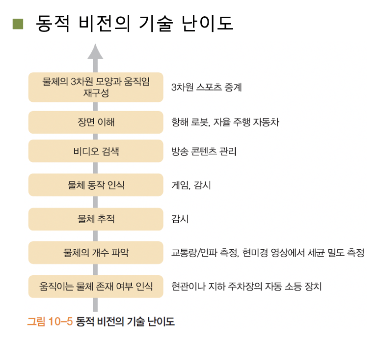
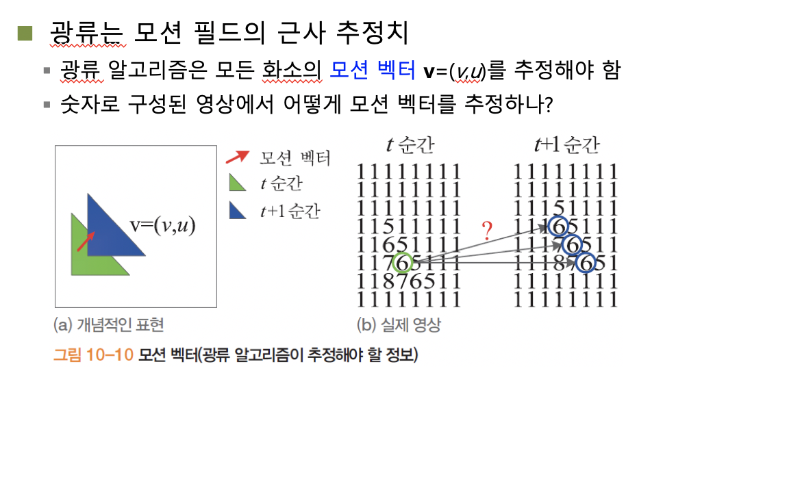
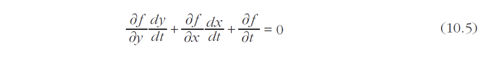
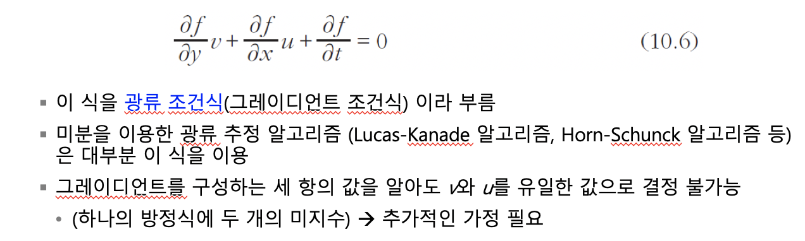
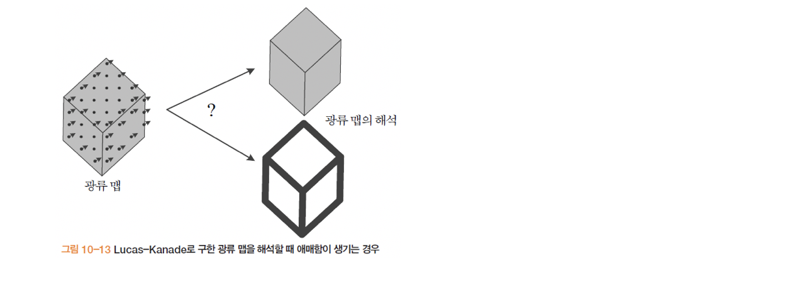

## 컴퓨터비전

#### 모션

##### 움직이는 상황

여러가지 연속 동작에 대하여 파악한다. 네가지 상황에 대한 장면이 존재 할 수 있다.

- 정지 카메마와 정지 장면

  앞장에서 공부한 내용. 10장에서는 다루지 x

- 정지 카메라와 동적 장면

  CCTV

- 동적 카메라와 정적 장면

  불법 주정차 단속 카메라 등이 이에 해당.찍는 당시는 아닌등의 이유로 좋은 예는 아니긴 하다.

- 동적 카메라와 동적 장면

  가장 복잡한 경우. 항해하는 로봇이나 스포츠 중계 등의 장면.

  

물체가 움직이는 방향 및 속도에 대한 정보가 필요하며 물체에 대한 행위를 인식하여야 합니다.

모션 필드 추정이 근본적으로 어려운 상황.3차원 모션 벡터는 복원이 불가하다. 2차원 벡터를 추정해야 하는데 대부분 연구에 대해 두장의 이웃 영상으로 2차원 모션 벡터를 추정하는 일로 국한한다.

##### 광류

모션필드에 대해 정확하게 알 수 없다.

가운데로 이동했음을 추측할 수 있는데, 주변에 것에 대하여 동일하게 움직였지 않을까 하는 추측이 가능한 것이다,

수백*수백이상의 256영상이기 때문에 굉장히 방대한 양이며, 동적 물체와 움직이지 않는 물체의 혼재, 가림이나 여러 기하변환, 잡음 등으로 인해 추정이 어렵다.

밝기 항상성 : 물체의 같은 점은 다음 영상에서 같은 명암 값을 가져야 한다. (정확히 들어맞지는 않지만 유사값 정도로 오차범위 이내의 값 추정 가능)

##### 광류 추정의 원리

두영상 사이의 시간차이가 충분히 작다고 가정하고 2차 이상의 항은 무시한다. 테일러 급수에 의해 

##### Lucas-Kanade 알고리즘

화소 (y,x)를 중심으로 하는 윈도우의 영역N(y,x)의 광류는 같다는 가정.

이웃 영역만 보는 지역적 알고리즘. 윈도우 크기가 중요하다. 윈도우 크기가 클수록 큰 움직임을 알아 낼 수 있지만 스무딩 효과로 모션 벡터의 정확성이 낮아진다. 명암 변화가 적은 물체 내부에 0인 벡터가 발생한다.

##### Horn-Schunk

광류는 부드러워야 한다는 가정이다.

복잡하고 반복적인 연산이라 잘 안씀. Lucas-Kanade알고리즘이 더 많이 이용된다.

광류는 큰 움직임이 존재하는 것에 대하여 추적이 어렵다.

시간이라는 새로운 축.ㄷㄴ