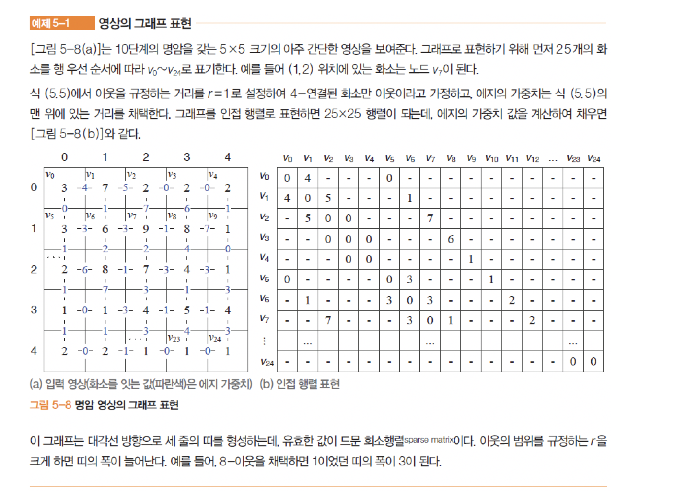
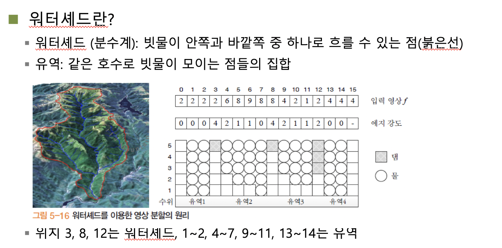
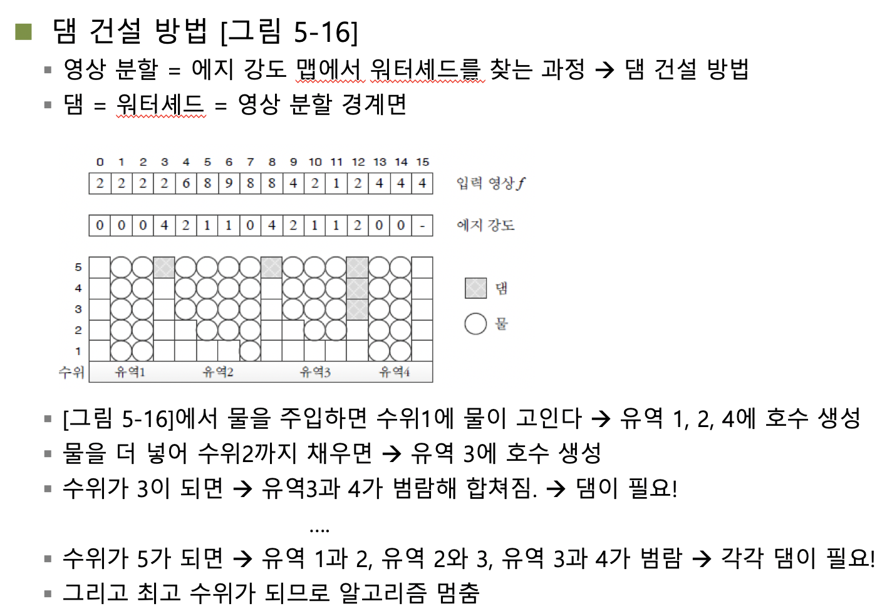

## 컴퓨터비전

##### 영상 분할의 원리

주어진 영상에 대한 영상의 분할이다. 네모난 색종이를 가위로 자른 형태라고 보면 된다. 분할한 영상들에 대해 교집합이 존재하지 않는다. 그리고 모든 분할한 영상의 합은 본래 영상이 된다. 

저분할은 영상의 영역을 나눌때 굉장히 적은 사이즈로 분할하는 것을 의미하고(그러니까 적은 개수로 분할한다는 의미 듬성듬성 쪼갬), 과분할은 굉장이 잘게 잘게 쪼개는 것을 의미한다. (굉장히 세밀히 쪼갠다.)

주어진 영상의 여러 정보들을 가지고 물체를 구분해야 한다. 세그멘테이션을 어떠한 특징점을 잡아서 분할 하느냐에 따라 다르게 되기 때문에 정답이란 존재하지 않으며 그 추출 정보와 값을 잘 선택해서 분할해야 한다.

사람이 긋는 경계와 컴퓨터가 지정한 경계에 대한 부분의 유사성이 가장 높은 세그멘테이션이 가장 좋은 분할이라고 할 수 있다. 

에지 정보를 확실한 정보로 믿을 수 없는 이유가 있는데, 에지 영역이 끊어지지 않아야만 영상분할 알고리즘으로 이용할 수 있지만 만일 끊어지지 않는다는 가능성이 존재한다면 그것은 영상분할로 이용할 수 없다. 또한 에지 영역에 대해 거짓 에지에 대한 판별과 끊어지지 않는 에지와 같은 이유때문에 에지는 영상분할에서 좋은 요소이긴 하지만 신뢰할 수 있는 요인은 아니다. 

##### 전통적 방법

특수 조건이거나 단순한 영상에 대해서만 작동하는 경우에 많이 이용했다. (Ex 공장 자동화 - 반도체 검사 등, 문서 인식 등) 명암에 대해 조명이 적게 들어오기도 하고 패턴도 단순하기 때문에 쉽게 이용되었다. 

##### 임계화를 이용한 영역 분할

문서 영상의 경우 오츄 알고리즘 (이진화 알고리즘)은 좋은 영상 분할 알고리즘이 될 수 있다. 하지만 명얌 단계가 둘 이상일 경우 문제가 발생한다.

- 삼진화로 확장

  이중 임계값을 이용한다. 기본 원리는 오츄 알고리즘의 것과 유사하다. 히스토그램에 대한 분산값을 구해서 가장 적절히 분산되는 임계값을 찾아 삼진화 시킨다. 

명암/칼라 히스토그램에 대한 분산값 추측을 이용한 영역 분할 이다. 

- 적응형 임계화 

  지역에 따라 적응적으로 임계값을 설정해준다.

##### 군집화 (Clastering)

- Supervised learning

  사람이 컴퓨터에게 특징을 어느정도 알려주고 파악하게 하는것을 지칭한다.

- Unsupervised learning

  그냥 던저주면 학습해서 자기가 분류해내는 것이다. 

##### 분할 합병

영상에 대해 분할했다가 합병했다가 하면서 찾는 방법이다.

##### 그래프 방법

영상에 대해 그래프로 표현 한 뒤 원하는 값을 찾을 수 있지 않느냐엥 대한 것이다. 

노드에 대해 가중치 값을 두고 연결시키는 그래프로 표현한다. 주변 연결성을 4연결성 또는 8연결성을 통해 볼 수 있는데 위의 그림에서는 4연결성으로 나타내었다. 

##### 워터셰드 (분수계)

폭포에 대해 떨어지다가 웅덩이를 만나 그곳이 차오른다. 그러다가 그 웅덩이가 다 차서 넘치게 되면 폭포가 다시 떨어지고 밑의 웅덩잉에 대해 또 차오르고 하는 것을 연상하면 된다. 

주어진 에지 영역을 표현 해보고 간격을 하나씩 높여보면서 합쳐지지못하도록 댐을 둔다. 

댐을 빨리 세워야 한다는 것은 영역에 대해 구분이 약하다는 것이고, 댐을 늦게 세워도 된다는 것은 영역 구분에 대한 정도가 강하다는 것이다. 

이러한 방법을 이용한다면 약한 영역이든 강한 영역이든 충분히 잘 구분해 낼 수 있다.

입력 영상의 표를 보면 각 유역에 대해 구분이 잘 되는 수치로 보이는데, 유역 3과 4를 보면 차이가 적은 것을 볼 수 있다. 이 경우에는 댐을 빨리 두어 영역에 대한 분할을 잘 수행해야 한다. 

